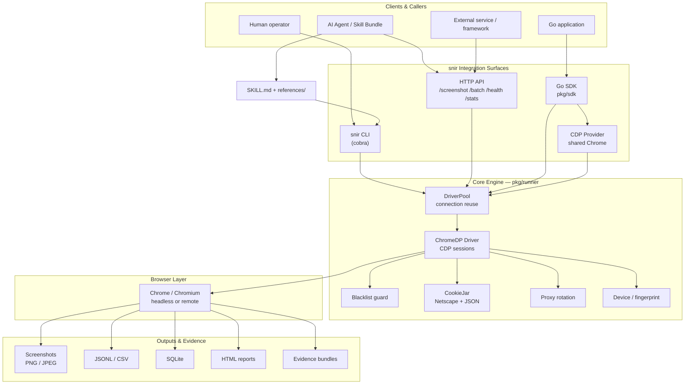
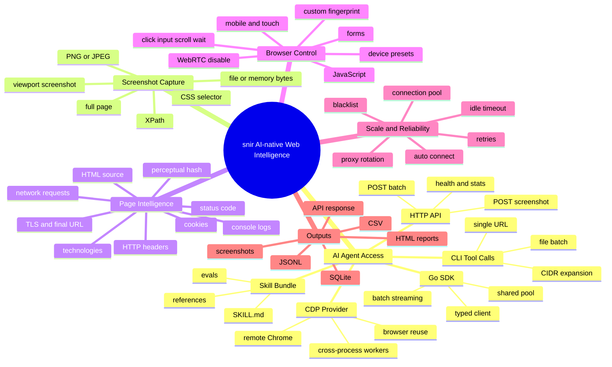
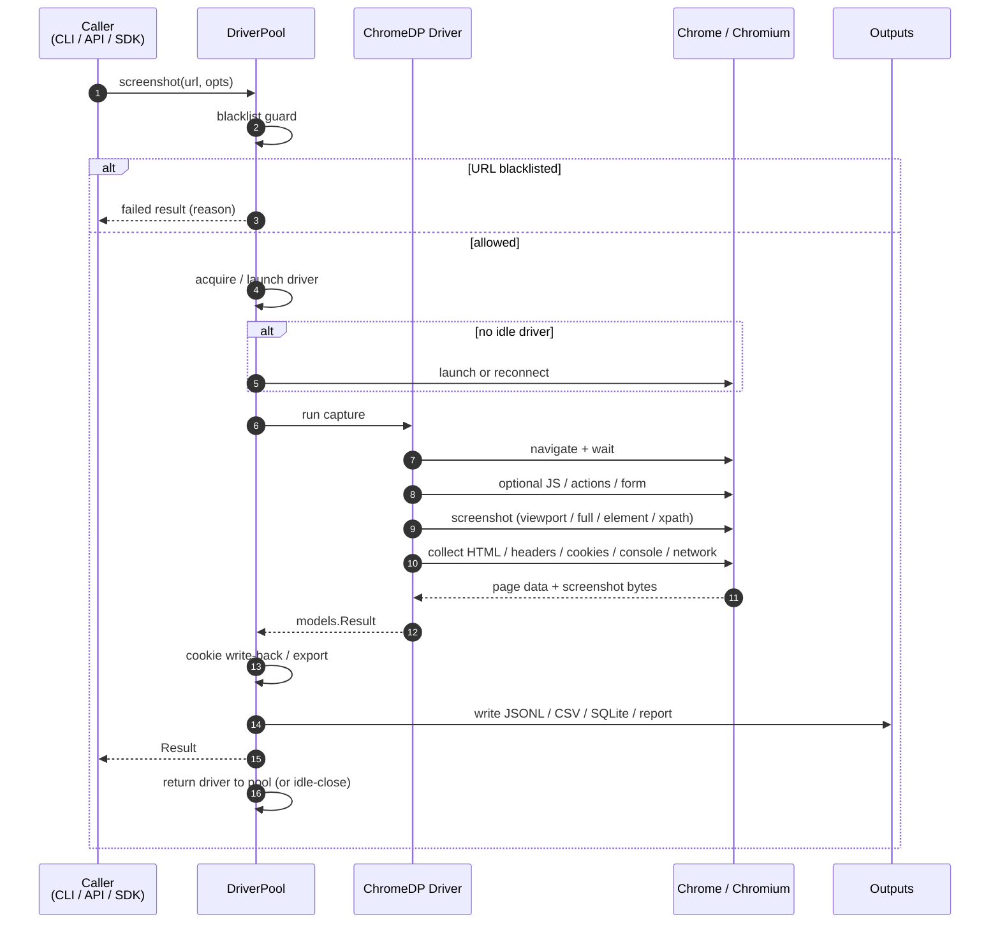
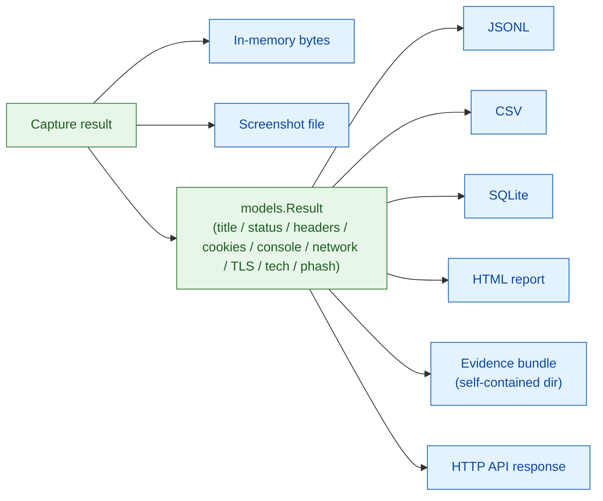

# snir — AI-Native Web Screenshot & Intelligence Collector

<p align="center">
  <strong>Give AI agents and automation systems a browser-backed way to capture screenshots, page evidence, and web intelligence.</strong>
</p>

<p align="center">
  <a href="https://github.com/cyberspacesec/snir-skills/releases/latest"></a>
  
  
  
  <a href="https://cyberspacesec.github.io/snir-skills/"></a>
</p>

<p align="center">
  📖 <strong>Full docs site:</strong> <a href="https://cyberspacesec.github.io/snir-skills/">cyberspacesec.github.io/snir-skills</a> — guides, CLI, SDK, HTTP API, internals, and advanced topics (130+ pages)
</p>

<p align="center">
  <b>English</b> &nbsp;|&nbsp; <a href="README.zh-CN.md">简体中文</a>
</p>

`snir` is a Chrome DevTools Protocol based screenshot and web-intelligence subsystem. It can be used directly by humans, but the project is now designed AI-first: an agent can discover the skill entrypoint, install the binary, choose the right integration mode, run screenshots or batch collection, and persist structured evidence without needing prior Go knowledge.

---

## Architecture at a Glance



Every integration surface — CLI, HTTP API, Go SDK, and the shared CDP Provider — converges on the same `pkg/runner` engine and its `DriverPool`, so behavior, evidence, and pool semantics are identical regardless of how you call snir.

---

## AI Agent Entry Points

| Agent need | Use this entry | Best for |
|------------|----------------|----------|
| Autonomous operation from a cloned repo | [`SKILL.md`](SKILL.md) | Anthropic-compatible Skill Bundle entrypoint with short operating instructions |
| Progressive task references | [`references/`](references/) | Agents loading only the docs needed for scan workflows, API/SDK usage, and output interpretation |
| One-shot CLI execution | `snir scan ...` | Shell-capable agents that need screenshots, HTML, headers, cookies, console logs, or network evidence |
| Language-neutral tool endpoint | `snir api` | Agent frameworks, non-Go systems, microservices, and tool adapters calling HTTP |
| Go-native embedding | [`pkg/sdk`](pkg/sdk) | Go applications that need typed SDK options, results, batching, streaming, and shared pools |
| Shared browser infrastructure | `snir provider` | Multi-process agents and workers that should reuse one Chrome/CDP provider |

### Agent Quick Start

If the repository is already cloned:

```bash
./scripts/install-snir.sh
snir version
```

Or install the latest release manually:

```bash
LATEST=$(curl -s https://api.github.com/repos/cyberspacesec/snir-skills/releases/latest | grep '"tag_name"' | sed -E 's/.*"([^"]+)".*/\1/')
OS=$(uname -s | sed 's/Linux/Linux/;s/Darwin/Darwin/;s/FreeBSD/Freebsd/;s/OpenBSD/Openbsd/;s/NetBSD/Netbsd/')
ARCH=$(uname -m | sed 's/x86_64/x86_64/;s/aarch64/arm64/;s/arm64/arm64/')
curl -L -o snir.tar.gz "https://github.com/cyberspacesec/snir-skills/releases/download/${LATEST}/snir-skills_${OS}_${ARCH}.tar.gz"
tar xzf snir.tar.gz snir && chmod +x snir && sudo mv snir /usr/local/bin/
snir version
```

Recommended first task:

```bash
snir scan example.com --full-page --save-html --save-headers --save-console --write-jsonl
```

---

## Capability Mind Map



---

## What snir Provides

| Area | Capabilities |
|------|--------------|
| Screenshot capture | Single page, full-page, element-level CSS selector/XPath, PNG/JPEG quality control, file output, in-memory bytes |
| Web evidence | HTML, HTTP headers, cookies, console logs, network requests, final URL, response code, TLS metadata |
| Agent workflows | Skill Bundle entrypoint, progressive references, install helper, evaluation prompts, copy-paste command patterns |
| Automation interfaces | CLI, HTTP API, Go SDK, shared singleton pool, remote Chrome/CDP provider |
| Browser interaction | JavaScript execution, pre-load JS, form filling, click/type/scroll/wait action sequences |
| Device and fingerprint control | Device presets, viewport, DPR, mobile/touch emulation, User-Agent, language, platform, vendor, WebGL, custom headers, WebRTC disable |
| Scale and reuse | Batch file scans, CIDR expansion, host/IP plus port expansion, concurrency, Chrome connection pools, idle close, auto-discovery |
| Network routing | Single proxy, proxy list, hot-reload proxy file, proxy API, round-robin/random/sequential strategies |
| Cookie workflows | Persistent JSON cookie jar, one-time cookies, Netscape import/export, write-back after capture |
| Persistence and reports | Screenshots, JSONL, CSV, SQLite, stdout, report conversion, merge, HTML reports, local web viewer |

For cyberspace mapping systems, snir works best as the web asset collection, browser evidence, screenshot, fingerprinting, and page-observation layer. See [Cyberspace Mapping Assessment](docs/cyberspace-mapping-assessment.md) for scope boundaries and integration notes.

---

## Integration Methods

### 1. Skill Bundle for AI Agents

The repository is structured as a single skill bundle rooted at [`SKILL.md`](SKILL.md). Agents should start there, then open deeper references only when needed.

| Resource | Purpose |
|----------|---------|
| [`SKILL.md`](SKILL.md) | Canonical AI-agent entrypoint and operating notes |
| [`references/README.md`](references/README.md) | Resource map for task-specific references |
| [`references/scan-workflows.md`](references/scan-workflows.md) | CLI scan patterns for single URL, batch, ports, and evidence collection |
| [`references/api-and-sdk.md`](references/api-and-sdk.md) | HTTP API, Go SDK, and CDP Provider integration |
| [`references/outputs-and-evidence.md`](references/outputs-and-evidence.md) | Output fields, persistence formats, and evidence interpretation |
| [`scripts/install-snir.sh`](scripts/install-snir.sh) | Deterministic release installer helper |
| [`evals/evals.json`](evals/evals.json) | Realistic prompts for validating agent behavior |

### 2. CLI

```bash
# Single URL screenshot
snir scan example.com

# Batch from URL file
snir scan file -f urls.txt --threads 10 --write-jsonl

# Expand bare hosts/IPs by common Web ports
snir scan file -f hosts.txt --ports 80,443,8080,8443 --db --write-jsonl

# CIDR network expansion
snir scan cidr 192.168.1.0/24 --ports 80,443

# Full-page screenshot with evidence collection
snir scan example.com --full-page --save-html --save-headers --save-cookies --save-console --save-network
```

### 3. HTTP API

```bash
snir api --host 127.0.0.1 --port 8080 --api-key secret
```

```bash
curl -X POST http://127.0.0.1:8080/screenshot \
  -H "X-API-Key: secret" \
  -H "Content-Type: application/json" \
  -d '{"url":"https://example.com","capture_full_page":true,"save_html":true,"save_headers":true}'
```

Use the HTTP API when an agent framework needs a stable tool endpoint instead of shelling out for every capture.

### 4. Go SDK

```go
package main

import (
	"fmt"

	"github.com/cyberspacesec/snir-skills/pkg/sdk"
)

func main() {
	client, err := sdk.NewClient(sdk.DefaultClientOptions())
	if err != nil {
		panic(err)
	}
	defer client.Close()

	result, err := client.Screenshot("https://example.com", nil)
	if err != nil {
		panic(err)
	}
	fmt.Println(result.Title, result.Screenshot)
}
```

SDK highlights:

- `NewClient` for local Chrome pool reuse.
- `NewRemoteClient` for a remote Chrome WebSocket endpoint.
- `AutoConnectClient` to prefer configured remote Chrome, discover a local provider, or start local Chrome.
- `Capture` and `CaptureBytes` for composable `With...` scenario options, including per-request output path, format, and quality.
- `CaptureEvidenceBundle`, `ScreenshotEvidenceBundle`, and `BatchScreenshotEvidenceBundles` for one-call full evidence capture plus portable bundle export.
- `ScreenshotEvidence`, `ScreenshotHeaders`, `ScreenshotCookies`, `ScreenshotConsole`, `ScreenshotNetwork`, `ScreenshotElementBytes`, `ScreenshotXPathBytes`, `ScreenshotDeviceBytes`, `ScreenshotViewportBytes`, `ScreenshotHTML`, `ScreenshotWithFormatBytes`, `ScreenshotWithDelayBytes`, `ScreenshotWithTimeoutBytes`, `ScreenshotWithActionsBytes`, `ScreenshotWithFormBytes`, `ScreenshotWithCookiesBytes`, and matching result-returning helpers.
- `ScreenshotWithProxy`, `ScreenshotWithProxyList`, `ScreenshotWithProxyFile`, `ScreenshotWithProxyURL`, `ScreenshotWithCustomHeaders`, `ScreenshotWithUserAgent`, `ScreenshotWithAcceptLanguage`, `ScreenshotWithFingerprint`, `ScreenshotWithCookieHeader`, `ScreenshotWithCookieFile`, `ScreenshotWithCookieImport`, `ScreenshotWithCookieExport`, `ScreenshotWithBlacklist`, `ScreenshotWithBlacklistFile`, `ScreenshotWithoutBlacklist`, `ScreenshotWithRetries`, and byte-returning variants for request-profile workflows.
- `ScreenshotWithDeviceEmulation`, `ScreenshotWithMobileEmulation`, `ScreenshotWithTouchEmulation`, `ScreenshotWithIgnoreCertErrors`, `ScreenshotWithPlugins`, `ScreenshotWithDisabledWebRTC`, `ScreenshotWithSpoofedScreen`, `ScreenshotWithCookieStrings`, `ScreenshotWithDefaultBlacklist`, and byte-returning variants for browser environment and anti-detection workflows.
- `WrapResult` helpers for evidence summaries plus JSON, HTML, screenshot, and evidence-bundle export.
- Typed interaction and form builders such as `ActionClick`, `ActionType`, `ActionWait`, `FormInput`, and `FormWithSubmit`.
- Per-request proxy rotation, manual mobile/touch emulation, Cookie header injection, persistent JSON Cookie files, Netscape cookie import/export, CookieJar write-back, and blacklist guards.
- `ScreenshotRequest`, `BatchScreenshotRequests`, `BatchScreenshotRequestsBytes`, `BatchScreenshotRequestsEvidenceBundles`, and streaming/callback variants for per-target option matrices.
- `ExpandTarget`, `ExpandTargets`, `BatchScreenshotTargets`, `BatchScreenshotTargetsBytes`, `BatchScreenshotTargetsStreaming`, `BatchScreenshotTargetsBytesStreaming`, `BatchScreenshotTargetsCallback`, and `BatchScreenshotTargetsBytesCallback` for host/IP inputs expanded across HTTP/HTTPS and ports.
- Batch, streaming, callback, and byte-returning batch APIs for larger workflows.
- `SharedCapture`, `SharedCaptureBytes`, `SharedScreenshotElement`, `SharedScreenshotDevice`, `SharedScreenshotWithJS`, `SharedScreenshotHeaders`, `SharedScreenshotCookies`, `SharedScreenshotConsole`, `SharedScreenshotNetwork`, `SharedScreenshotWithFormatBytes`, `SharedScreenshotWithDelayBytes`, `SharedScreenshotWithTimeoutBytes`, `SharedScreenshotWithActionsBytes`, `SharedScreenshotWithCookiesBytes`, `SharedScreenshotWithProxyListBytes`, `SharedScreenshotWithDeviceEmulationBytes`, `SharedScreenshotWithMobileEmulationBytes`, `SharedScreenshotWithDisabledWebRTCBytes`, `SharedScreenshotWithCookieStringsBytes`, `SharedScreenshotWithDefaultBlacklistBytes`, `SharedScreenshotEvidence`, and `SharedScreenshotEvidenceBundle` for process-wide Chrome pool reuse without managing a client instance.
- `SharedBatchScreenshot`, `SharedBatchScreenshotBytes`, `SharedBatchScreenshotRequests`, `SharedBatchScreenshotTargets`, `SharedBatchScreenshotEvidenceBundles`, and streaming/callback variants for shared-pool batch workflows without creating a client.

### 5. CDP Provider

```bash
snir provider --port 9223 --idle-timeout 5m
curl http://127.0.0.1:9223/ws
```

Use the provider when multiple agents, services, or workers should share Chrome instead of launching separate browser processes. Other snir entrypoints can connect with `--wss ws://host:9222/devtools/browser/...`, and Go callers can use `sdk.NewRemoteClient(...)` or `sdk.AutoConnectClient(...)`.

---

## Request Lifecycle



---

## Installation

### Pre-built Binaries

Download from [GitHub Releases](https://github.com/cyberspacesec/snir-skills/releases/latest).

| Platform | Command |
|----------|---------|
| Linux x86_64 | `curl -L https://github.com/cyberspacesec/snir-skills/releases/latest/download/snir-skills_Linux_x86_64.tar.gz \| tar xz snir` |
| macOS arm64 | `curl -L https://github.com/cyberspacesec/snir-skills/releases/latest/download/snir-skills_Darwin_arm64.tar.gz \| tar xz snir` |
| Windows x86_64 | Download `snir-skills_Windows_x86_64.zip` from [Releases](https://github.com/cyberspacesec/snir-skills/releases/latest) |

### Linux Packages

```bash
sudo dpkg -i snir_*.deb              # Debian/Ubuntu
sudo rpm -i snir-*.rpm               # RHEL/Fedora
sudo pacman -U snir-*.pkg.tar.zst    # Arch Linux
```

### Docker

```bash
docker pull ghcr.io/cyberspacesec/snir:latest
docker run --rm ghcr.io/cyberspacesec/snir:latest scan example.com
```

### From Source

Requires Go 1.23+.

```bash
git clone https://github.com/cyberspacesec/snir-skills.git
cd snir-skills
make build
./snir version
```

### Browser Requirement

Screenshot capture requires Chrome/Chromium unless `--wss` points to a remote Chrome or provider.

```bash
sudo apt install chromium-browser
brew install --cask google-chrome
```

---

## Quick Examples

```bash
# Basic capture
snir scan example.com

# Capture all common evidence
snir scan example.com --full-page --save-html --save-headers --save-cookies --save-console --save-network

# Mobile device preset
snir scan example.com --device iphone-15 --full-page

# Element screenshot
snir scan example.com --selector "#dashboard-panel"

# Run JavaScript before capture
snir scan example.com --js "document.querySelectorAll('.popup').forEach(el => el.remove());"

# Proxy rotation
snir scan file -f urls.txt --threads 10 --proxy-file proxies.txt --proxy-strategy random

# Cookie import and write-back
snir scan example.com --cookie-import cookies.txt --cookie-write-back --save-cookies

# Structured downstream evidence
snir scan file -f urls.txt --write-jsonl --db --db-path results.db
```

---

## Output & Evidence Pipeline



Every capture produces a structured `models.Result`. From there, snir can persist to JSONL, CSV, SQLite, a self-contained evidence-bundle directory, a rich HTML report, or return it directly as an HTTP API response — all driven by the same underlying capture.

---

## Documentation

| Document | Description |
|----------|-------------|
| [Skill Bundle Entry](SKILL.md) | AI-agent entrypoint and concise operating notes |
| [Skill Resource Map](references/README.md) | Which reference file an agent should open for each task |
| [SKILLS Index](docs/superpowers/SKILLS.md) | Full command map, installation paths, and flag overview |
| [Scan Command](docs/superpowers/scan.md) | CLI screenshot, batch scan, ports, devices, proxies, evidence, and output options |
| [HTTP API](docs/superpowers/api.md) | API server, auth, endpoints, request and response schema |
| [CDP Provider](docs/superpowers/provider.md) | Shared Chrome/CDP provider setup and reuse patterns |
| [Full Capabilities](docs/skills.md) | CLI, Go SDK, HTTP API, and Provider reference |
| [Quick Examples](docs/quick_examples.md) | Copy-paste usage examples |
| [Usage Examples](docs/usage_examples.md) | Detailed scenario walkthroughs |
| [Docs Website](https://cyberspacesec.github.io/snir-skills/) | VitePress site with 130+ pages of guides, reference, and internals |

---

## License

[MIT](LICENSE)
