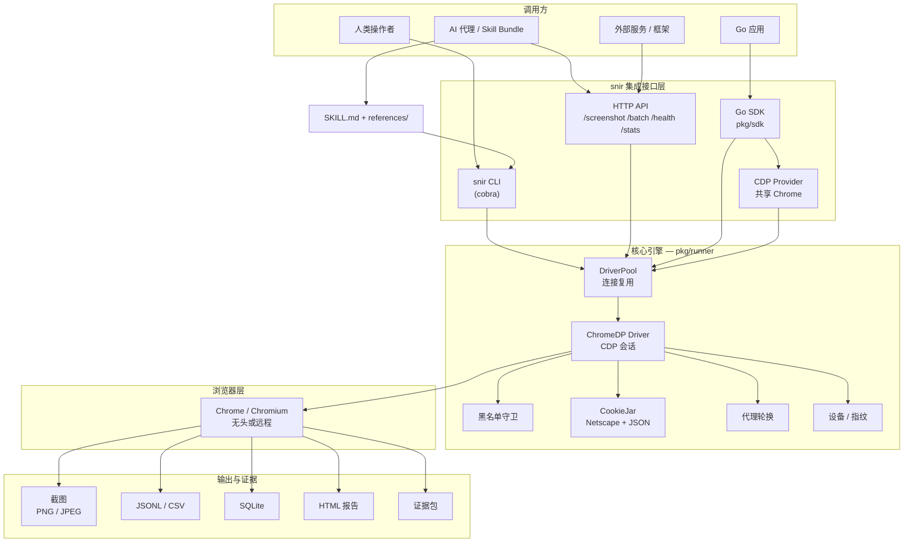
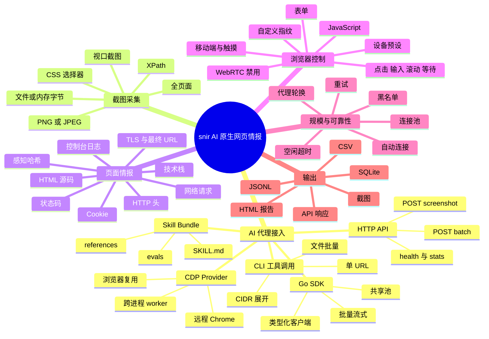
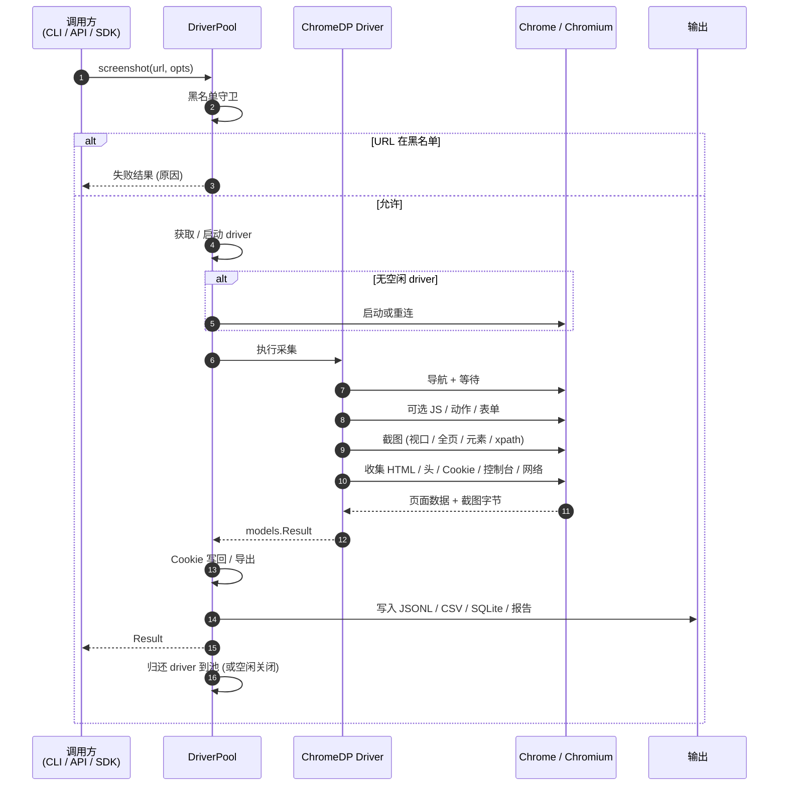
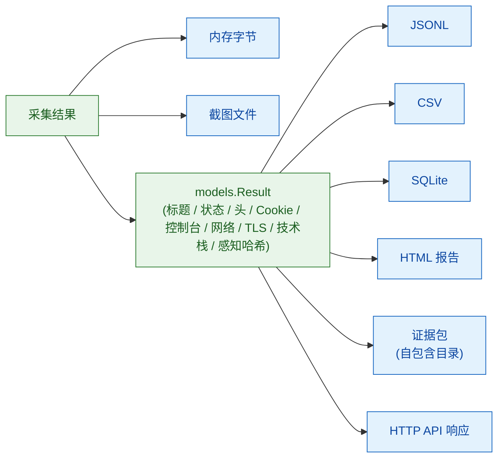

# snir — AI 原生网页截图与情报采集工具

<p align="center">
  <strong>基于 Chrome DevTools Protocol，让 AI 代理与自动化系统拥有浏览器级取证能力。</strong>
</p>

<p align="center">
  <a href="https://github.com/cyberspacesec/snir-skills/releases/latest"></a>
  
  
  
  <a href="https://cyberspacesec.github.io/snir-skills/"></a>
</p>

<p align="center">
  📖 <strong>完整文档站：</strong><a href="https://cyberspacesec.github.io/snir-skills/">cyberspacesec.github.io/snir-skills</a> — 指南、CLI、SDK、HTTP API、内部模块、进阶主题，共 130+ 篇文档
</p>

<p align="center">
  <a href="README.md">English</a> &nbsp;|&nbsp; <b>简体中文</b>
</p>

`snir` 是一个基于 Chrome DevTools Protocol 的截图与 Web 情报子系统。它可供人类直接使用，但设计以 AI 优先：代理可自发现 skill 入口、安装二进制、选择集成模式、执行截图或批量采集、持久化结构化证据，无需预先了解 Go 知识。

---

## 架构一览



每个集成接口 — CLI、HTTP API、Go SDK、共享 CDP Provider — 都汇聚到同一个 `pkg/runner` 引擎及其 `DriverPool`，因此无论你如何调用 snir，行为、证据和池语义完全一致。

---

## AI 代理入口

| 代理需求 | 使用入口 | 适用场景 |
|----------|----------|----------|
| 从克隆仓库自主运行 | [`SKILL.md`](SKILL.md) | Anthropic 兼容 Skill Bundle 入口，含简短操作说明 |
| 渐进式任务参考 | [`references/`](references/) | 代理按需加载扫描工作流、API/SDK 用法、输出解读文档 |
| 一次性 CLI 执行 | `snir scan ...` | Shell 能力代理，需要截图、HTML、头、Cookie、控制台日志或网络证据 |
| 语言中立的工具端点 | `snir api` | 代理框架、非 Go 系统、微服务、工具适配器调用 HTTP |
| Go 原生嵌入 | [`pkg/sdk`](pkg/sdk) | Go 应用需要类型化 SDK 选项、结果、批处理、流式、共享池 |
| 共享浏览器基础设施 | `snir provider` | 多进程代理和 worker 复用同一个 Chrome/CDP provider |

### 代理快速开始

如果仓库已克隆：

```bash
./scripts/install-snir.sh
snir version
```

或手动安装最新版本：

```bash
LATEST=$(curl -s https://api.github.com/repos/cyberspacesec/snir-skills/releases/latest | grep '"tag_name"' | sed -E 's/.*"([^"]+)".*/\1/')
OS=$(uname -s | sed 's/Linux/Linux/;s/Darwin/Darwin/;s/FreeBSD/Freebsd/;s/OpenBSD/Openbsd/;s/NetBSD/Netbsd/')
ARCH=$(uname -m | sed 's/x86_64/x86_64/;s/aarch64/arm64/;s/arm64/arm64/')
curl -L -o snir.tar.gz "https://github.com/cyberspacesec/snir-skills/releases/download/${LATEST}/snir-skills_${OS}_${ARCH}.tar.gz"
tar xzf snir.tar.gz snir && chmod +x snir && sudo mv snir /usr/local/bin/
snir version
```

推荐首任务：

```bash
snir scan example.com --full-page --save-html --save-headers --save-console --write-jsonl
```

---

## 能力思维导图



---

## snir 能力一览

| 领域 | 能力 |
|------|------|
| 截图采集 | 单页、全页、元素级 CSS 选择器/XPath、PNG/JPEG 质量控制、文件输出、内存字节 |
| Web 证据 | HTML、HTTP 头、Cookie、控制台日志、网络请求、最终 URL、响应码、TLS 元数据 |
| 代理工作流 | Skill Bundle 入口、渐进式参考、安装助手、评测提示词、复制粘贴命令模式 |
| 自动化接口 | CLI、HTTP API、Go SDK、共享单例池、远程 Chrome/CDP provider |
| 浏览器交互 | JavaScript 执行、预加载 JS、表单填写、点击/输入/滚动/等待动作序列 |
| 设备与指纹控制 | 设备预设、视口、DPR、移动端/触摸模拟、User-Agent、语言、平台、vendor、WebGL、自定义头、WebRTC 禁用 |
| 规模与复用 | 批量文件扫描、CIDR 展开、host/IP 加端口展开、并发、Chrome 连接池、空闲关闭、自动发现 |
| 网络路由 | 单代理、代理列表、热加载代理文件、代理 API、轮询/随机/顺序策略 |
| Cookie 工作流 | 持久化 JSON cookie jar、一次性 Cookie、Netscape 导入/导出、采集后写回 |
| 持久化与报告 | 截图、JSONL、CSV、SQLite、标准输出、报告转换、合并、HTML 报告、本地 Web 查看器 |

用于网络空间测绘系统时，snir 最适合作为 Web 资产采集、浏览器证据、截图、指纹与页面观察子模块。参见[网络空间测绘底层库支撑性评估](docs/cyberspace-mapping-assessment.md)了解边界与集成说明。

---

## 集成方式

### 1. AI 代理 Skill Bundle

仓库结构为单 skill bundle，根入口为 [`SKILL.md`](SKILL.md)。代理应从此开始，仅按需打开更深层参考。

| 资源 | 用途 |
|------|------|
| [`SKILL.md`](SKILL.md) | 标准 AI 代理入口与操作说明 |
| [`references/README.md`](references/README.md) | 任务相关参考文件资源地图 |
| [`references/scan-workflows.md`](references/scan-workflows.md) | CLI 扫描模式：单 URL、批量、端口、证据采集 |
| [`references/api-and-sdk.md`](references/api-and-sdk.md) | HTTP API、Go SDK、CDP Provider 集成 |
| [`references/outputs-and-evidence.md`](references/outputs-and-evidence.md) | 输出字段、持久化格式、证据解读 |
| [`scripts/install-snir.sh`](scripts/install-snir.sh) | 确定性 release 安装助手 |
| [`evals/evals.json`](evals/evals.json) | 验证代理行为的真实提示词 |

### 2. CLI

```bash
# 单 URL 截图
snir scan example.com

# 从 URL 文件批量
snir scan file -f urls.txt --threads 10 --write-jsonl

# 对裸 host/IP 展开常见 Web 端口
snir scan file -f hosts.txt --ports 80,443,8080,8443 --db --write-jsonl

# CIDR 网段展开
snir scan cidr 192.168.1.0/24 --ports 80,443

# 全页截图 + 证据采集
snir scan example.com --full-page --save-html --save-headers --save-cookies --save-console --save-network
```

### 3. HTTP API

```bash
snir api --host 127.0.0.1 --port 8080 --api-key secret
```

```bash
curl -X POST http://127.0.0.1:8080/screenshot \
  -H "X-API-Key: secret" \
  -H "Content-Type: application/json" \
  -d '{"url":"https://example.com","capture_full_page":true,"save_html":true,"save_headers":true}'
```

当代理框架需要稳定的工具端点而非每次调用都 shell out 时，使用 HTTP API。

### 4. Go SDK

```go
package main

import (
	"fmt"

	"github.com/cyberspacesec/snir-skills/pkg/sdk"
)

func main() {
	client, err := sdk.NewClient(sdk.DefaultClientOptions())
	if err != nil {
		panic(err)
	}
	defer client.Close()

	result, err := client.Screenshot("https://example.com", nil)
	if err != nil {
		panic(err)
	}
	fmt.Println(result.Title, result.Screenshot)
}
```

SDK 亮点：

- `NewClient` 本地 Chrome 池复用
- `NewRemoteClient` 连接远程 Chrome WebSocket 端点
- `AutoConnectClient` 优先配置的远程 Chrome，发现本地 provider，或启动本地 Chrome
- `Capture` 和 `CaptureBytes` 组合式 `With...` 场景选项，含单次输出路径、格式、质量
- `CaptureEvidenceBundle`、`ScreenshotEvidenceBundle`、`BatchScreenshotEvidenceBundles` 一站式全证据采集与便携包导出
- `ScreenshotEvidence`、`ScreenshotHeaders`、`ScreenshotCookies`、`ScreenshotConsole`、`ScreenshotNetwork`、`ScreenshotElementBytes`、`ScreenshotXPathBytes`、`ScreenshotDeviceBytes`、`ScreenshotViewportBytes`、`ScreenshotHTML`、`ScreenshotWithFormatBytes`、`ScreenshotWithDelayBytes`、`ScreenshotWithTimeoutBytes`、`ScreenshotWithActionsBytes`、`ScreenshotWithFormBytes`、`ScreenshotWithCookiesBytes` 及返回结果的对应方法
- `ScreenshotWithProxy`、`ScreenshotWithProxyList`、`ScreenshotWithProxyFile`、`ScreenshotWithProxyURL`、`ScreenshotWithCustomHeaders`、`ScreenshotWithUserAgent`、`ScreenshotWithAcceptLanguage`、`ScreenshotWithFingerprint`、`ScreenshotWithCookieHeader`、`ScreenshotWithCookieFile`、`ScreenshotWithCookieImport`、`ScreenshotWithCookieExport`、`ScreenshotWithBlacklist`、`ScreenshotWithBlacklistFile`、`ScreenshotWithoutBlacklist`、`ScreenshotWithRetries` 及字节返回变体，用于请求画像工作流
- `ScreenshotWithDeviceEmulation`、`ScreenshotWithMobileEmulation`、`ScreenshotWithTouchEmulation`、`ScreenshotWithIgnoreCertErrors`、`ScreenshotWithPlugins`、`ScreenshotWithDisabledWebRTC`、`ScreenshotWithSpoofedScreen`、`ScreenshotWithCookieStrings`、`ScreenshotWithDefaultBlacklist` 及字节返回变体，用于浏览器环境与反检测工作流
- `WrapResult` 助手，用于证据摘要以及 JSON、HTML、截图、证据包导出
- 类型化交互与表单构建器：`ActionClick`、`ActionType`、`ActionWait`、`FormInput`、`FormWithSubmit`
- 单次请求代理轮换、手动移动端/触摸模拟、Cookie 头注入、持久化 JSON Cookie 文件、Netscape cookie 导入/导出、CookieJar 写回、黑名单守卫
- `ScreenshotRequest`、`BatchScreenshotRequests`、`BatchScreenshotRequestsBytes`、`BatchScreenshotRequestsEvidenceBundles` 及流式/回调变体，用于单目标选项矩阵
- `ExpandTarget`、`ExpandTargets`、`BatchScreenshotTargets`、`BatchScreenshotTargetsBytes`、`BatchScreenshotTargetsStreaming`、`BatchScreenshotTargetsBytesStreaming`、`BatchScreenshotTargetsCallback`、`BatchScreenshotTargetsBytesCallback`，用于 host/IP 输入跨 HTTP/HTTPS 和端口展开
- 批量、流式、回调、字节返回批量 API，适用于更大规模工作流
- `SharedCapture`、`SharedCaptureBytes`、`SharedScreenshotElement`、`SharedScreenshotDevice`、`SharedScreenshotWithJS`、`SharedScreenshotHeaders`、`SharedScreenshotCookies`、`SharedScreenshotConsole`、`SharedScreenshotNetwork`、`SharedScreenshotWithFormatBytes`、`SharedScreenshotWithDelayBytes`、`SharedScreenshotWithTimeoutBytes`、`SharedScreenshotWithActionsBytes`、`SharedScreenshotWithCookiesBytes`、`SharedScreenshotWithProxyListBytes`、`SharedScreenshotWithDeviceEmulationBytes`、`SharedScreenshotWithMobileEmulationBytes`、`SharedScreenshotWithDisabledWebRTCBytes`、`SharedScreenshotWithCookieStringsBytes`、`SharedScreenshotWithDefaultBlacklistBytes`、`SharedScreenshotEvidence`、`SharedScreenshotEvidenceBundle`，用于进程级 Chrome 池复用而无需管理客户端实例
- `SharedBatchScreenshot`、`SharedBatchScreenshotBytes`、`SharedBatchScreenshotRequests`、`SharedBatchScreenshotTargets`、`SharedBatchScreenshotEvidenceBundles` 及流式/回调变体，用于共享池批量工作流而无需创建客户端

### 5. CDP Provider

```bash
snir provider --port 9223 --idle-timeout 5m
curl http://127.0.0.1:9223/ws
```

当多个代理、服务或 worker 应该复用同一个 Chrome 而非各自启动浏览器进程时使用 provider。其他 snir 入口可通过 `--wss ws://host:9222/devtools/browser/...` 连接，Go 调用方可使用 `sdk.NewRemoteClient(...)` 或 `sdk.AutoConnectClient(...)`。

---

## 请求生命周期



---

## 安装

### 预编译二进制

从 [GitHub Releases](https://github.com/cyberspacesec/snir-skills/releases/latest) 下载。

| 平台 | 命令 |
|------|------|
| Linux x86_64 | `curl -L https://github.com/cyberspacesec/snir-skills/releases/latest/download/snir-skills_Linux_x86_64.tar.gz \| tar xz snir` |
| macOS arm64 | `curl -L https://github.com/cyberspacesec/snir-skills/releases/latest/download/snir-skills_Darwin_arm64.tar.gz \| tar xz snir` |
| Windows x86_64 | 从 [Releases](https://github.com/cyberspacesec/snir-skills/releases/latest) 下载 `snir-skills_Windows_x86_64.zip` |

### Linux 包管理器

```bash
sudo dpkg -i snir_*.deb              # Debian/Ubuntu
sudo rpm -i snir-*.rpm               # RHEL/Fedora
sudo pacman -U snir-*.pkg.tar.zst    # Arch Linux
```

### Docker

```bash
docker pull ghcr.io/cyberspacesec/snir:latest
docker run --rm ghcr.io/cyberspacesec/snir:latest scan example.com
```

### 从源码编译

需要 Go 1.23+。

```bash
git clone https://github.com/cyberspacesec/snir-skills.git
cd snir-skills
make build
./snir version
```

### 浏览器依赖

截图采集需要 Chrome/Chromium，除非 `--wss` 指向远程 Chrome 或 provider。

```bash
sudo apt install chromium-browser
brew install --cask google-chrome
```

---

## 快速示例

```bash
# 基础采集
snir scan example.com

# 采集全部常用证据
snir scan example.com --full-page --save-html --save-headers --save-cookies --save-console --save-network

# 移动设备预设
snir scan example.com --device iphone-15 --full-page

# 元素截图
snir scan example.com --selector "#dashboard-panel"

# 截图前执行 JavaScript
snir scan example.com --js "document.querySelectorAll('.popup').forEach(el => el.remove());"

# 代理轮换
snir scan file -f urls.txt --threads 10 --proxy-file proxies.txt --proxy-strategy random

# Cookie 导入与写回
snir scan example.com --cookie-import cookies.txt --cookie-write-back --save-cookies

# 结构化下游证据
snir scan file -f urls.txt --write-jsonl --db --db-path results.db
```

---

## 输出与证据流水线



每次采集都会生成一个结构化的 `models.Result`。从这里，snir 可以持久化为 JSONL、CSV、SQLite、自包含证据包目录、富 HTML 报告，或直接作为 HTTP API 响应返回 — 都由同一个底层采集驱动。

---

## 文档

| 文档 | 说明 |
|------|------|
| [Skill Bundle 入口](SKILL.md) | AI 代理入口与简明操作说明 |
| [Skill 资源地图](references/README.md) | 代理各任务应打开哪个参考文件 |
| [SKILLS 索引](docs/superpowers/SKILLS.md) | 完整命令地图、安装路径、标志概览 |
| [scan 命令](docs/superpowers/scan.md) | CLI 截图、批量扫描、端口、设备、代理、证据、输出选项 |
| [HTTP API](docs/superpowers/api.md) | API 服务、鉴权、端点、请求与响应 schema |
| [CDP Provider](docs/superpowers/provider.md) | 共享 Chrome/CDP provider 设置与复用模式 |
| [完整能力](docs/skills.md) | CLI + Go SDK + HTTP API + Provider 完整参考 |
| [快速示例](docs/quick_examples.md) | 复制粘贴使用示例 |
| [使用示例](docs/usage_examples.md) | 详细场景 walkthrough |
| [文档站](https://cyberspacesec.github.io/snir-skills/) | VitePress 站点，130+ 页指南、参考与内部模块 |

---

## 许可证

[MIT](LICENSE)
