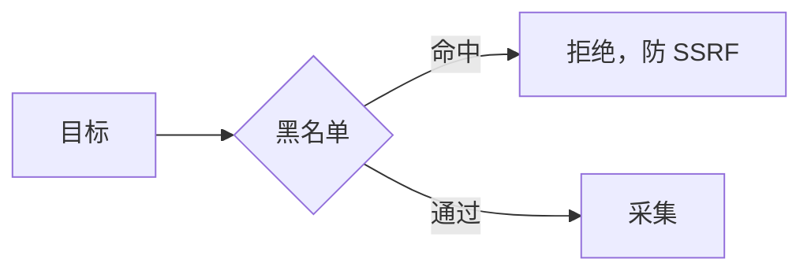
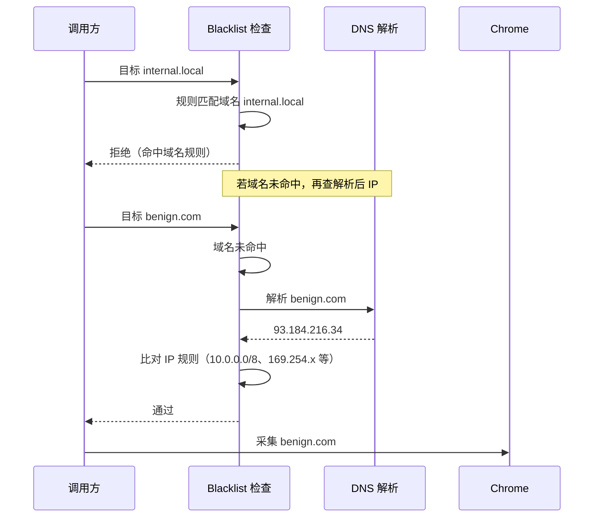

# 黑名单

<p align="center">🚫 目标过滤，防 SSRF 与危险探测。</p>

`URLBlacklist`（`pkg/runner/blacklist.go`）在采集前检查目标，命中则拒绝。

## 默认规则

`DefaultBlacklist` 屏蔽：

- 🏠 本地与内网：`localhost`、`127.0.0.0/8`、`10.0.0.0/8`、`172.16.0.0/12`、`192.168.0.0/16`、`169.254.0.0/16`、`fc00::/7`
- ☁️ 云元数据：`169.254.169.254`、`metadata.google.internal`、`metadata.internal`、`metadata.service`
- 🔐 敏感内部服务：`consul.service.consul`、`vault.service.consul`
- 🗄️ 数据库端口：`*:1433`、`*:3306`、`*:5432`、`*:6379`

## 规则语法

| 语法 | 示例 | 说明 |
|------|------|------|
| CIDR | `10.0.0.0/8` | 网段匹配 |
| 正则 | `.*:6379` | 任意 host 的 6379 端口 |
| 字面量 | `localhost` | 精确匹配 |

## CLI

```bash
# 默认（启用默认规则）
snir scan file -f urls.txt

# 追加自定义
snir scan file -f urls.txt --blacklist-pattern "internal.local"

# 规则文件
snir scan file -f urls.txt --blacklist-file blocklist.txt

# 禁用（仅受控内网）
snir scan file -f hosts.txt --enable-blacklist=false
```

## SDK

```go
opts := sdk.NewScreenshotOptions(
    sdk.WithDefaultBlacklist(),
    sdk.WithBlacklist("internal.local", "10.0.0.0/8"),
    sdk.WithBlacklistFile("blocklist.txt"),
)
```

## 规则文件

每行一条规则，支持 `#` 注释。

## 安全



黑名单对域名与 IP 双重拦截的实际时序（以 `internal.local` 为例）：



::: danger SSRF 防护底线
- ✅ 生产环境**保留默认黑名单**
- ✅ 对用户输入的目标**先过黑名单**再采集
- ❌ 仅在**授权内网扫描**时才 `--enable-blacklist=false`
:::

::: warning 云元数据是 SSRF 重灾区
`169.254.169.254` 等云元数据端点能泄露临时凭证/实例身份。默认黑名单已屏蔽，**切勿为图方便而禁用**。
:::

## 下一步

- [黑名单 CLI](../cli/scan-blacklist)
- [黑名单构建器 SDK](../sdk/builder-blacklist)
- [内部 pkg/runner/blacklist](../internals/runner-blacklist)
- [安全注意](./security)
