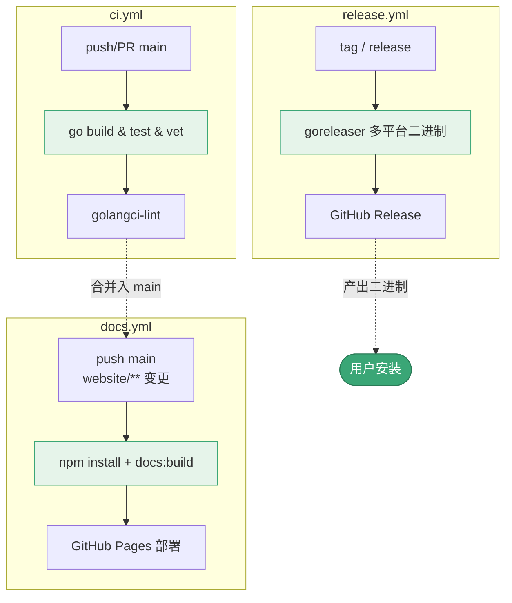
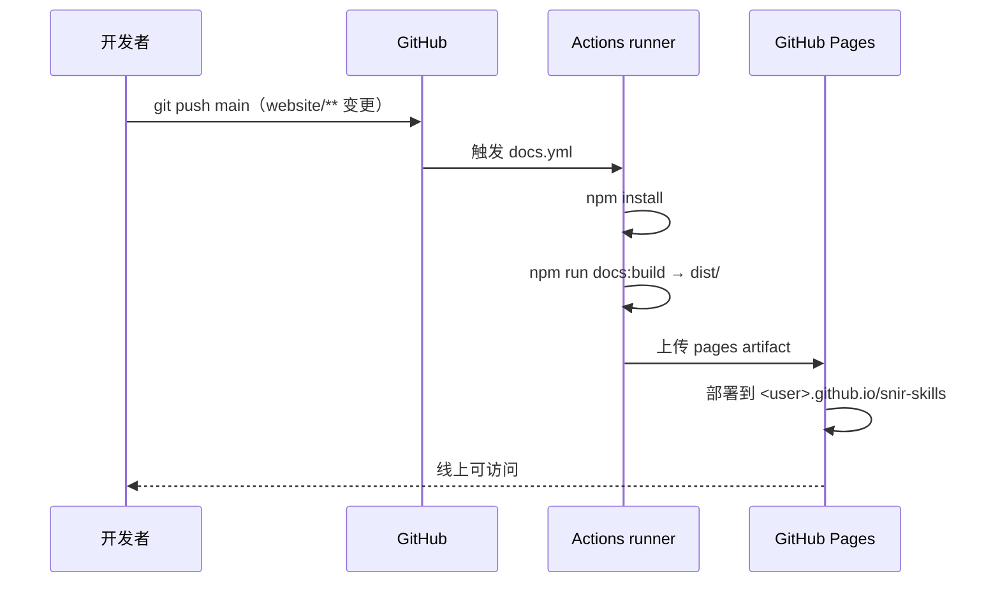

# CI/CD 集成

<p align="center">🔄 在 CI/CD 中使用 snir 与部署文档站。</p>

仓库含多个 GitHub Actions 工作流。

三条工作流分别守「质量—发布—文档」三个关卡：



`docs.yml` 从代码推送到线上文档的部署时序：



## 工作流

| 工作流 | 触发 | 作用 |
|--------|------|------|
| `ci.yml` | push/PR main | 质量检查、测试、构建 |
| `release.yml` | tag/release | goreleaser 多平台二进制 |
| `docs.yml` | push main（website/**） | 构建 VitePress 部署 GitHub Pages |

## 在 CI 中跑截图

::: tip CI 环境跑 Chrome 的关键
GitHub Actions 的 `ubuntu-latest` runner 自带 Chrome，但 CI 容器无桌面环境，必须给 Chrome 加 `--no-sandbox`，否则报 `No usable sandbox!` 失败。

snir 在检测到 CI 环境（无 DISPLAY 且为 root）时**自动追加** `--no-sandbox`，无需手动处理。
:::

::: details 完整工作流示例
```yaml
name: web-check
on:
  schedule:
    - cron: '0 3 * * *'
jobs:
  scan:
    runs-on: ubuntu-latest
    steps:
      - uses: actions/checkout@v4
      - run: sudo apt-get update && sudo apt-get install -y chromium
      - run: ./snir scan file -f urls.txt --threads 10 --write-jsonl --db
      - uses: actions/upload-artifact@v4
        with:
          name: evidence
          path: |
            results.jsonl
            *.db
            screenshots/
```
:::

## 文档站部署

`docs.yml` 自动：

1. checkout（fetch-depth 0）
2. setup-node 20 + npm cache
3. `cd website && npm install`
4. `npm run docs:build`
5. configure-pages → upload-pages-artifact → deploy-pages

推送到 `main` 且 `website/` 有变更即触发，部署到 GitHub Pages。见 [文档贡献](../community/docs)。

## 发布

`release.yml` 用 goreleaser 构建多平台二进制并发布 GitHub Release。见 [更新日志](../reference/changelog)。

## 质量检查

`ci.yml` 的 `quality` job：`go mod download`、`go build`、`go test`、`go vet`、golangci-lint（若有）。

## 本地模拟 CI

```bash
go mod download
go build ./...
go test ./...
cd website && npm install && npm run docs:build
```

## 下一步

- [Docker 部署](./docker)
- [文档贡献](../community/docs)
- [自动化巡检](../guide/automation)
