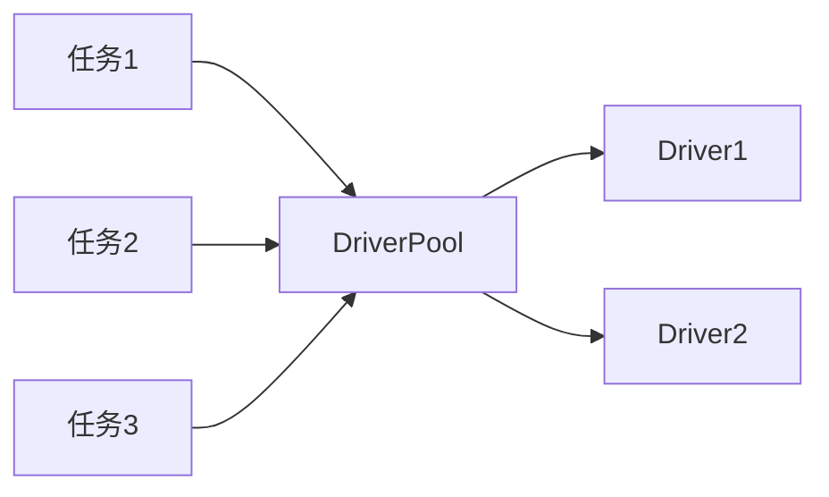
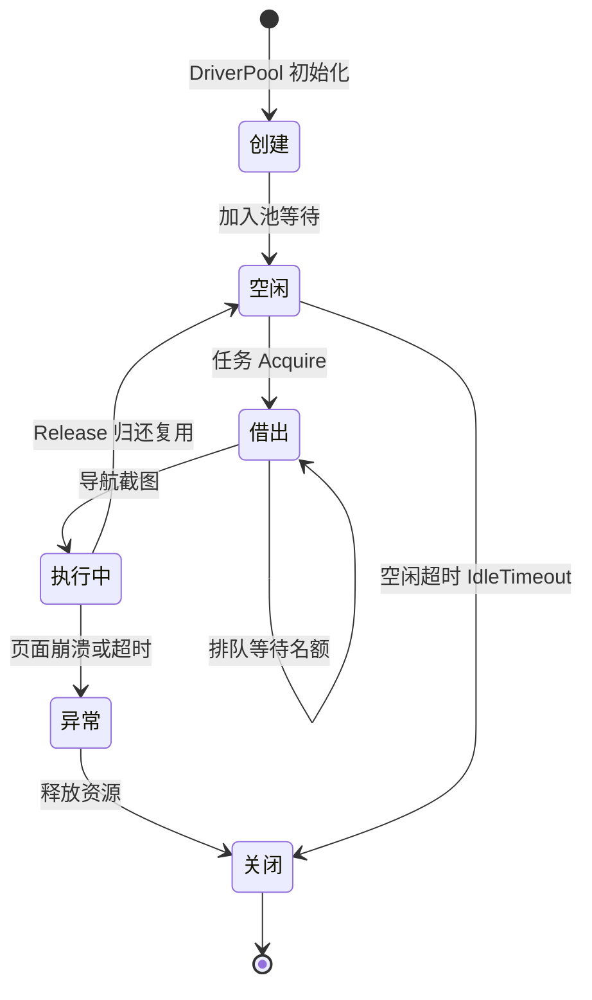

# 并发与池

<p align="center">🏊 浏览器复用与并发控制。</p>

浏览器是昂贵资源，snir 提供多层复用机制。

::: tip 为什么需要复用
每起一个 Chrome 进程约占 **~150MB 内存**。批量场景下若每任务起停一次浏览器，几十并发就会吃满机器。复用是 snir 性能的核心。
:::

## 复用层次

| 层次 | 机制 | 范围 |
|------|------|------|
| 进程内 | `DriverPool` | 同进程多任务 |
| 进程内单例 | 共享池（`Shared*`） | 同进程全局 |
| 跨进程 | `snir provider` | 多进程共享 Chrome |

## 进程内：DriverPool

`DriverPool` 管理一批 Driver，任务借还复用：



`--threads`（CLI）/ `maxConcurrent`（SDK）控制并发度。

## 共享池单例

SDK `Shared*` 函数用进程内全局共享池，多任务自动复用：

```go
sdk.SharedCapture(url, opts)  // 自动用共享池
```

见 [共享池](../sdk/shared)、[共享池单例](../internals/runner-pool-singleton)。

## 跨进程：Provider

```bash
snir provider --max-concurrent 20
# worker
snir scan ... --wss ws://...
```

见 [provider](../cli/provider)、[远程 Chrome](./remote-chrome)。

## API 并发限流

HTTP API 用 `ConcurrencyLimiter`：

- `--max-concurrent`：同时执行数
- `--queue-size`：排队容量

见 [并发限流](../api/concurrency)。

## 池统计

- `SharedPoolStats()`：SDK 共享池统计
- `GET /stats`：API 并发统计
- `PoolStats`：DriverPool 统计

## 空闲超时

`SharedSetIdleTimeout(d)` 设浏览器空闲多久后关闭，节省资源。

## 并发数选择

| 机器 | 建议 --threads |
|------|---------------|
| 🖥️ 4 核 | 5-10 |
| 🖥️ 8 核 | 10-20 |
| 🖥️ 服务器 | 20-50 |

::: warning 并发不是越高越好
过多会触发**目标限流**或**耗尽内存**。从 5-10 起步，观察目标响应与机器负载再调。见 [性能调优](./performance)。
:::

池中一个 Driver 从空闲到回收的生命周期：



## 下一步

- [DriverPool](../internals/runner-pool)
- [共享池单例](../internals/runner-pool-singleton)
- [并发限流 API](../api/concurrency)
- [性能调优](./performance)
