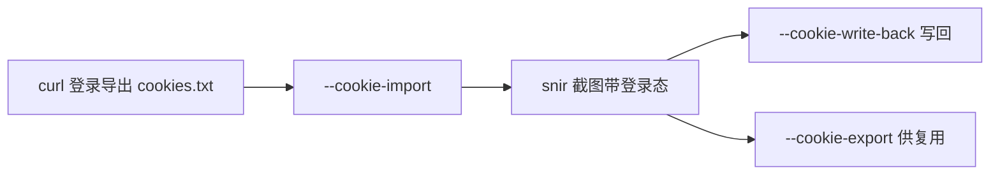

# Cookie 管理

<p align="center">🍪 注入、持久化、导入导出 Cookie。</p>

snir 的 Cookie 能力分两类：**注入**（会话保持）与**证据**（采集存档）。

## 注入 vs 证据

| 目的 | 工具 | Result 字段 |
|------|------|------------|
| 会话保持 | `--cookie*` / `WithCookie*` | — |
| 证据存档 | `--save-cookies` / `WithCookies()` | `cookies` |

## 注入方式

| 方式 | CLI | SDK | 适合 |
|------|-----|-----|------|
| 内联 | `--cookie name=value` | `WithCookieStrings` | 少量简单 |
| Header 串 | — | `WithCookieHeader` | `a=1; b=2` |
| 结构化 | — | `WithInjectedCookies` | 含 domain/path |
| 持久化 | `--cookie-file` + `--cookie-write-back` | `WithCookieFile` + `WithCookieWriteBack` | 跨任务复用 |
| 导入 Netscape | `--cookie-import` | `WithCookieImport` | curl 登录态 |
| 导出 Netscape | `--cookie-export` | `WithCookieExport` | 供 curl 用 |

## 登录后截图流程



## CLI 示例

```bash
# 内联
snir scan example.com --cookie "session=abc" --cookie "token=xyz"

# 持久化 + 写回
snir scan example.com --cookie-file cookies.json --cookie-write-back

# 导入 curl 登录态
snir scan example.com --cookie-import login.txt

# 导出
snir scan example.com --cookie-export out.txt
```

## SDK 示例

```go
opts := sdk.NewScreenshotOptions(
    sdk.WithCookieFile("cookies.json"),
    sdk.WithCookieWriteBack(),
    sdk.WithCookies(),   // 同时作为证据采集
)
```

## CookieJar 与 Netscape

- `CookieJar`（JSON）：跨任务复用，`--cookie-file`
- Netscape（`cookies.txt`）：curl/wget 互通，`--cookie-import`/`--cookie-export`

见 [内部 CookieJar](../internals/runner-cookie-jar)、[Netscape Cookie](../internals/runner-cookie-netscape)。

## 下一步

- [Cookie 选项 CLI](../cli/scan-cookie)
- [Cookie 构建 SDK](../sdk/builder-cookie)
- [表单与交互](./forms)
