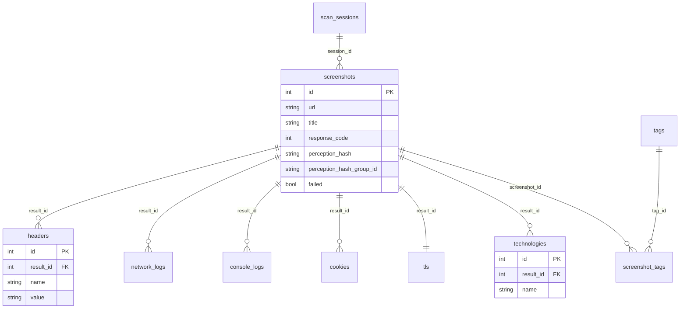

# 数据库存储

<p align="center">🗄️ SQLite 结构化存储与查询。</p>

`pkg/database` 用 GORM 把 `Result` 持久化到 SQLite。

## 启用

```bash
snir scan file -f urls.txt --db --db-path scan.db
```

## 表结构

| 表 | 模型 | 说明 |
|----|------|------|
| `screenshots` | `Screenshot` | 主表（url/title/code/hash...） |
| `scan_sessions` | `ScanSession` | 扫描会话 |
| `tags` / `screenshot_tags` | `Tag`/`ScreenshotTag` | 标签 |
| `headers` | `Header` | 响应头 |
| `network_logs` | `NetworkLog` | 网络请求 |
| `console_logs` | `ConsoleLog` | 控制台 |
| `cookies` | `Cookie` | Cookie |
| `tls` | `TLS` | TLS 信息 |
| `technologies` | `Technology` | 技术栈 |

嵌套表通过 `result_id` 关联，`OnDelete:CASCADE`。表之间的关联关系如下：



::: tip 💡 级联删除
删除一条 `screenshots` 记录时，GORM 的 `OnDelete:CASCADE` 会自动清除其下属的 headers、network_logs、cookies、technologies 等所有子表记录，避免孤儿数据。
:::

## 索引

`html`、`title`、`perception_hash`、`perception_hash_group_id` 建索引。

## 查询示例

```sql
-- 失败目标
SELECT url, failed_reason FROM screenshots WHERE failed = 1;

-- 状态码分布
SELECT response_code, count(*) FROM screenshots GROUP BY response_code;

-- 相似页面聚类
SELECT perception_hash_group_id, count(*), group_concat(host)
FROM screenshots GROUP BY perception_hash_group_id HAVING count(*) > 1;

-- 技术栈
SELECT s.host, group_concat(t.name) FROM technologies t
JOIN screenshots s ON t.result_id = s.id GROUP BY s.host;

-- TLS 即将过期
SELECT host, not_after FROM tls WHERE not_after < date('now','+30 days');

-- 某响应头
SELECT s.host, h.value FROM headers h
JOIN screenshots s ON h.result_id = s.id WHERE h.name = 'Server';
```

## DBWriter

`DBWriter` 实现 `runner.Writer`，把 `Result` 写入 SQLite。`NewDB` 自动迁移表结构。

## 适合场景

- 长期结构化存储
- 多次扫描对比
- 与 BI/分析工具对接

## 下一步

- [数据库选项 CLI](../cli/scan-db)
- [pkg/database](../internals/database)
- [输出格式](./output-formats)
