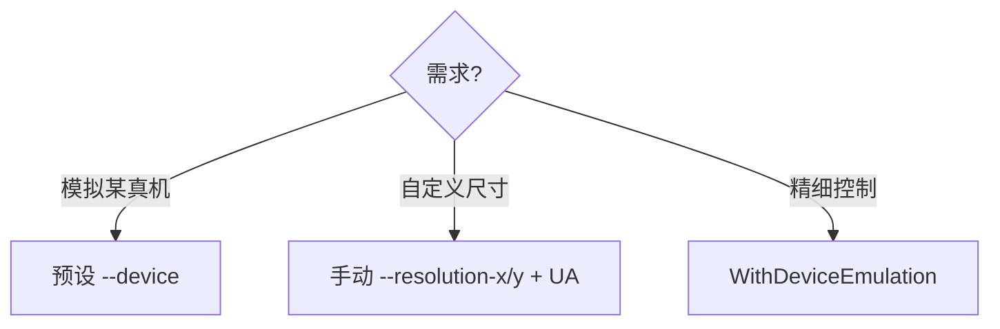
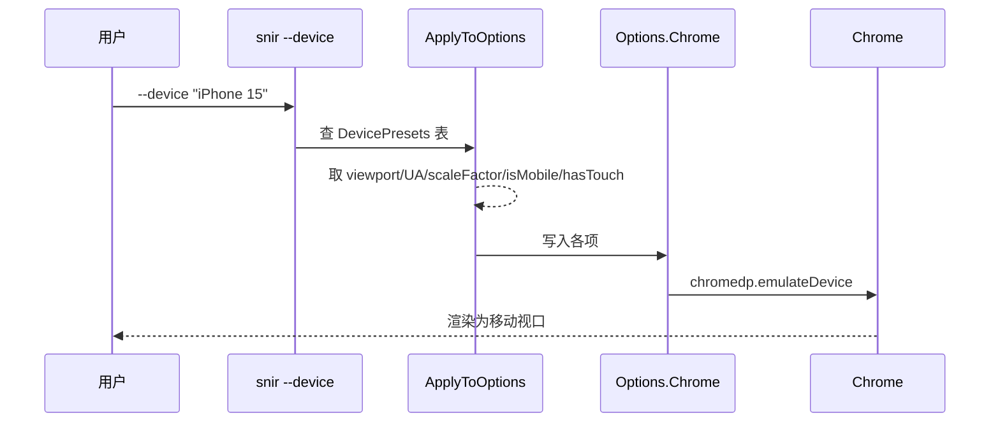

# 设备模拟

<p align="center">📱 模拟手机/平板/桌面视角。</p>

`DevicePreset`（`pkg/runner/device_presets.go`）封装视口、UA、像素比、移动端、触摸等参数。

::: info 一个预设 = 一整套移动端配置
`--device iphone-15` 不是只改视口，而是同时设置视口尺寸、User-Agent、设备像素比、移动端视口标记、触摸仿真——一次模拟整台真机。
:::

## 预设

`--list-devices` 查看全部。常用：

| 名称 | 设备 |
|------|------|
| `iphone-15` / `iphone-15-pro` | iPhone 15 系列 |
| `iphone-14-pro-max` | iPhone 14 Pro Max |
| `iphone-se` | iPhone SE |
| `ipad-pro-12` / `ipad-air` / `ipad-mini` | iPad 系列 |
| `pixel-8-pro` / `pixel-8` / `pixel-7` | Pixel |
| `galaxy-s24` / `galaxy-s23-ultra` / `galaxy-tab-s9` | Samsung |
| `desktop-1080p` / `desktop-1440p` / `desktop-4k` | 桌面 |

## CLI

```bash
snir scan example.com --device iphone-15
snir scan --list-devices
```

## SDK

```go
// 预设
opts := sdk.NewScreenshotOptions(sdk.WithDevice("iphone-15"))

// 精细控制
opts := sdk.NewScreenshotOptions(
    sdk.WithDeviceEmulation(390, 844, 3.0, true, true),
)

// 移动端 + 触摸
opts := sdk.NewScreenshotOptions(
    sdk.WithMobileEmulation(3.0),
    sdk.WithTouchEmulation(true),
)
```

## 预设应用了什么

`ApplyToOptions` 写入 `Options.Chrome`：

- 视口宽高
- User-Agent
- 设备像素比（scaleFactor）
- `IsMobile`（移动端视口）
- `HasTouch`（触摸）

## 决策



预设应用到 `Options.Chrome` 的写入时序：



## 下一步

- [设备模拟 CLI](../cli/scan-device)
- [视口与设备构建器](../sdk/builder-viewport)
- [内部 Device Presets](../internals/runner-device)
