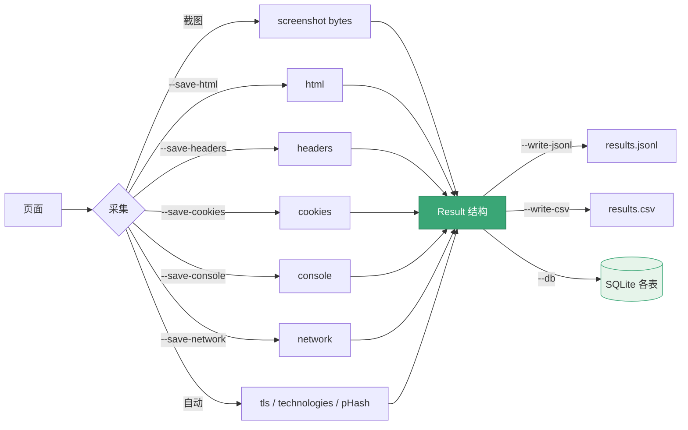

# 证据采集

<p align="center">🔍 一次截图同时采集多种证据。</p>

snir 把截图与证据统一到 `Result`，保证可采信、可关联。

## 可采集证据

| 证据 | 开关 | Result 字段 | 内容 |
|------|------|------------|------|
| HTML 源码 | `--save-html` / `WithHTML()` | `html` | 页面源码 |
| HTTP 头 | `--save-headers` / `WithHeaders()` | `headers` | 响应头列表 |
| Cookie | `--save-cookies` / `WithCookies()` | `cookies` | Cookie 列表 |
| 控制台 | `--save-console` / `WithConsole()` | `console` | 日志（level/message） |
| 网络 | `--save-network` / `WithNetwork()` | `network` | 请求日志 |
| TLS | 自动 | `tls` | 证书信息 |
| 技术栈 | 自动 | `technologies` | 识别结果 |
| 感知哈希 | 自动 | `perception_hash` | 截图指纹 |
| 最终 URL | 自动 | `final_url` | 跳转后 URL |
| 状态码 | 自动 | `response_code` | HTTP 状态 |

## 全量证据

CLI：

```bash
snir scan example.com \
  --save-html --save-headers --save-cookies \
  --save-console --save-network \
  --write-jsonl --db
```

SDK：

```go
opts := sdk.NewScreenshotOptions(
    sdk.WithEvidence(),   // 一次启用 HTML+头+Cookie+控制台+网络
)
```

## 证据结构

见 [Result Schema](../reference/result-schema) 各嵌套结构。

## 内存字节 vs 文件

- 文件：截图落盘 `screenshots/`，证据入库/JSONL
- 内存字节：`ScreenshotBytes`/API `MemoryWriter`，截图以字节返回，不落盘

## 何时采集什么

| 场景 | 证据 |
|------|------|
| 资产盘点 | html + headers |
| 安全侦察 | 全量 |
| 报错排查 | console + network |
| 会话 | cookies |
| TLS 审计 | tls（自动） |

## 持久化

证据随 `Result` 分发给 JSONL/CSV/SQLite。嵌套证据在 SQLite 各自成表。见 [输出格式](./output-formats)。

从采集到落盘，证据的全链路流转如下：



## 下一步

- [Result Schema](../reference/result-schema)
- [证据选项 CLI](../cli/scan-evidence)
- [输出格式](./output-formats)
