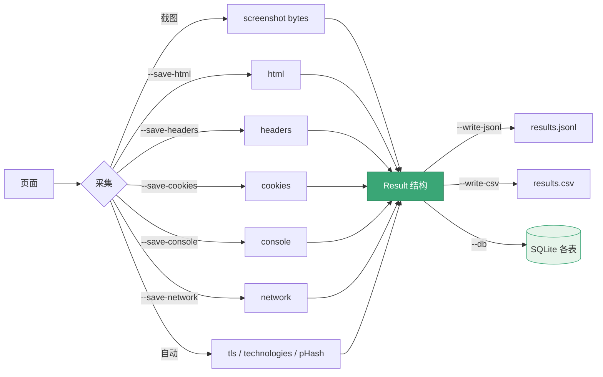

# 证据采集

<p align="center">🔍 一次截图同时采集多种证据。</p>

snir 把截图与证据统一到 `Result`，保证可采信、可关联。

## 可采集证据

| 证据 | 开关 | Result 字段 | 内容 |
|------|------|------------|------|
| HTML 源码 | `--save-html` / `WithHTML()` | `html` | 页面源码 |
| HTTP 头 | `--save-headers` / `WithHeaders()` | `headers` | 响应头列表 |
| Cookie | `--save-cookies` / `WithCookies()` | `cookies` | Cookie 列表 |
| 控制台 | `--save-console` / `WithConsole()` | `console` | 日志（level/message） |
| 网络 | `--save-network` / `WithNetwork()` | `network` | 请求日志 |
| TLS | 自动 | `tls` | 证书信息 |
| 技术栈 | 自动 | `technologies` | 识别结果 |
| 感知哈希 | 自动 | `perception_hash` | 截图指纹 |
| 最终 URL | 自动 | `final_url` | 跳转后 URL |
| 状态码 | 自动 | `response_code` | HTTP 状态 |

## 全量证据

CLI：

```bash
snir scan example.com \
  --save-html --save-headers --save-cookies \
  --save-console --save-network \
  --write-jsonl --db
```

SDK：

```go
opts := sdk.NewScreenshotOptions(
    sdk.WithEvidence(),   // 一次启用 HTML+头+Cookie+控制台+网络
)
```

## 证据结构

见 [Result Schema](../reference/result-schema) 各嵌套结构。

## 内存字节 vs 文件

::: info 两种交付形态
| 形态 | 字段 / Writer | 截图落盘？ | 适用 |
|------|---------------|-----------|------|
| 文件 | 默认 `Writer` | ✅ `screenshots/` | 批量存档、归档复查 |
| 内存字节 | `ScreenshotBytes` / API `MemoryWriter` | ❌ 仅返回字节 | 实时 API、无磁盘环境 |
:::

证据（HTML/头/Cookie/控制台/网络）始终随 `Result` 入库或写 JSONL，与截图形态无关。

## 何时采集什么

::: tip 按场景选证据，避免全量采集的开销
| 场景 | 推荐证据 | 理由 |
|------|---------|------|
| 资产盘点 | html + headers | 够看技术栈与响应特征 |
| 安全侦察 | 全量 | 任何证据都可能成为线索 |
| 报错排查 | console + network | 控制台与网络日志直指根因 |
| 会话/登录 | cookies | 复用会话、识别身份 |
| TLS 审计 | tls（自动） | 证书无需额外开关 |
:::

## 持久化

证据随 `Result` 分发给 JSONL/CSV/SQLite。嵌套证据在 SQLite 各自成表。见 [输出格式](./output-formats)。

从采集到落盘，证据的全链路流转如下：



证据在 SQLite 中按类型分表，外键关联主结果：

```mermaid
erDiagram
    results ||--o{ evidence_cookies : has
    results ||--o{ evidence_headers : has
    results ||--o{ evidence_console : has
    results ||--o{ evidence_network : has
    results ||--|| evidence_html : one
    results {
        int id PK
        text url
        text title
        int status_code
        text phash
        text technologies
        text tls_json
    }
    evidence_cookies {
        int id PK
        int result_id FK
        text name
        text value
        text domain
    }
    evidence_headers {
        int id PK
        int result_id FK
        text key
        text value
    }
    evidence_console {
        int id PK
        int result_id FK
        text level
        text text
    }
    evidence_network {
        int id PK
        int result_id FK
        text method
        text url
        int status
    }
```

## 下一步

- [Result Schema](../reference/result-schema)
- [证据选项 CLI](../cli/scan-evidence)
- [输出格式](./output-formats)
