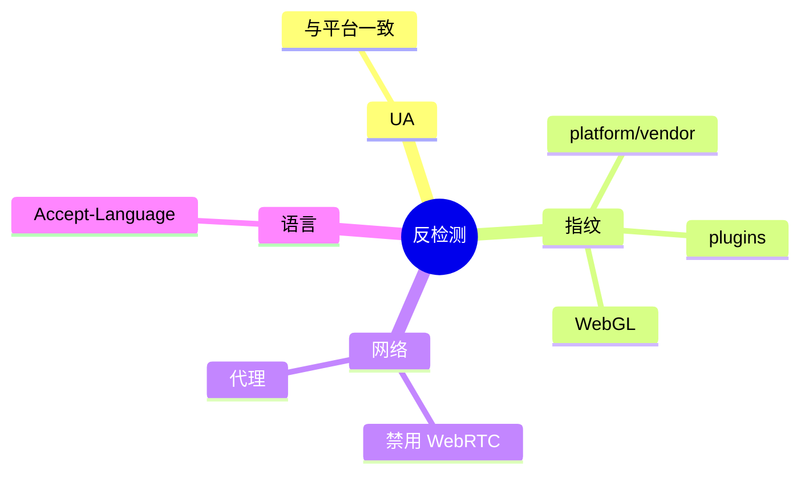

# 浏览器指纹

<p align="center">🎭 指纹伪装，降低被识别为自动化。</p>

snir 可伪装多项浏览器指纹，辅助反检测。

## 可控指纹

| 项 | CLI/SDK | 说明 |
|----|---------|------|
| User-Agent | `--user-agent` / `WithUserAgent` | 浏览器标识 |
| Platform | `WithFingerprint` | `navigator.platform` |
| Vendor | `WithFingerprint` | `navigator.vendor` |
| WebGL 厂商/渲染器 | `WithFingerprint` | GPU 标识 |
| 插件 | `WithPlugins` | `navigator.plugins` |
| Accept-Language | `WithAcceptLanguage` | 语言头 |
| WebRTC | `WithDisableWebRTC` | 禁用，防真实 IP 泄露 |
| 屏幕 | `WithSpoofedScreen` | `screen.width/height` |
| 自定义头 | `WithCustomHeaders` | HTTP 头 |

## SDK 示例

```go
opts := sdk.NewScreenshotOptions(
    sdk.WithUserAgent("Mozilla/5.0 (Windows NT 10.0; Win64; x64)"),
    sdk.WithFingerprint("Win32", "Google Inc.", "Intel Inc.", "Intel Iris"),
    sdk.WithPlugins("PDF Viewer", "Chrome PDF Viewer"),
    sdk.WithAcceptLanguage("zh-CN,zh;q=0.9"),
    sdk.WithDisableWebRTC(),
    sdk.WithSpoofedScreen(1920, 1080),
)
```

## 客户端级 vs 单次级

指纹可在 `ClientOptions` 设客户端基线，单次 `With*` 覆盖。见 [ClientOptions](../sdk/client-options)。

## 反检测要点



::: warning 注意
指纹伪装可降低识别，但非万能。高级反爬可能仍能检测（canvas 指纹、行为分析等）。
:::

## 下一步

- [指纹构建器](../sdk/builder-fingerprint)
- [ClientOptions](../sdk/client-options)
- [代理与轮换](./proxy)
