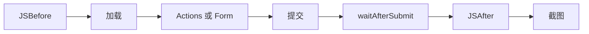

# 表单与交互

<p align="center">📝 结构化交互：点击、输入、滚动、等待、表单。</p>

snir 提供 `InteractionAction` 与 `Form` 两层抽象，结构化地与页面交互。

## 交互动作（Actions）

SDK 工厂（CLI 经 API 的 `actions` 字段）：

| 动作 | CSS | XPath |
|------|-----|-------|
| 点击 | `ActionClick(sel)` | `ActionClickXPath(xp)` |
| 输入 | `ActionType(sel, val)` | `ActionTypeXPath(xp, val)` |
| 滚动 | `ActionScroll(sel, px)` | — |
| 等待时长 | `ActionWait(d)` | — |
| 等待可见 | `ActionWaitVisible(sel)` | `ActionWaitVisibleXPath(xp)` |
| 悬停 | `ActionHover(sel)` | `ActionHoverXPath(xp)` |

## 表单（Form）

| 工厂 | 说明 |
|------|------|
| `NewForm(fields...)` | 基础表单 |
| `FormWithSubmit(sel, wait, fields...)` | 带提交按钮 |
| `FormWithSubmitXPath(xp, wait, fields...)` | 带提交（XPath） |

字段工厂：`FormInput`/`FormSelect`/`FormCheckbox`/`FormRadio`（各有 XPath 变体）。

## 示例：登录后截图

```go
form := sdk.FormWithSubmit("#login-btn", 3*time.Second,
    sdk.FormInput("#username", "myuser"),
    sdk.FormInput("#password", "mypass"),
    sdk.FormCheckbox("#remember"),
)

opts := sdk.NewScreenshotOptions(
    sdk.WithForm(form),
    sdk.WithCookies(),     // 采集登录后 Cookie
    sdk.WithFullPage(),
)
result, _ := sdk.SharedCapture("https://example.com/login", opts)
```

## 交互流程



## 选择 CSS 还是 XPath

- CSS：简单、可读，多数场景够用
- XPath：复杂层级、无 id/class 时更精确

## 适用场景

- 登录后页面截图
- 触发"加载更多"
- 关闭弹窗后截图
- 等待异步内容出现

## 下一步

- [JS 与交互构建器](../sdk/builder-js)
- [表单构建器](../sdk/builder-form)
- [JS 注入](./js-injection)
