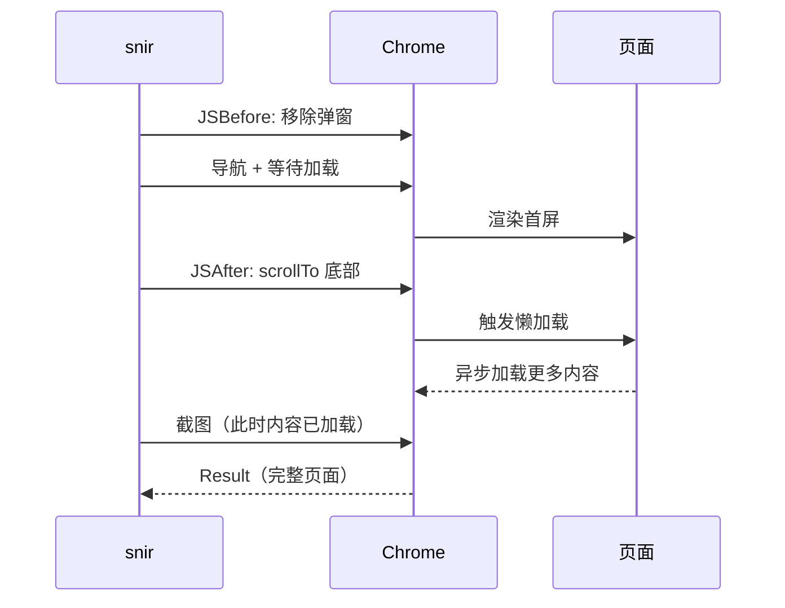

# JS 注入

<p align="center">☕ 在页面执行自定义 JavaScript。</p>

::: tip 何时需要 JS 注入
当页面有懒加载、cookie 弹窗、动态内容等需要在截图前用 JS 处理时，用 `--js` / `--js-file` 注入自定义脚本。
:::

## 注入方式

| 方式 | CLI | SDK | 时机 |
|------|-----|-----|------|
| 内联 | `--js` | `WithJS` / `WithJSAfter` | 加载后 |
| 文件 | `--js-file` | `WithJSFile` | 加载后 |
| 加载前 | `--run-js-before` | `WithJSBefore` | 加载前 |

## 执行时序


## 典型用例

```bash
# 滚动到底触发懒加载
snir scan example.com --js "window.scrollTo(0, document.body.scrollHeight)"

# 关闭 cookie 弹窗
snir scan example.com --js "document.querySelector('.consent')?.remove()"

# 加载前 hook
snir scan example.com --js-file preload.js --run-js-before
```

## SDK 示例

```go
opts := sdk.NewScreenshotOptions(
    sdk.WithJSBefore("document.querySelector('.consent')?.remove()"),
    sdk.WithJS("window.scrollTo(0, document.body.scrollHeight)"),
)
```

以"滚动触发懒加载"为例，JS 注入各阶段与浏览器的交互时序：



## 与交互动作的区别

- `--js`：自由 JS，灵活但需自处理异步
- `WithActions`：结构化动作（点击/输入/滚动/等待/hover），见 [表单与交互](./forms)

## 注意

::: warning JS 注入的边界
- JS 错误**不必然中断截图**，但可能影响结果（如截图时内容未加载完）
- 复杂异步逻辑建议用 `ActionWaitVisible` 等待完成再截图，而非 `setTimeout`
:::

## 下一步

- [JS 注入 CLI](../cli/scan-js)
- [JS 与交互构建器](../sdk/builder-js)
- [表单与交互](./forms)
