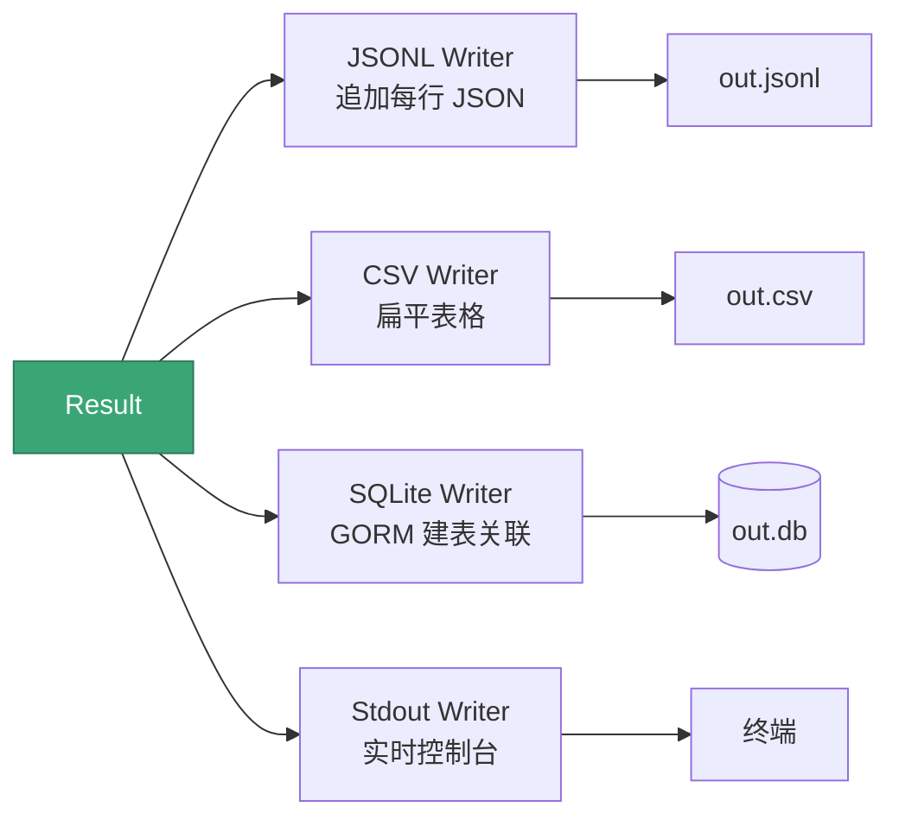

# 输出格式

<p align="center">📤 JSONL / CSV / SQLite / Stdout。</p>

`Result` 通过 `Writer` 接口分发到多种输出，可同时启用。

## 格式对比

| 格式 | 特点 | 适合 |
|------|------|------|
| JSONL | 每行一条 JSON，流式追加 | 管线、jq |
| CSV | 扁平表格 | Excel、BI |
| SQLite | 结构化、索引、关联查询 | 长期存储、分析 |
| Stdout | 实时控制台 | 调试 |

## JSONL

```bash
snir scan file -f urls.txt --write-jsonl
```

每行一个完整 `Result` JSON：

```bash
jq -c 'select(.failed==true)' results.jsonl
jq -c '{url,title,code:.response_code}' results.jsonl
```

流式追加，适合管线与下游脚本逐行处理。

## CSV

```bash
snir scan file -f urls.txt --write-csv --csv-file out.csv
```

扁平表格，嵌套字段（headers/network/cookies）会序列化或省略。需完整证据请用 JSONL/SQLite。

## SQLite

```bash
snir scan file -f urls.txt --db --db-path scan.db
```

GORM 自动建表，嵌套证据各自成表（`result_id` 关联，`OnDelete:CASCADE`）。索引字段：`html`/`title`/`perception_hash`/`perception_hash_group_id`。

查询见 [数据库存储](./database)。

## Stdout

```bash
snir scan example.com --write-stdout=false  # 关闭
```

## 多格式并存

```bash
snir scan file -f urls.txt \
  --write-jsonl --jsonl-file out.jsonl \
  --write-csv --csv-file out.csv \
  --db --db-path out.db \
  --write-stdout=false
```

`Result` 同时分发给所有启用的 Writer。一个 `Result` 扇出到多路输出的关系如下：



::: tip 💡 扇出与并发
`Writer` 之间互不阻塞，单次扫描的 `Result` 会被广播给所有启用的 Writer，因此 JSONL + SQLite + 截图可同时产出而无需多次扫描。
:::

## 文件命名

截图文件名经 `SanitizeFilename` 清理非法字符，保证跨平台安全。截图目录默认 `./screenshots/`。

## 下一步

- [输出选项 CLI](../cli/scan-output)
- [数据库选项 CLI](../cli/scan-db)
- [数据库存储](./database)
- [Result Schema](../reference/result-schema)
