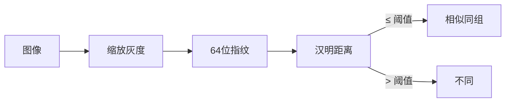
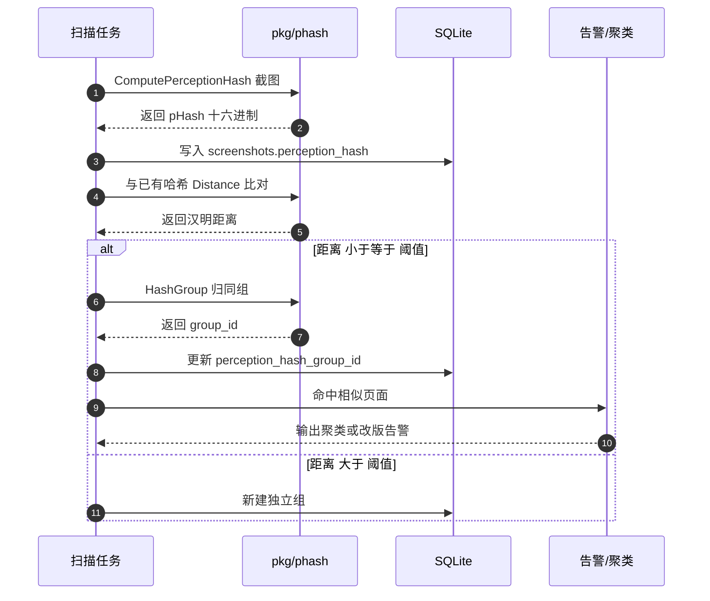

# 感知哈希

<p align="center">🧮 截图相似度与聚类。</p>

`pkg/phash` 基于图像感知哈希，实现去重与相似页面发现。

::: info 为什么用感知哈希
感知哈希把图像降为 64 位指纹，对**缩放/压缩/轻微改动作鲁棒**——同一页面的截图即使分辨率不同，哈希仍相近。比逐像素比对实用得多，适合"这个站和那个站是不是同一模板"这类判断。
:::

## 哈希算法

| 函数 | 算法 | 说明 |
|------|------|------|
| `ComputeHash` | dHash | 差值哈希 |
| `ComputePerceptionHash` | pHash | 感知哈希（DCT） |
| `ComputeAverageHash` | aHash | 均值哈希 |

每张截图自动计算并存入 `Result.PerceptionHash`（十六进制）。

## 距离与相似

```go
func Distance(hash1, hash2 string) (int, error)
func DistanceFromValues(h1, h2 uint64) int
func IsSimilar(hash1, hash2 uint64, threshold int) bool
```

汉明距离越小越相似。`threshold` 控制判定阈值。

## 聚类

`HashGroup` 把相似哈希归同组，赋予 `perception_hash_group_id`：

```go
type HashGroup struct { ... }
func NewHashGroup() *HashGroup
```

入库后可按 `group_id` 查询相似页面。

## 原理



感知哈希把图像降为 64 位指纹，对缩放/压缩/轻微改动作鲁棒。

## 用途

- 🔄 截图去重
- 🎭 相似页面发现（模板站、钓鱼站）
- 📈 改版检测（对比两次哈希距离）
- 🗂️ 视觉聚类归档

## 查询示例

```sql
-- 相似页面组
SELECT perception_hash_group_id, count(*), group_concat(host)
FROM screenshots
GROUP BY perception_hash_group_id
HAVING count(*) > 1;
```

扫描入库后比对哈希并归组、触发相似告警的时序：



## 下一步

- [pkg/phash](../internals/phash)
- [Result Schema](../reference/result-schema)
- [内容监控](../guide/monitoring)
