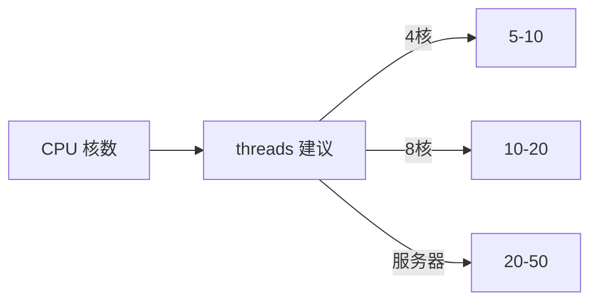

# 性能调优

<p align="center">⚡ 提升采集吞吐与资源效率。</p>

## 调优维度

| 维度 | 手段 |
|------|------|
| 并发 | `--threads` / `maxConcurrent` |
| 浏览器复用 | 共享池 / provider |
| 超时延迟 | `--timeout` / `--delay` |
| 截图体积 | JPEG + 质量 / `--skip-screenshot` |
| 远程 Chrome | `--wss` 分担 |
| 内存模式 | `ScreenshotBytes` / API MemoryWriter |

## 并发数



过多并发会触发目标限流、耗尽内存、降成功率。从 5-10 起步，观察失败率调整。

## 浏览器复用

- 进程内多任务：共享池（`Shared*`）
- 跨进程：`snir provider` + `--wss`

避免每任务启动 Chrome。见 [并发与池](./concurrency)。

## 超时与延迟

- 慢站点：`--timeout 60 --delay 3`
- 快站点批量：默认即可，减小 `--delay`

## 截图体积

- 批量存档用 JPEG：`--screenshot-format jpeg --screenshot-quality 80`
- 仅要证据：`--skip-screenshot`
- 内存模式不落盘：SDK `ScreenshotBytes` / API `MemoryWriter`

## 远程 Chrome

把浏览器压力转移到专用机器：

```bash
snir scan file -f urls.txt --threads 20 --wss ws://chrome-host:9222/...
```

## 资源监控

- `GET /stats` 看 API 并发
- `SharedPoolStats()` 看池负载
- 容器内存/CPU 监控

## 失败与重试

`--max-retries 3` 对不稳定目标重试，但过多重试降吞吐。配合代理轮换 `sequential` 策略。

## 下一步

- [并发与池](./concurrency)
- [远程 Chrome](./remote-chrome)
- [故障排查](./troubleshooting)
