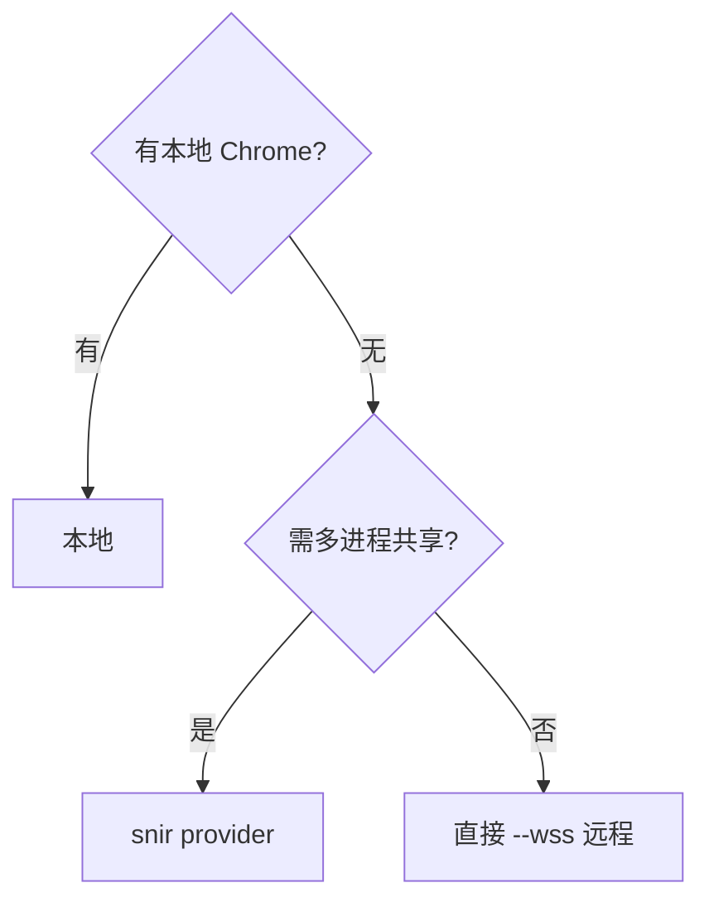

# 远程 Chrome

<p align="center">🌐 用远程 CDP 端点，免本地浏览器。</p>

无本地 Chrome 或需多进程复用时，连接远程 Chrome DevTools Protocol 端点。

## 连接

```bash
snir scan example.com --wss ws://host:9222/devtools/browser/<id>
```

`--wss` 指向远程 Chrome 的 WebSocket 调试 URL。

## 部署远程 Chrome

在服务器上启动 headless Chrome：

```bash
chromium --headless --remote-debugging-port=9222 --remote-debugging-address=0.0.0.0 \
  --no-sandbox --disable-gpu
```

获取 `webSocketDebuggerUrl`：

```bash
curl http://host:9222/json/version
```

## 共享 Provider

`snir provider` 启动常驻 Chrome 供多进程复用：

```bash
# 服务端
snir provider --port 9223 --max-concurrent 20

# 各 worker
snir scan example.com --wss ws://provider-host:9222/devtools/browser/<id>
```

见 [provider 命令](../cli/provider)。

## SDK

```go
client, _ := sdk.NewRemoteClient("ws://host:9222/devtools/browser/xxx", 10)
defer client.Close()
```

或自动连接：

```go
client, mode, _ := sdk.AutoConnectClient(opts)  // opts.WSSURL 指定远程
```

见 [自动连接](../sdk/autoconnect)。

## 决策



## 安全

- 远程调试端口勿暴露公网，限内网或加鉴权
- `--remote-debugging-address` 默认 127.0.0.1，开放需谨慎

## 下一步

- [provider 命令](../cli/provider)
- [Chrome 选项](../cli/scan-chrome)
- [自动连接](../sdk/autoconnect)
- [并发与池](./concurrency)
