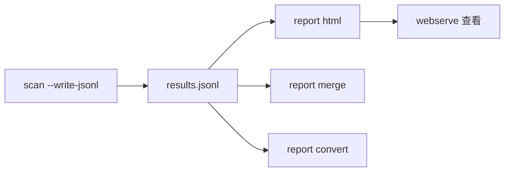

# 报告生成

<p align="center">📊 富 HTML 报告、转换、合并。</p>

`pkg/report` 处理采集产出，生成可视化报告。

## report html

从 JSONL 生成自包含富 HTML 报告：

```bash
snir scan file -f urls.txt --write-jsonl \
  --save-html --save-headers
snir report html -i results.jsonl -o report.html
snir webserve --dir .
```

报告包含：结果总览、截图缩略图网格、每结果元信息（URL/标题/状态码/技术栈/哈希）、证据展开。

## report convert

格式转换（如 JSONL → CSV）：

```bash
snir report convert -i results.jsonl -o results.csv
```

## report merge

合并多次扫描：

```bash
snir report merge -i batch1.jsonl -i batch2.jsonl -o merged.jsonl
snir report html -i merged.jsonl -o report.html
```

## webserve

本地 Web 服务托管产物：

```bash
snir webserve --host 0.0.0.0 --port 8080
```

浏览器访问查看报告与截图。

## 流程



## 内部

- `RichHTMLTemplate`：内置富 HTML 模板
- `ReadJSONLResults`：读 JSONL 反序列化
- `ReportData`：模板数据

见 [pkg/report](../internals/report)。

## 下一步

- [report 命令族](../cli/report)
- [pkg/report](../internals/report)
- [输出格式](./output-formats)
