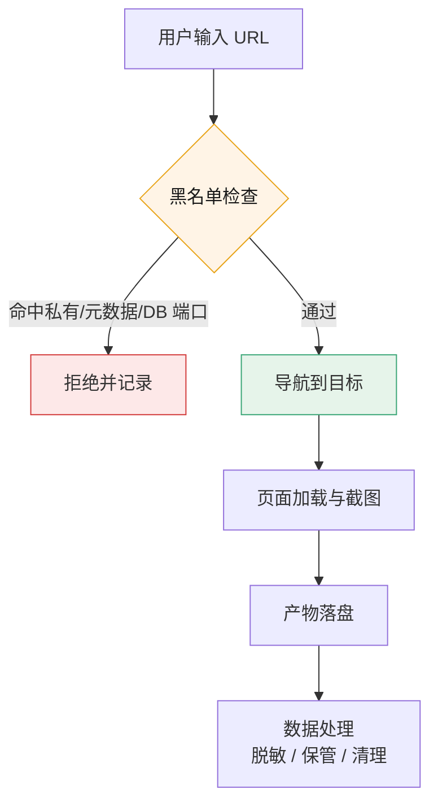
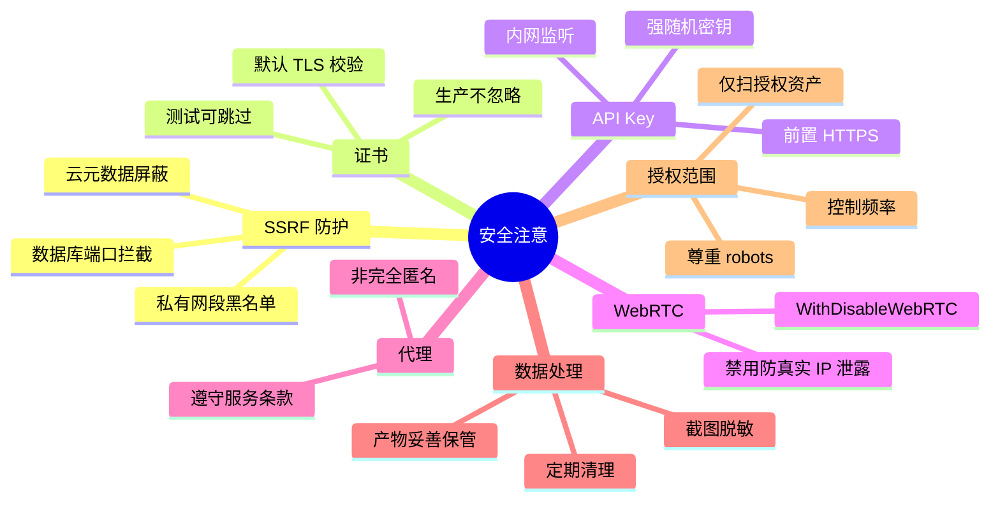

# 安全注意

🛡️ 安全与合规使用 snir。

::: warning 重要
仅在授权范围内使用 snir 扫描第三方资产。未经授权的扫描可能违法。
:::

## SSRF 防护

snir 默认黑名单屏蔽内网与云元数据地址，防 SSRF：

- 私有网段（10/8、172.16/12、192.168/16、fc00::/7）
- 云元数据（169.254.169.254、metadata.google.internal 等）
- 数据库端口（1433/3306/5432/6379）

请求在进入浏览器前的过滤链路如下：

**生产环境务必保留默认黑名单。** 仅在授权内网扫描时才 `--enable-blacklist=false`。见 [黑名单](./blacklist)。

## API 鉴权

- `--api-key` 强随机密钥
- 生产前置 HTTPS（反代）
- 内网监听 `--host 127.0.0.1`
- 不提交 key 到代码库

见 [API 鉴权](../api/auth)。

## 远程 Chrome 暴露面

- 远程调试端口勿暴露公网
- `--remote-debugging-address` 谨慎开放
- 限内网或加网络层鉴权

见 [远程 Chrome](./remote-chrome)。

## 数据处理

- 截图/HTML/Cookie 可能含敏感信息
- 妥善保管 SQLite/JSONL 产物
- 按合规要求定期清理
- 分享报告前脱敏

## 代理使用

- 遵守代理服务条款
- WebRTC 可能泄露真实 IP，配合 `WithDisableWebRTC()`
- 代理不等于完全匿名

## 授权范围

- 仅扫描授权资产
- 尊重 robots.txt 与服务条款
- 控制并发与频率，避免影响目标
- 不绕过访问控制

## 合规

- 遵守当地法律法规
- 企业内部使用遵循公司安全策略
- 保留审计日志

安全注意要点按维度分类：

## 下一步

- [黑名单](./blacklist)
- [API 鉴权](../api/auth)
- [远程 Chrome](./remote-chrome)
- [FAQ](../reference/faq)
