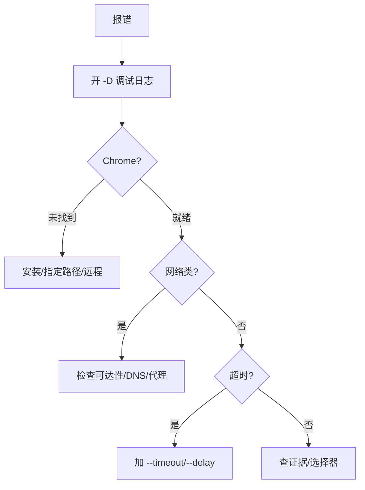

# 故障排查

<p align="center">🛠️ 常见问题与解决。</p>

## 排查流程



## 常见问题

### Chrome 未找到

```
ChromeNotFoundError
```

::: tip 三种解法（任选其一）
- 安装 Chrome/Chromium
- `--chrome-path /usr/bin/chromium` 显式指定路径
- 用远程 `--wss` 连接远程 Chrome，免本地浏览器
:::

### 超时

```
扫描超时: 无法在指定时间内完成页面加载
```

::: warning 慢站点三板斧
- `--timeout 60` 加大整体超时
- `--delay 3` 加载后额外等待异步内容
- 检查网络与目标可达性
:::

### net::ERR_*

| 错误 | 含义 | 处理 |
|------|------|------|
| `ERR_CONNECTION_REFUSED` | 目标端口无服务 | 确认端口/服务 |
| `ERR_NAME_NOT_RESOLVED` | DNS 问题 | 查 DNS/换 DNS |
| `ERR_TIMED_OUT` | 网络慢 | 加超时、查代理 |

### Could not find node with given id

元素截图时元素不存在：

- 网站慢 → `--timeout`/`--delay`
- 反爬虫
- 选择器/XPath 不对，确认页面结构
- 用 `ActionWaitVisible` 等元素出现

### 证书错误

::: warning 仅测试环境用 `--ignore-cert-errors`
- **测试环境**：自签名证书可用 `--ignore-cert-errors` 跳过
- **生产环境**：修复证书，**切勿**忽略，否则失去 TLS 验证意义
:::

### 截图为空/白屏

::: tip 三步排查
1. **页面 JS 渲染** → 需等待：`--delay`
2. **懒加载** → 滚动触发：`--js "scrollTo(...)"` 或 `ActionScroll`
3. **反爬虫阻断** → 换 UA/指纹/代理
:::

### API 503/拒绝

::: info 并发超载
并发超 `--max-concurrent`，队列满 `--queue-size`。`GET /stats` 查负载，降并发或扩队列。
:::

### 批量失败率高

::: warning 多因素排查
- **目标限流**：降 `--threads`、加代理轮换
- **不稳定目标**：`--max-retries`
- **网络/代理问题**：排查 `net::ERR_*`
:::

## 调试日志

```bash
snir scan example.com -D
```

输出详细 CDP 交互过程，定位问题。

## 下一步

- [错误码](../reference/error-codes)
- [性能调优](./performance)
- [FAQ](../reference/faq)
