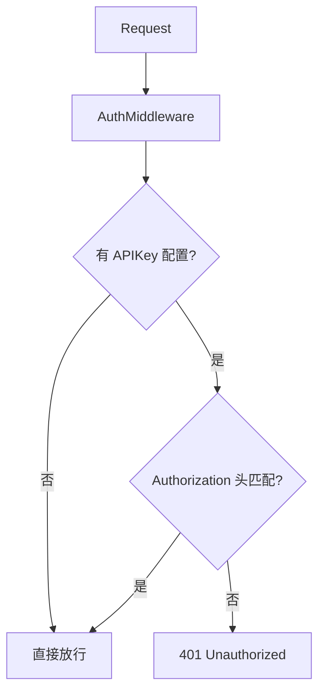
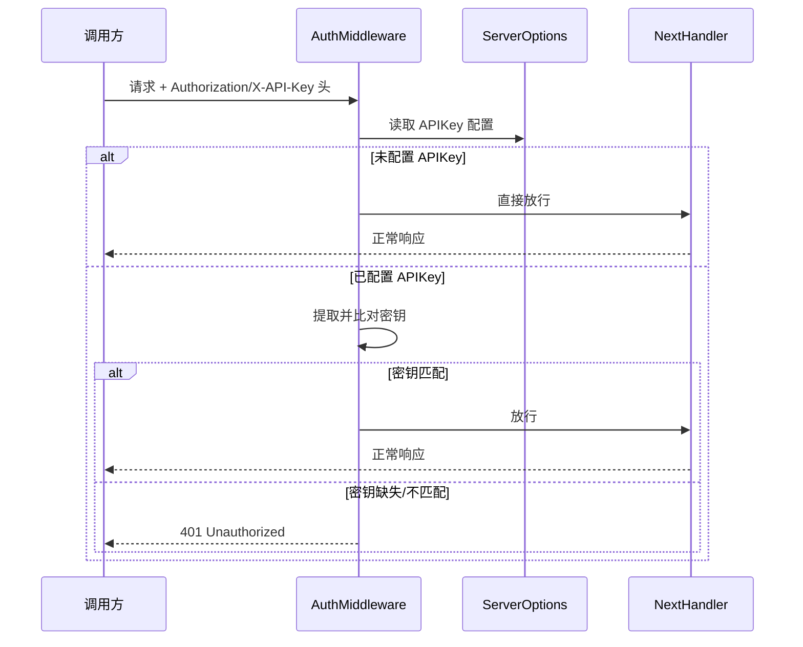

# API 鉴权

<p align="center">🔑 `pkg/api/middleware.go` — API Key 鉴权。</p>

> 📁 源码：[`pkg/api/middleware.go`](https://github.com/cyberspacesec/snir-skills/blob/main/pkg/api/middleware.go)

## 方法

| 符号 | 源码 | 说明 |
|------|------|------|
| `(*Server) CreateAuthMiddleware()` | [L11](https://github.com/cyberspacesec/snir-skills/blob/main/pkg/api/middleware.go#L11) | 鉴权中间件 |

## 鉴权流程



## 鉴权时序

下图展示一次请求的鉴权交互：中间件读取配置与请求头，比对密钥后决定放行或返回 401。未配置 `--api-key` 时直接放行（仅本地测试）。



## 使用

客户端在请求头携带密钥：

```http
POST /screenshot
Authorization: Bearer <api-key>
Content-Type: application/json

{"url":"https://example.com"}
```

或 `X-API-Key: <api-key>`。

## 配置

`--api-key <secret>` 设置密钥。未设置则不鉴权（仅本地测试用）。

::: warning
生产务必设置强随机 `--api-key`，并前置 HTTPS 反代。见 [安全](../advanced/security)。
:::

## 下一步

- [中间件](./middleware)
- [安全](../advanced/security)
- [CLI api auth](../cli/api-auth)
- [API 总览](./overview)
