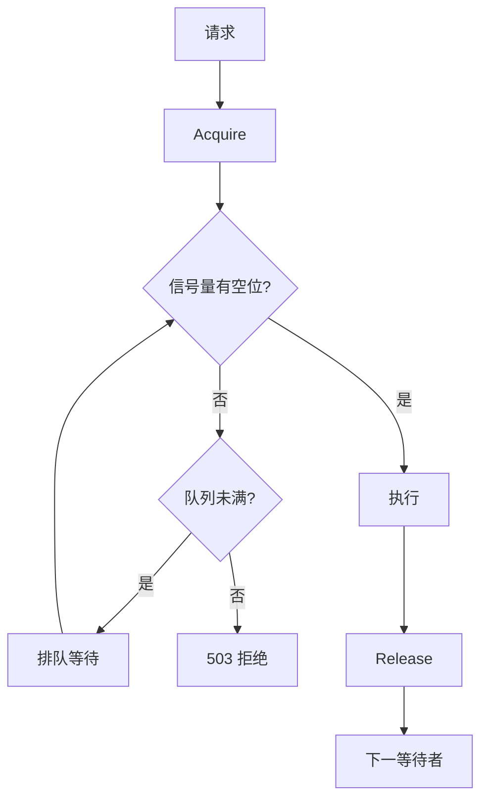
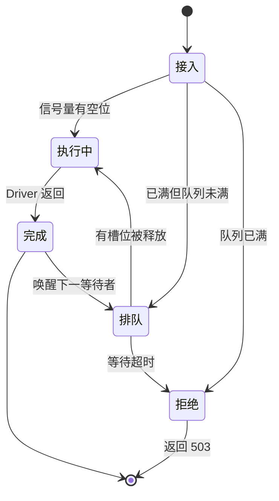

# 并发限流

🚦 `pkg/api/concurrency.go` — 并发上限与等待队列。

> 📁 源码：[`pkg/api/concurrency.go`](https://github.com/cyberspacesec/snir-skills/blob/main/pkg/api/concurrency.go)

## 类型

| 符号 | 源码 | 说明 |
|------|------|------|
| `ConcurrencyLimiter` | [L15](https://github.com/cyberspacesec/snir-skills/blob/main/pkg/api/concurrency.go#L15) | 限流器 |
| `NewConcurrencyLimiter(max, queue)` | [L25](https://github.com/cyberspacesec/snir-skills/blob/main/pkg/api/concurrency.go#L25) | 带队列构造 |
| `NewBasicConcurrencyLimiter(max)` | [L44](https://github.com/cyberspacesec/snir-skills/blob/main/pkg/api/concurrency.go#L44) | 无队列构造 |
| `ProcessConcurrent(...)` | [L137](https://github.com/cyberspacesec/snir-skills/blob/main/pkg/api/concurrency.go#L137) | 并发处理批量 |
| `(*Server) CreateConcurrencyLimitMiddleware()` | [L167](https://github.com/cyberspacesec/snir-skills/blob/main/pkg/api/concurrency.go#L167) | mux 中间件 |

## 模型

## 请求状态流转

下图展示单个请求在 `--max-concurrent` 与 `--queue-size` 约束下的状态机：从接入到执行、排队或被拒绝的完整流转，以及释放槽位后唤醒等待者。

## 两个构造器

| 构造器 | 队列 | 满时行为 |
|--------|------|---------|
| `NewConcurrencyLimiter` | 有 | 排队等待 |
| `NewBasicConcurrencyLimiter` | 无 | 立即拒绝 |

API 服务用前者，`--queue-size` 控制队列深度。

## 统计

`GetConcurrencyStats`（[server.go#L98](https://github.com/cyberspacesec/snir-skills/blob/main/pkg/api/server.go#L98)）返回 `active/waiting/max/queue/uptime`，`GET /stats` 暴露。

## 配置

::: warning max-concurrent 不是越大越好
- `--max-concurrent N`：并发上限，**建议 ≤ Chrome 池大小**——超过池大小请求只能排队等 Driver，徒增延迟
- `--queue-size N`：等待队列深度，缓冲突发流量

队列满返回 **503**，客户端应**退避重试**（指数退避，别立即重打）。见 [故障排查](../advanced/troubleshooting)。
:::

## 下一步

- [中间件](./middleware)
- [GET /stats](./endpoint-stats)
- [并发与池](../advanced/concurrency)
- [pkg/api（内部）](../internals/api)
