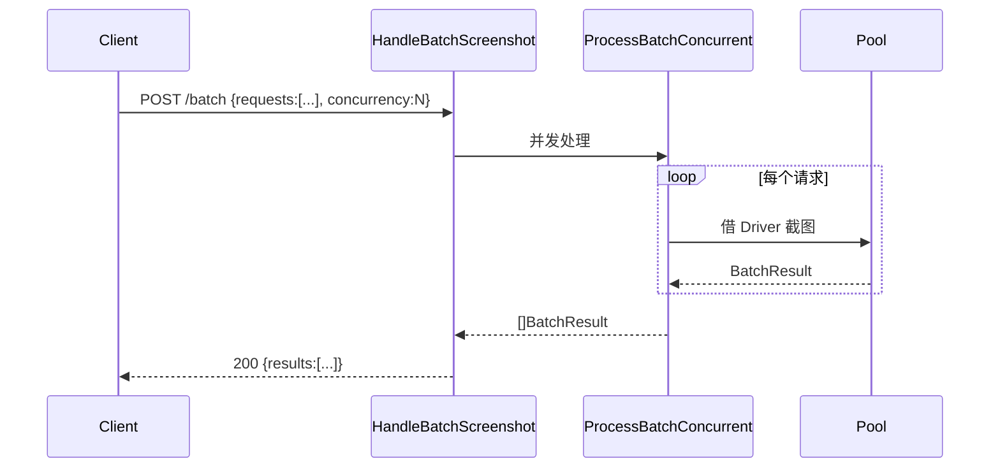

# POST /batch

<p align="center">🗂️ 批量截图端点。</p>

> 📁 源码：[`pkg/api/batch.go`](https://github.com/cyberspacesec/snir-skills/blob/main/pkg/api/batch.go)

## Handler

| 符号 | 源码 | 说明 |
|------|------|------|
| `HandleBatchScreenshot` | [L13](https://github.com/cyberspacesec/snir-skills/blob/main/pkg/api/batch.go#L13) | `POST /batch` |
| `ProcessBatchConcurrent` | [L167](https://github.com/cyberspacesec/snir-skills/blob/main/pkg/api/batch.go#L167) | 并发处理 |

## 流程



## 请求体

`BatchScreenshotRequest`（[types.go#L113](https://github.com/cyberspacesec/snir-skills/blob/main/pkg/api/types.go#L113)）：

```json
{
  "requests": [
    {"url":"https://a.com","fullPage":true},
    {"url":"https://b.com"}
  ],
  "concurrency": 5
}
```

## 响应

返回 `[]BatchResult`，每条含目标、结果、错误（[types.go#L191](https://github.com/cyberspacesec/snir-skills/blob/main/pkg/api/types.go#L191)）。

## 并发

::: info 两层并发，别搞混
- **批次内并发**：请求体 `concurrency` 字段控制本批次内同时跑几个
- **服务级并发**：整个 `/batch` 请求受 `ConcurrencyLimiter` 约束，仍占 `--max-concurrent` 名额

`ProcessBatchConcurrent` 用 goroutine + 信号量控制批次内并发，受服务级 [`ConcurrencyLimiter`](./concurrency) 约束。
:::

## 示例

```bash
curl -X POST http://localhost:8080/batch \
  -H "Authorization: Bearer $KEY" \
  -H "Content-Type: application/json" \
  -d @batch.json
```

## 下一步

- [POST /screenshot](./endpoint-screenshot)
- [请求类型](./request-types)
- [并发限流](./concurrency)
- [CLI api](../cli/api)
