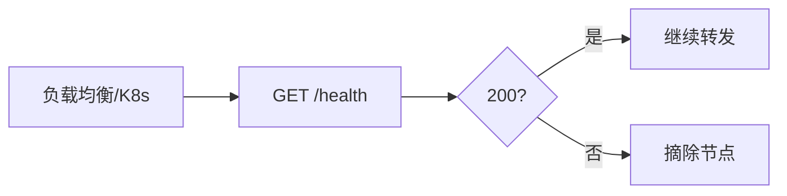

# GET /health

<p align="center">💚 健康检查端点。</p>

> 📁 源码：[`pkg/api/server.go`](https://github.com/cyberspacesec/snir-skills/blob/main/pkg/api/server.go)

## Handler

| 符号 | 源码 | 说明 |
|------|------|------|
| `HandleHealth` | [L175](https://github.com/cyberspacesec/snir-skills/blob/main/pkg/api/server.go#L175) | `GET /health` |

## 响应

返回服务存活状态，常用于负载均衡/容器探针：

```json
{ "success": true, "data": { "status": "ok" } }
```

## 用途



::: info 探针专用，无需鉴权
`/health` **不触发截图、不查 DB**，只返回进程存活——所以无需鉴权，方便负载均衡/K8s 探针高频调用而不增负担。返回 200 即健康继续转发，非 200/超时则摘除节点重启容器。
:::

## 下一步

- [GET /stats](./endpoint-stats)
- [API 总览](./overview)
- [Docker](../advanced/docker)
