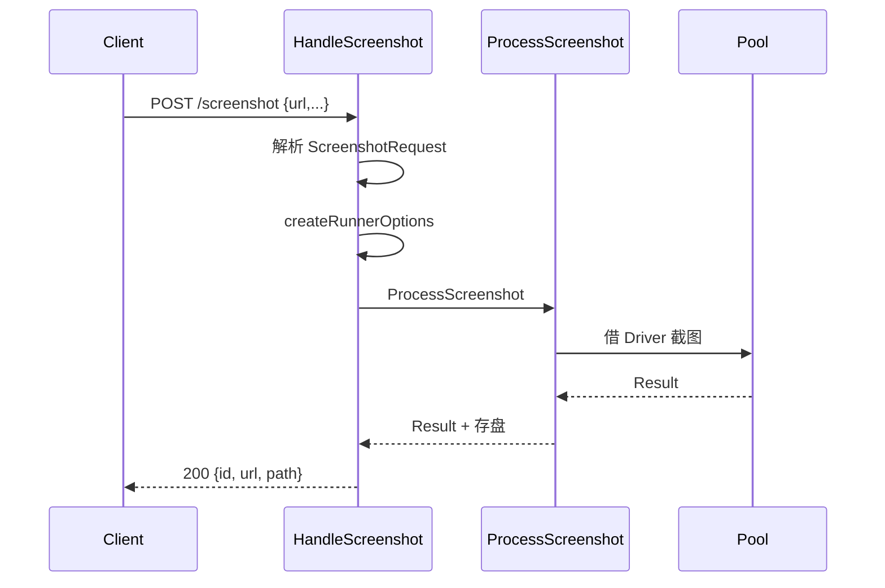

# POST /screenshot

<p align="center">📸 单次截图端点。</p>

> 📁 源码：[`pkg/api/screenshot.go`](https://github.com/cyberspacesec/snir-skills/blob/main/pkg/api/screenshot.go)

## Handler

| 符号 | 源码 | 说明 |
|------|------|------|
| `HandleScreenshot` | [L19](https://github.com/cyberspacesec/snir-skills/blob/main/pkg/api/screenshot.go#L19) | `POST /screenshot` |
| `HandleGetScreenshot` | [L77](https://github.com/cyberspacesec/snir-skills/blob/main/pkg/api/screenshot.go#L77) | `GET /screenshot/:id` |
| `HandleListScreenshots` | [L319](https://github.com/cyberspacesec/snir-skills/blob/main/pkg/api/screenshot.go#L319) | `GET /screenshots` |
| `createRunnerOptions` | [L125](https://github.com/cyberspacesec/snir-skills/blob/main/pkg/api/screenshot.go#L125) | 请求→Options |
| `ensureProtocol` | [L296](https://github.com/cyberspacesec/snir-skills/blob/main/pkg/api/screenshot.go#L296) | 补协议 |

## 流程



## 请求示例

```bash
curl -X POST http://localhost:8080/screenshot \
  -H "Authorization: Bearer $KEY" \
  -H "Content-Type: application/json" \
  -d '{"url":"https://example.com","fullPage":true,"format":"png"}'
```

## 取回

- `GET /screenshot/:id`：取单张截图（图片或元信息）
- `GET /screenshots`：列出已存截图（`ScreenshotInfo`）

## 字段

请求体字段见 [请求类型](./request-types)，响应见 [响应格式](./response)。

## 下一步

- [请求类型](./request-types)
- [响应格式](./response)
- [POST /batch](./endpoint-batch)
- [CLI api](../cli/api)
