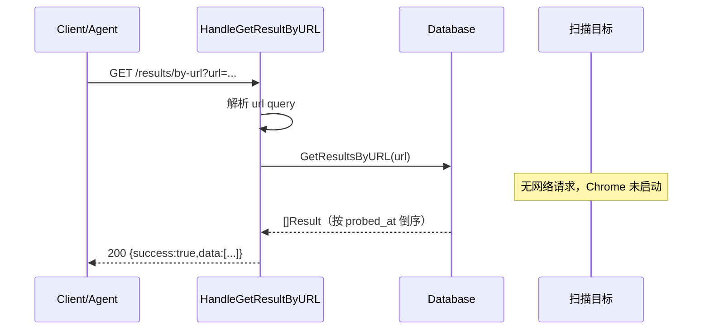

# 结果检索端点

<p align="center">🗄️ 只读检索已存储的历史扫描结果。</p>

> 📁 源码：[`pkg/api/results.go`](https://github.com/cyberspacesec/snir-skills/blob/main/pkg/api/results.go) · 路由注册：[`pkg/api/server_methods.go`](https://github.com/cyberspacesec/snir-skills/blob/main/pkg/api/server_methods.go#L120)

## 启用方式

`/results` 系列端点依赖数据库。启动 api 时必须带 `--db-path` 指向一个 SQLite 文件：

```bash
snir api --db-path ./data/snir.db
```

未带 `--db-path`（或文件不可写）时，所有 `/results*` 请求返回 `503 Service Unavailable`，响应体：

```json
{ "success": false, "error": "服务端未启用数据库：请用 --db-path 启动 snir api" }
```

## 端点

| 方法 | 路径 | 说明 |
|------|------|------|
| `GET` | `/results?limit=N` | 列出所有历史扫描结果（按 `probed_at` 倒序），`limit` 默认 100、上限 1000 |
| `GET` | `/results/{id}` | 按主键 `id` 检索单个结果 |
| `GET` | `/results/by-url?url=...` | 按精确 URL 查询该 URL 的全部历史记录 |
| `GET` | `/results/by-host?host=...` | 按 host 前缀模糊查询（如 `example.com` 命中 `example.com`、`sub.example.com`） |

::: warning 路由顺序
`/results/by-url` 与 `/results/by-host` 必须在 `/results/{id}` 之前注册，否则会被 `{id}` 捕获而误判 `by-url` 为非法 id。源码已按此顺序注册。
:::

## Handler

| 符号 | 源码 | 说明 |
|------|------|------|
| `HandleListResults` | [L36](https://github.com/cyberspacesec/snir-skills/blob/main/pkg/api/results.go#L36) | `GET /results` |
| `HandleGetResult` | [L72](https://github.com/cyberspacesec/snir-skills/blob/main/pkg/api/results.go#L72) | `GET /results/{id}` |
| `HandleGetResultByURL` | [L105](https://github.com/cyberspacesec/snir-skills/blob/main/pkg/api/results.go#L105) | `GET /results/by-url` |
| `HandleGetResultByHost` | [L132](https://github.com/cyberspacesec/snir-skills/blob/main/pkg/api/results.go#L132) | `GET /results/by-host` |

## 鉴权

与所有受保护端点一致，使用 `X-API-Key` 请求头：

```
X-API-Key: <your-key>
```

未带 key 或 key 不匹配时返回 `401 Unauthorized`。鉴权中间件细节见 [鉴权](./auth)。

## 响应格式

统一 `APIResponse` 信封，`data` 为单个 [`Result`](./response) 或 `Result` 数组：

```json
{
  "success": true,
  "message": "",
  "data": {
    "id": 1,
    "url": "https://example.com/",
    "response_code": 200,
    "title": "Example Domain",
    "host": "example.com",
    "probed_at": "2026-07-18T12:34:56Z"
  }
}
```

`Result` 完整字段见 [pkg/models](https://github.com/cyberspacesec/snir-skills/blob/main/pkg/models/models.go#L22)；主要 JSON tag：`id`、`url`、`response_code`、`title`、`host`、`probed_at`、`screenshot`、`failed`。

## curl 示例

```bash
# 列出最近 50 条历史结果
curl -s "http://127.0.0.1:8080/results?limit=50" \
  -H "X-API-Key: <key>" | jq

# 按精确 URL 查询该 URL 的全部历史扫描
curl -s "http://127.0.0.1:8080/results/by-url?url=https://example.com/" \
  -H "X-API-Key: <key>" | jq

# 按 host 前缀模糊查询（命中 example.com 与子域）
curl -s "http://127.0.0.1:8080/results/by-host?host=example.com" \
  -H "X-API-Key: <key>" | jq
```

## Go SDK 示例

`pkg/sdk` 提供 `HTTPClient`——与进程内 `Client`（driver 直连 Chrome）平行的轻量 HTTP 客户端，专用于结果检索等只读端点，不启动 Chrome：

```go
import "github.com/cyberspacesec/snir-skills/pkg/sdk"

client := sdk.NewHTTPClient(sdk.HTTPClientOptions{
    BaseURL: "http://127.0.0.1:8080",
    APIKey:  "<key>",
})

// 按主键检索
result, err := client.GetResult(1)

// 按 URL 查询该 URL 的全部历史
results, err := client.GetResultByURL("https://example.com/")

// 列出全部历史（limit<=0 用服务端默认 100，limit>1000 由服务端截断为 1000）
all, err := client.ListResults(100)
```

`HTTPClient` 在服务端返回 503 时给出明确错误：`服务端未启用数据库：请用 --db-path 启动 snir api`，便于 Agent 自动诊断配置问题。

## 检索时序

下图展示一次 `GET /results/by-url?url=...` 检索链路：Handler 解析 query、调用数据库层 `GetResultsByURL`、封装 `APIResponse` 返回，全程不启动 Chrome、不发任何网络请求到扫描目标。



## 与扫描端点的区别

::: important AI Agent 接入必读
`/results` 与 `/screenshot` `/batch` 是两类完全不同的端点，混用会得到错误结果：

- **`POST /screenshot`、`POST /batch`** — 触发**新扫描**：启动 Chrome、向扫描目标发真实网络请求、生成截图与 HTML、落盘入库。
- **`GET /results*`** — **只检索**已存储的历史扫描结果：读数据库、不启动 Chrome、不向目标发任何网络请求。

Agent 接入决策：

| 意图 | 用哪个端点 |
|------|------------|
| 扫描一个新目标、拿到本次截图与响应 | `POST /screenshot` |
| 批量扫描一批新目标 | `POST /batch` |
| 查询某 URL / 某 host 之前扫过的历史 | `GET /results*` |
| 按 id 取回某次历史扫描的完整记录 | `GET /results/{id}` |

典型工作流：先 `/screenshot` 扫描并入库，后续任何"这个 URL 之前扫成什么样"的查询都走 `/results*`，零成本复用历史数据。
:::

## 下一步

- [POST /screenshot](./endpoint-screenshot)
- [POST /batch](./endpoint-batch)
- [响应格式](./response)
- [鉴权](./auth)
- [CLI api](../cli/api)
