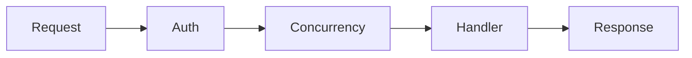
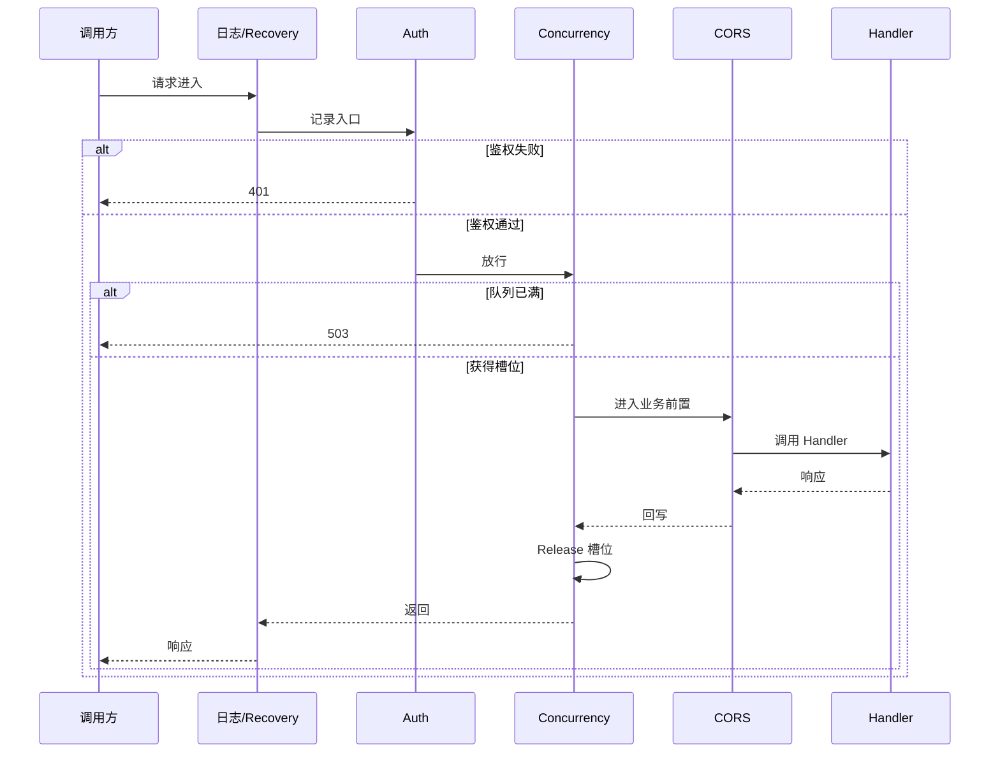

# 中间件

🧱 `pkg/api/middleware.go` + `concurrency.go` — 请求处理链。

> 📁 源码：[`middleware.go`](https://github.com/cyberspacesec/snir-skills/blob/main/pkg/api/middleware.go) · [`concurrency.go`](https://github.com/cyberspacesec/snir-skills/blob/main/pkg/api/concurrency.go)

## 中间件

| 符号 | 源码 | 说明 |
|------|------|------|
| `CreateAuthMiddleware` | [middleware.go#L11](https://github.com/cyberspacesec/snir-skills/blob/main/pkg/api/middleware.go#L11) | 鉴权 |
| `CreateConcurrencyLimitMiddleware` | [concurrency.go#L167](https://github.com/cyberspacesec/snir-skills/blob/main/pkg/api/concurrency.go#L167) | 并发限流 |

## 链顺序

鉴权在前：未授权请求不占用并发槽位。

::: tip 顺序很关键：Auth 必须在 Concurrency 前
若 Concurrency 在前，未授权的垃圾请求也会占满并发槽位，把合法请求挤到队列——等于 DoS 放大。Auth 先过滤掉非法请求，再让通过的进入并发控制，是正确的防御顺序。
:::

## 中间件链时序

下图展示一次请求穿过中间件链的完整时序：日志记录入口→鉴权过滤→并发限流获取槽位→（可选 CORS）→进入业务 Handler，再沿链路返回响应。鉴权失败或队列满都会提前短路。

## 注册

[`SetupRoutes`](https://github.com/cyberspacesec/snir-skills/blob/main/pkg/api/server_methods.go#L90) 把中间件应用到路由组。

## 扩展

可自行加日志/Recovery/CORS 中间件，遵循 gorilla/mux `func(http.Handler) http.Handler` 签名。

## 下一步

- [鉴权](./auth)
- [并发限流](./concurrency)
- [Server](./server)
- [API 总览](./overview)
