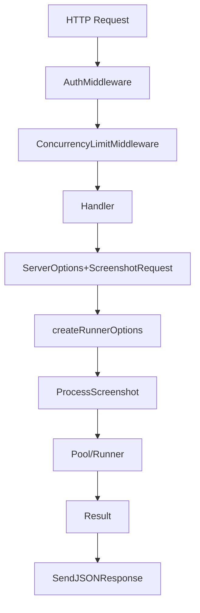

# HTTP API 总览

<p align="center">🌐 `pkg/api` — 把 snir 暴露为 HTTP 服务。</p>

`pkg/api` 基于 gorilla/mux 提供 HTTP 接口，让非 Go 程序也能调用 snir，支持鉴权、并发限流、队列。

> 📁 源码目录：[`pkg/api/`](https://github.com/cyberspacesec/snir-skills/blob/main/pkg/api)

## 文件结构

| 文件 | 源码 | 职责 |
|------|------|------|
| `types.go` | [types.go](https://github.com/cyberspacesec/snir-skills/blob/main/pkg/api/types.go) | 请求/响应/Server 类型 |
| `server_methods.go` | [server_methods.go](https://github.com/cyberspacesec/snir-skills/blob/main/pkg/api/server_methods.go) | Server 方法、路由 |
| `server.go` | [server.go](https://github.com/cyberspacesec/snir-skills/blob/main/pkg/api/server.go) | 健康统计、并发入口 |
| `screenshot.go` | [screenshot.go](https://github.com/cyberspacesec/snir-skills/blob/main/pkg/api/screenshot.go) | 截图端点 |
| `batch.go` | [batch.go](https://github.com/cyberspacesec/snir-skills/blob/main/pkg/api/batch.go) | 批量端点 |
| `concurrency.go` | [concurrency.go](https://github.com/cyberspacesec/snir-skills/blob/main/pkg/api/concurrency.go) | 并发限流器 |
| `middleware.go` | [middleware.go](https://github.com/cyberspacesec/snir-skills/blob/main/pkg/api/middleware.go) | 鉴权中间件 |
| `helpers.go` | [helpers.go](https://github.com/cyberspacesec/snir-skills/blob/main/pkg/api/helpers.go) | 辅助函数 |

## 端点一览

| 方法 | 路径 | 说明 | 详解 |
|------|------|------|------|
| POST | `/screenshot` | 单次截图 | [→](./endpoint-screenshot) |
| GET | `/screenshot/:id` | 取已存截图 | [→](./endpoint-screenshot) |
| GET | `/screenshots` | 列出截图 | [→](./endpoint-screenshot) |
| POST | `/batch` | 批量截图 | [→](./endpoint-batch) |
| GET | `/health` | 健康检查 | [→](./endpoint-health) |
| GET | `/stats` | 统计 | [→](./endpoint-stats) |

## 请求处理链



## 启动

::: tip 生产启动最小参数
```bash
snir api --host 127.0.0.1 --port 8080 \
  --api-key $(openssl rand -hex 32) \
  --max-concurrent 10 --queue-size 100
```
- `--host 127.0.0.1`：仅本机，公网暴露交给反代
- `--api-key`：强随机，勿用弱口令
- `--max-concurrent`：建议 ≤ Chrome 池大小，否则请求排队
:::

见 [CLI api](../cli/api) 与 [安全](../advanced/security)。

## 内部视角

实现细节见 [pkg/api（内部）](../internals/api)。

## 下一步

- [Server 与选项](./server)
- [请求类型](./request-types)
- [鉴权](./auth)
- [并发限流](./concurrency)
- [POST /screenshot](./endpoint-screenshot)
