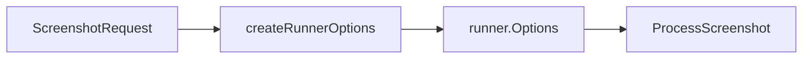
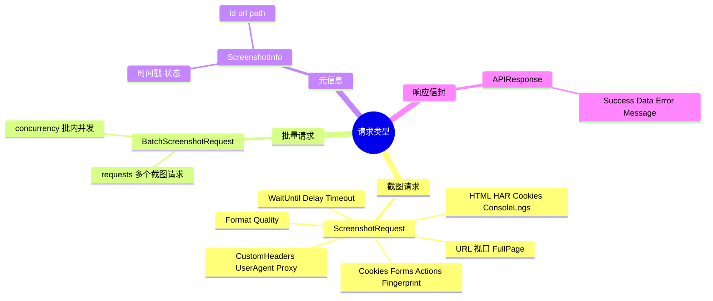

# 请求类型

📨 `pkg/api/types.go` — API 数据契约。

> 📁 源码：[`pkg/api/types.go`](https://github.com/cyberspacesec/snir-skills/blob/main/pkg/api/types.go)

## 类型

| 符号 | 源码 | 说明 |
|------|------|------|
| `APIResponse` | [L13](https://github.com/cyberspacesec/snir-skills/blob/main/pkg/api/types.go#L13) | 统一响应 |
| `InteractionAction` | [L21](https://github.com/cyberspacesec/snir-skills/blob/main/pkg/api/types.go#L21) | 交互动作 |
| `FormField` | [L31](https://github.com/cyberspacesec/snir-skills/blob/main/pkg/api/types.go#L31) | 表单字段 |
| `Form` | [L39](https://github.com/cyberspacesec/snir-skills/blob/main/pkg/api/types.go#L39) | 表单 |
| `CustomCookie` | [L47](https://github.com/cyberspacesec/snir-skills/blob/main/pkg/api/types.go#L47) | 自定义 Cookie |
| `BrowserFingerprint` | [L57](https://github.com/cyberspacesec/snir-skills/blob/main/pkg/api/types.go#L57) | 指纹 |
| `ScreenshotRequest` | [L73](https://github.com/cyberspacesec/snir-skills/blob/main/pkg/api/types.go#L73) | 截图请求体 |
| `BatchScreenshotRequest` | [L113](https://github.com/cyberspacesec/snir-skills/blob/main/pkg/api/types.go#L113) | 批量请求体 |
| `ScreenshotInfo` | [L204](https://github.com/cyberspacesec/snir-skills/blob/main/pkg/api/types.go#L204) | 截图元信息 |

## ScreenshotRequest 字段

| 字段 | 说明 |
|------|------|
| `URL` | 目标 |
| `ViewportWidth/Height` | 视口 |
| `FullPage` | 整页 |
| `Format/Quality` | 输出格式 |
| `WaitUntil/Delay/Timeout` | 等待策略 |
| `HTML/HAR/Cookies/ConsoleLogs` | 证据开关 |
| `CustomHeaders/UserAgent` | 请求定制 |
| `Proxy` | 代理 |
| `Cookies []CustomCookie` | 注入 Cookie |
| `Forms []Form` | 表单提交 |
| `Actions []InteractionAction` | 交互动作 |
| `Fingerprint` | 指纹 |

## 请求→Options 转换

[`createRunnerOptions`](https://github.com/cyberspacesec/snir-skills/blob/main/pkg/api/screenshot.go#L125) 把 `ScreenshotRequest` 映射为 `runner.Options`：

## 请求类型分类

下图按端点维度归纳 API 的请求类型与各自的关键字段，便于快速对照"该端点接受什么"。

## BatchScreenshotRequest

`BatchScreenshotRequest` 包含 `[]ScreenshotRequest` 与并发参数，由 [`HandleBatchScreenshot`](https://github.com/cyberspacesec/snir-skills/blob/main/pkg/api/batch.go#L13) 处理。

## 下一步

- [POST /screenshot](./endpoint-screenshot)
- [POST /batch](./endpoint-batch)
- [响应格式](./response)
- [Server](./server)
