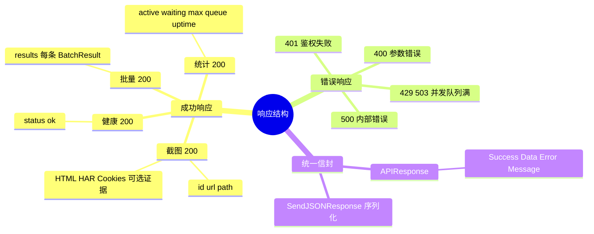
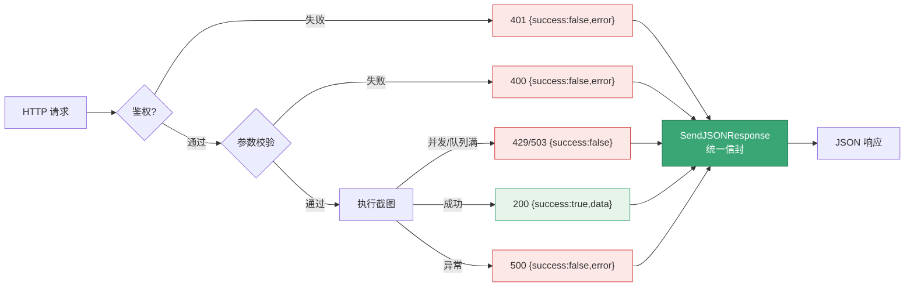

# 响应格式

<p align="center">📤 `pkg/api/types.go` + `helpers.go` — 统一响应。</p>

> 📁 源码：[`types.go`](https://github.com/cyberspacesec/snir-skills/blob/main/pkg/api/types.go) · [`helpers.go`](https://github.com/cyberspacesec/snir-skills/blob/main/pkg/api/helpers.go)

## APIResponse

[`APIResponse`](https://github.com/cyberspacesec/snir-skills/blob/main/pkg/api/types.go#L13) 是所有 JSON 响应的统一信封：

| 字段 | 说明 |
|------|------|
| `Success` | 是否成功 |
| `Data` | 数据载荷 |
| `Error` | 错误信息 |
| `Message` | 提示 |

## 示例

成功：

```json
{
  "success": true,
  "data": { "id": "abc123", "url": "https://example.com" },
  "message": "screenshot captured"
}
```

失败：

```json
{
  "success": false,
  "error": "scan timeout",
  "message": "无法在指定时间内完成页面加载"
}
```

## 输出

[`SendJSONResponse`](https://github.com/cyberspacesec/snir-skills/blob/main/pkg/api/helpers.go#L41) 设置状态码与 `Content-Type: application/json`，序列化 `APIResponse` 写回。

## 响应结构分类

下图按"成功/错误"两条主线归纳响应结构与各端点的返回字段，所有出口都套同一 `APIResponse` 信封。



## 状态码

| 码 | 场景 |
|----|------|
| 200 | 成功 |
| 400 | 请求参数错误 |
| 401 | 鉴权失败 |
| 429/503 | 并发/队列满 |
| 500 | 内部错误 |

请求到响应的统一处理链路：所有出口都套同一 `APIResponse` 信封，由 `SendJSONResponse` 序列化：



## 下一步

- [请求类型](./request-types)
- [辅助函数](./helpers)
- [POST /screenshot](./endpoint-screenshot)
