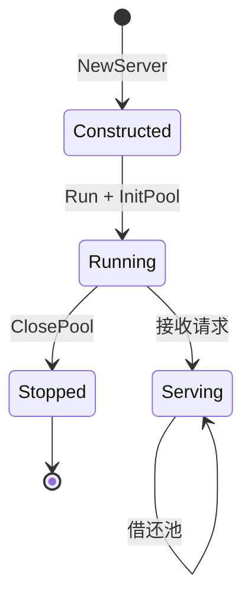

# Server 与选项

🖥️ `pkg/api/types.go` / `server_methods.go` — 服务主体。

> 📁 源码：[`types.go`](https://github.com/cyberspacesec/snir-skills/blob/main/pkg/api/types.go) · [`server_methods.go`](https://github.com/cyberspacesec/snir-skills/blob/main/pkg/api/server_methods.go)

## 类型

| 符号 | 源码 | 说明 |
|------|------|------|
| `ServerOptions` | [types.go#L154](https://github.com/cyberspacesec/snir-skills/blob/main/pkg/api/types.go#L154) | 服务配置 |
| `Server` | [types.go#L175](https://github.com/cyberspacesec/snir-skills/blob/main/pkg/api/types.go#L175) | 服务主体 |
| `MemoryWriter` | [types.go#L185](https://github.com/cyberspacesec/snir-skills/blob/main/pkg/api/types.go#L185) | 内存结果存储 |
| `NewServer(options)` | [server_methods.go#L15](https://github.com/cyberspacesec/snir-skills/blob/main/pkg/api/server_methods.go#L15) | 构造 |

## Server 方法

| 方法 | 源码 | 说明 |
|------|------|------|
| `InitPool(opts)` | [L27](https://github.com/cyberspacesec/snir-skills/blob/main/pkg/api/server_methods.go#L27) | 初始化浏览器池 |
| `ClosePool()` | [L38](https://github.com/cyberspacesec/snir-skills/blob/main/pkg/api/server_methods.go#L38) | 关闭池 |
| `GetBlacklist(opts)` | [L45](https://github.com/cyberspacesec/snir-skills/blob/main/pkg/api/server_methods.go#L45) | 取黑名单 |
| `ProcessScreenshot(req, opts)` | [L51](https://github.com/cyberspacesec/snir-skills/blob/main/pkg/api/server_methods.go#L51) | 执行截图 |
| `SetupRoutes()` | [L90](https://github.com/cyberspacesec/snir-skills/blob/main/pkg/api/server_methods.go#L90) | 注册路由 |
| `HandleRoot` | [L119](https://github.com/cyberspacesec/snir-skills/blob/main/pkg/api/server_methods.go#L119) | 根路径 |
| `Run()` | [L134](https://github.com/cyberspacesec/snir-skills/blob/main/pkg/api/server_methods.go#L134) | 启动监听 |
| `HandleStats` | [L160](https://github.com/cyberspacesec/snir-skills/blob/main/pkg/api/server_methods.go#L160) | 统计 |

## ServerOptions 字段

| 字段 | 说明 |
|------|------|
| `Host/Port` | 监听地址 |
| `APIKey` | 鉴权密钥 |
| `MaxConcurrent` | 并发上限 |
| `QueueSize` | 等待队列 |
| `OutputDir` | 截图存储目录 |
| `ChromeOptions` | Chrome/池配置 |

## 生命周期

::: warning 优雅关闭别忘 ClosePool
`ClosePool()` 释放浏览器池与 Chrome 进程。服务退出前务必调用，否则 Chrome 子进程残留，长期跑会越积越多吃光内存。容器场景靠 `docker stop` 的 SIGTERM + 进程信号处理触发。
:::

## 下一步

- [API 总览](./overview)
- [请求类型](./request-types)
- [并发限流](./concurrency)
- [pkg/api（内部）](../internals/api)
