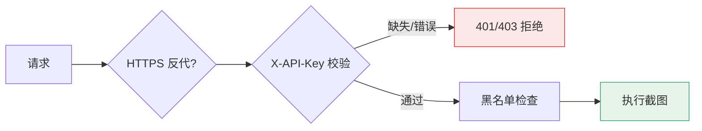

# API 鉴权

<p align="center">🔐 `snir api` 的 API Key 鉴权。</p>

## 启用鉴权

`--api-key` 指定密钥。**不指定则自动生成**并打印到启动日志，需自行记录。

```bash
snir api --api-key secret
# 或自动生成
snir api  # 启动日志会打印生成的 key
```

## 请求鉴权

每个请求须带 `X-API-Key` 头：

```bash
curl -X POST http://127.0.0.1:8080/screenshot \
  -H "X-API-Key: secret" \
  -H "Content-Type: application/json" \
  -d '{"url":"example.com"}'
```

## 未授权

- 缺失或错误 key → 拒绝（401/403）
- 建议配合 HTTPS 反代使用，避免 key 明文传输



## 安全建议

::: danger key 是最后一道门，别让它裸奔
- ✅ 用**强随机** key（≥32 字节，`openssl rand -hex 32`）
- ✅ 生产环境**前置 HTTPS**（nginx/caddy 反代），否则 key 在 HTTP 明文传输可被抓包
- ✅ 仅本机用就 `--host 127.0.0.1`，别监听 `0.0.0.0` 暴露公网
- ✅ 保留默认黑名单防 SSRF（API 接收外部 URL，风险更高）
- ❌ 不要把 key 硬编码提交到代码库，用环境变量/密钥管理
:::

## 与黑名单协同

`snir api` 同样支持 `--enable-blacklist`/`--default-blacklist`/`--blacklist-pattern`/`--blacklist-file`，对 API 请求的目标做过滤。见 [黑名单](./scan-blacklist)。

## 下一步

- [api 命令](./api)
- [HTTP API 鉴权](../api/auth)
- [安全注意](../advanced/security)
