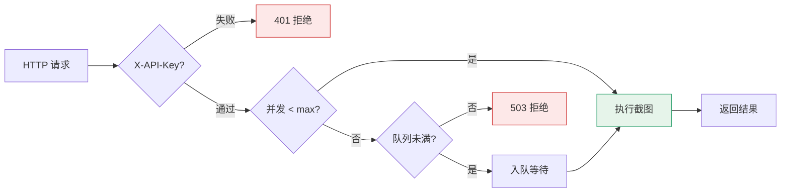

# api 命令

<p align="center">🌐 `snir api` — 启动 HTTP API 服务。</p>

启动常驻 HTTP 服务，供任何语言/系统通过 HTTP 调用 snir 能力。

## 用法

```bash
snir api [flags]
```

## 标志

| 标志 | 默认 | 说明 |
|------|------|------|
| `--host` | `0.0.0.0` | 监听地址 |
| `--port` | `8080` | 监听端口 |
| `--api-key` | 自动生成 | API 密钥（不指定则自动生成并打印） |
| `--max-concurrent` | `10` | 最大并发请求数 |
| `--queue-size` | `100` | 请求队列大小 |
| `--wss` | — | 远程 Chrome WebSocket URL |
| `--ignore-cert-errors` | `false` | 忽略证书错误 |
| `--enable-blacklist` | `true` | 启用黑名单 |
| `--default-blacklist` | `true` | 用默认黑名单 |
| `--blacklist-pattern` | — | 自定义黑名单规则 |
| `--blacklist-file` | — | 黑名单文件 |

## 示例

```bash
# 基本启动
snir api --host 127.0.0.1 --port 8080 --api-key secret

# 自动生成密钥（启动时打印）
snir api --port 8080

# 用远程 Chrome
snir api --wss ws://host:9222/devtools/browser/xxx

# 高并发
snir api --max-concurrent 50 --queue-size 500
```

## 端点

| 方法 | 路径 | 说明 |
|------|------|------|
| POST | `/screenshot` | 单次截图 |
| POST | `/batch` | 批量截图 |
| GET | `/health` | 健康检查 |
| GET | `/stats` | 并发统计 |

详见 [HTTP API](../api/overview)。

## 调用示例

```bash
curl -X POST http://127.0.0.1:8080/screenshot \
  -H "X-API-Key: secret" -H "Content-Type: application/json" \
  -d '{"url":"example.com","save_html":true}'
```

## 并发与限流

`--max-concurrent` 限制同时在执行的截图数；超出进入 `--queue-size` 队列等待。满则拒绝。见 [并发限流](../api/concurrency)。

::: warning 默认密钥仅本地用，对外务必显式设
- `--api-key` 不指定会**自动生成并打印**到启动日志——适合本地一次性试用
- 对外暴露（哪怕内网）务必显式 `--api-key <强随机值>`，并配合反代/网络隔离
- 默认 `--host 0.0.0.0` 会监听所有网卡，仅本机用请改 `--host 127.0.0.1`
:::



## 下一步

- [API 鉴权](./api-auth)
- [HTTP API 总览](../api/overview)
- [并发限流](../api/concurrency)
