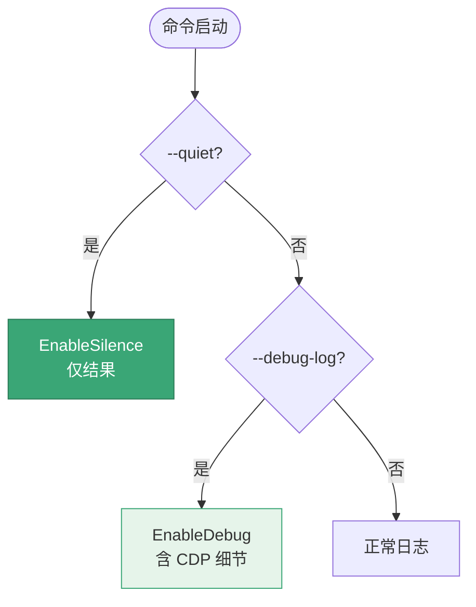

# 全局选项

<p align="center">🌍 适用于所有 snir 子命令的持久化标志。</p>

全局标志通过 cobra `PersistentFlags` 注册，对所有子命令生效。

## 标志

| 标志 | 简写 | 默认 | 说明 |
|------|------|------|------|
| `--debug-log` | `-D` | `false` | 启用调试日志，输出详细 CDP 交互过程 |
| `--quiet` | `-q` | `false` | 静默（几乎所有）日志 |

## 用法

```bash
# 调试模式
snir scan example.com -D
snir scan example.com --debug-log

# 静默模式（仅输出结果）
snir scan example.com -q

# 组合：调试但静默冲突时静默优先
```

## 行为细节

- `PersistentPreRunE` 中处理：若 `--quiet` 启用，调用 `log.EnableSilence()`；若 `--debug-log` 且未静默，调用 `log.EnableDebug()`。
- 静默优先级高于调试：同时指定时静默生效。



## 何时用

- 🐛 **`-D` 调试**：排查失败、看 CDP 细节、定位超时原因
- 🤫 **`-q` 静默**：脚本/管线中只想要结果，减少日志噪声

## 示例：管线友好输出

```bash
snir scan file -f urls.txt -q --write-jsonl --write-stdout=false
```

## 下一步

- [CLI 总览](./overview)
- [退出码](./exit-codes)
- [故障排查](../advanced/troubleshooting)
