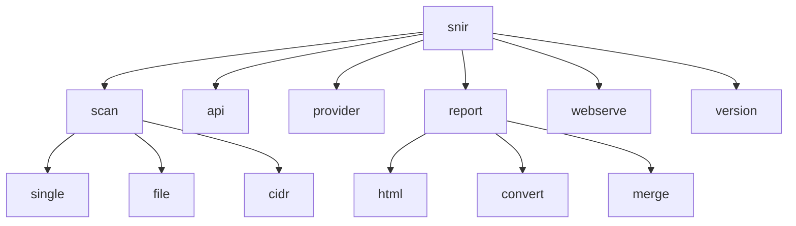

# CLI 总览

<p align="center">🖥️ snir 命令行入口与子命令一览。</p>

snir CLI 基于 [cobra](https://github.com/spf13/cobra) 构建。根命令 `snir`，下挂若干子命令。

## 用法

```bash
snir [command] [flags]
```

无子命令时显示帮助（含 Logo）。

::: tip 任何时候都能 `--help`
每个命令层级都支持 `--help`，且帮助信息**从 cobra 命令树自动生成**——新加的子命令无需手写文档即自动出现在帮助中。
:::

## 子命令

| 命令 | 说明 | 文档 |
|------|------|------|
| 📸 `scan` | 扫描并截图网站 | [scan](./scan) |
| ┗ `scan single [url]` | 扫描单个 URL | [scan-single](./scan-single) |
| ┗ `scan file` | 从文件批量扫描 | [scan-file](./scan-file) |
| ┗ `scan cidr [cidr]` | 扫描网段 | [scan-cidr](./scan-cidr) |
| 🌐 `api` | 启动 HTTP API 服务 | [api](./api) |
| 🔌 `provider` | 启动 CDP Provider 服务 | [provider](./provider) |
| 📊 `report` | 报告相关命令 | [report](./report) |
| ┗ `report html` | 生成 HTML 报告 | [report-html](./report-html) |
| ┗ `report convert` | 转换报告格式 | [report-convert](./report-convert) |
| ┗ `report merge` | 合并多个报告 | [report-merge](./report-merge) |
| 🌐 `webserve` | 启动 Web 服务器查看结果 | [webserve](./webserve) |
| ℹ️ `version` | 显示版本信息 | [version](./version) |

## 命令树



## 帮助

```bash
snir              # 显示帮助
snir scan --help  # 某命令帮助
snir --list-devices # （scan）列出设备预设
```

帮助信息自动从 cobra 命令树生成，新命令自动出现。

## 快速验证

::: details 30 秒上手
```bash
snir version              # 确认安装
snir scan example.com     # 扫一张试试
snir scan example.com --full-page --save-html --save-headers   # 带证据
```
跑通这三条，snir 就装好了。
:::

## 下一步

- [全局选项](./global-options)
- [scan 命令族](./scan)
- [CLI 标志全表](../reference/cli-flags)
