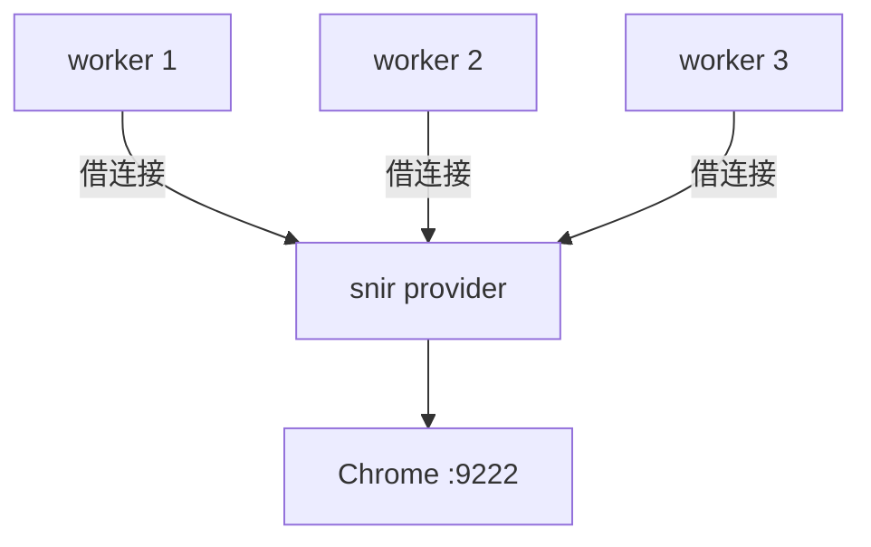

# provider 命令

<p align="center">🔌 `snir provider` — 启动共享 CDP Provider。</p>

启动一个常驻 Chrome/CDP 端点，让**多个进程**的 worker 复用同一 Chrome，避免每个进程各自拉浏览器。

## 用法

```bash
snir provider [flags]
```

## 标志

| 标志 | 默认 | 说明 |
|------|------|------|
| `--port` | `9223` | Provider 服务监听端口 |
| `--chrome-port` | `9222` | Chrome 远程调试端口 |
| `--max-concurrent` | `10` | 最大并发截图数 |
| `--idle-timeout` | `0` | 浏览器空闲超时（如 `5m`，`0`=不自动关闭） |
| `--chrome-path` | — | Chrome 可执行文件路径 |
| `--user-agent` | — | 自定义 UA |
| `--proxy` | — | 代理服务器地址 |

## 示例

```bash
# 启动共享 Provider
snir provider --port 9223 --max-concurrent 20

# 空闲 5 分钟自动关闭 Chrome
snir provider --idle-timeout 5m

# 指定 Chrome 路径与代理
snir provider --chrome-path /usr/bin/chromium --proxy http://127.0.0.1:8080
```

## 多 worker 复用



各 worker 用 `--wss` 连接 Provider 暴露的 Chrome：

```bash
# 在 worker 进程中
snir scan example.com --wss ws://provider-host:9222/devtools/browser/<id>
```

## 适合场景

- 多 agent / 多 worker 并发采集
- 跨进程资源复用，降低 Chrome 启动开销
- 集中式浏览器管理

## 与 DriverPool 的区别

- `DriverPool`（进程内）：同进程多任务复用一批 Driver
- `provider`（跨进程）：多进程共享同一 Chrome 端点

见 [并发与池](../advanced/concurrency)。

## 下一步

- [远程 Chrome](../advanced/remote-chrome)
- [并发与池](../advanced/concurrency)
- [内部 pkg/provider](../internals/provider)
