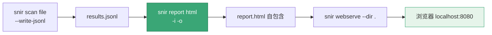

# report html

<p align="center">📄 `snir report html` — 生成富 HTML 报告。</p>

从 `results.jsonl` 读取采集结果，生成一个自包含的富 HTML 报告，便于浏览与分享。

## 用法

```bash
snir report html [flags]
```

## 示例

```bash
# 基本生成
snir report html -i results.jsonl -o report.html

# 默认输出
snir report html -i results.jsonl
```

## 报告内容

富 HTML 报告包含：

::: tip 一个 report.html = 一份可分享的全量证据
报告是**单文件自包含**——CSS、截图缩略图全部内嵌，无需额外资源。可直接发邮件、存档、离线打开，对方不用装任何东西。

- 📋 结果总览（成功/失败计数、状态码分布）
- 🖼️ 截图缩略图网格
- 📝 每个结果的元信息（URL/标题/状态码/技术栈/哈希）
- 🔍 证据展开（HTML/头/Cookie/控制台/网络，按采集项）
:::

模板由 `pkg/report/html.go` 的 `RichHTMLTemplate` 渲染。

## 工作流

从扫描到浏览报告的三步流水线：



```bash
snir scan file -f urls.txt --full-page \
  --save-html --save-headers \
  --write-jsonl
snir report html -i results.jsonl -o report.html
snir webserve --dir .
# 浏览器访问 http://localhost:8080
```

## 输入

`ReadJSONLResults` 读取 JSONL，每行反序列化为 `models.Result`，组装为 `ReportData` 供模板渲染。

## 下一步

- [report 总览](./report)
- [report convert](./report-convert)
- [报告生成（进阶）](../advanced/reports)
