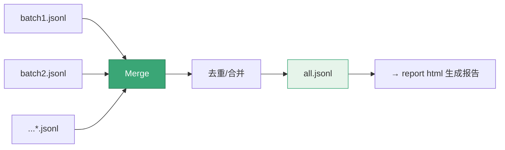
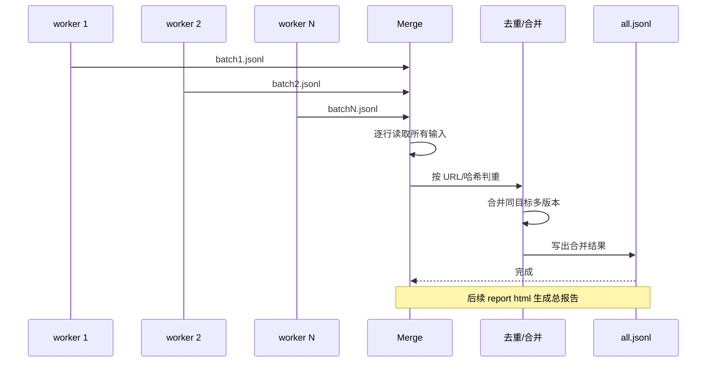

# report merge

<p align="center">🔗 `snir report merge` — 合并多个结果文件。</p>

把多次扫描的 JSONL 结果合并为一个文件，便于统一查看或报告。

## 用法

```bash
snir report merge [flags]
```

## 示例

```bash
# 合并两个批次
snir report merge -i batch1.jsonl -i batch2.jsonl -o merged.jsonl

# 合并多个并生成报告
snir report merge -i *.jsonl -o all.jsonl
snir report html -i all.jsonl -o report.html
```

## 合并选项

`MergeOptions` 控制多个输入与输出路径。`Merge` 读取所有输入 JSONL，去重/合并后写出。

::: info 多 worker 分布式采集的标准收尾
多机/多 worker 各扫一批 → 各产 `batchN.jsonl` → `report merge -i *.jsonl -o all.jsonl` 汇总 → `report html` 出一份总报告。这是分布式采集的典型收尾流程。
:::



多批次 JSONL 合并的去重/汇总时序：



## 适用场景

- 多次分批扫描后统一汇总
- 多 worker 各自产出后合并
- 跨时间段结果归并

## 下一步

- [report 总览](./report)
- [report html](./report-html)
- [输出格式](../advanced/output-formats)
