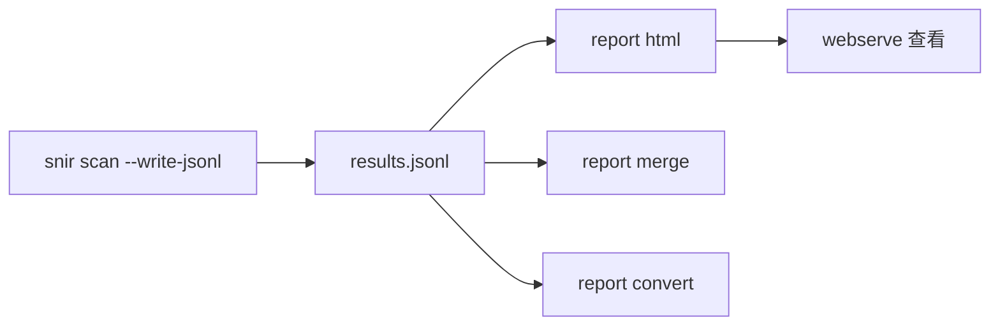
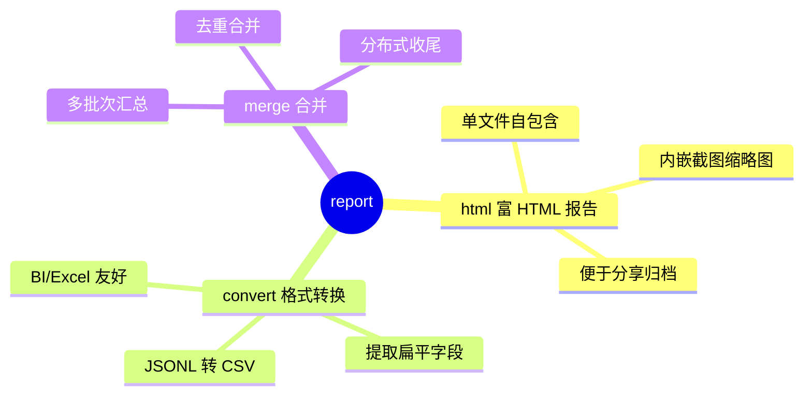

# report 命令族

<p align="center">📊 `snir report` — 报告生成、转换、合并。</p>

`report` 命令族处理 `results.jsonl` 等采集产出，生成可视化报告或转换/合并结果。

## 子命令

| 子命令 | 说明 | 文档 |
|--------|------|------|
| `report html` | 从 JSONL 生成富 HTML 报告 | [report-html](./report-html) |
| `report convert` | 转换报告/结果格式 | [report-convert](./report-convert) |
| `report merge` | 合并多个结果文件 | [report-merge](./report-merge) |

## 典型流程



report 命令族按职责分类的心智图：



## 示例

```bash
# 采集
snir scan file -f urls.txt --write-jsonl

# 生成 HTML 报告
snir report html -i results.jsonl -o report.html

# 合并多次扫描
snir report merge -i batch1.jsonl -i batch2.jsonl -o merged.jsonl

# 本地查看
snir webserve --dir .
```

## 下一步

- [report html](./report-html)
- [report convert](./report-convert)
- [report merge](./report-merge)
- [报告生成（进阶）](../advanced/reports)
