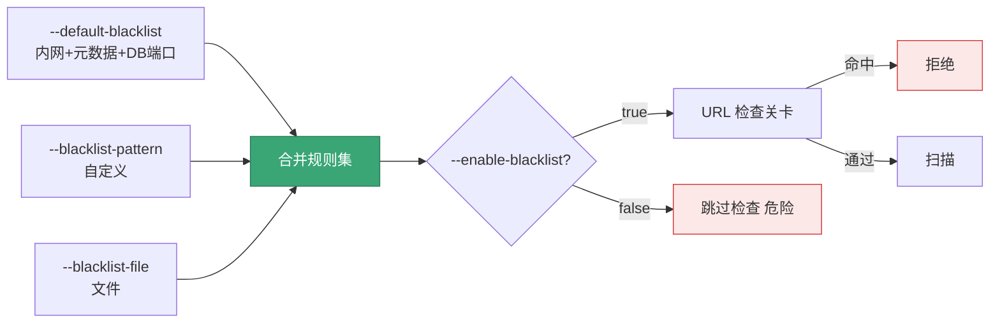

# 黑名单

<p align="center">🚫 用黑名单过滤危险/无关目标，防 SSRF。</p>

## 标志

| 标志 | 默认 | 说明 |
|------|------|------|
| `--enable-blacklist` | `true` | 启用黑名单检查 |
| `--default-blacklist` | `true` | 使用内置默认规则 |
| `--blacklist-pattern` | — | 自定义规则（可多次，支持 CIDR 与正则） |
| `--blacklist-file` | — | 规则文件路径 |

四类规则来源可叠加，最终合并为检查集：



## 默认黑名单（节选）

默认屏蔽危险地址，防 SSRF 与内网探测：

- 🏠 本地与内网：`localhost`、`127.0.0.0/8`、`10.0.0.0/8`、`172.16.0.0/12`、`192.168.0.0/16`、`169.254.0.0/16`、`fc00::/7`
- ☁️ 云元数据：`169.254.169.254`（AWS/GCP/DO）、`metadata.google.internal`、`metadata.internal`、`metadata.service`
- 🔐 敏感内部服务：`consul.service.consul`、`vault.service.consul`
- 🗄️ 数据库端口：`*:1433`（MSSQL）、`*:3306`（MySQL）、`*:5432`（PG）、`*:6379`（Redis）

## 示例

```bash
# 默认（启用默认规则）
snir scan file -f urls.txt

# 追加自定义规则
snir scan file -f urls.txt --blacklist-pattern "internal.local" --blacklist-pattern "10.0.0.0/8"

# 规则文件
snir scan file -f urls.txt --blacklist-file blocklist.txt

# 仅自定义、不用默认
snir scan file -f urls.txt --default-blacklist=false --blacklist-pattern "bad.example"

# 完全禁用（危险，仅在受控内网扫描时）
snir scan file -f hosts.txt --enable-blacklist=false
```

## 规则语法

支持：

- **CIDR**：`10.0.0.0/8`
- **正则**：`.*:6379` 匹配任意 host 的 6379 端口
- **字面量**：`localhost`

## 规则文件格式

每行一条规则，支持 `#` 注释。

## 安全建议

- 生产环境**务必**保留默认黑名单
- 仅在授权内网扫描时才考虑 `--enable-blacklist=false`
- 详见 [安全注意](../advanced/security)

## 下一步

- [安全注意](../advanced/security)
- [黑名单（进阶）](../advanced/blacklist)
- [内部 pkg/runner/blacklist](../internals/runner-blacklist)
