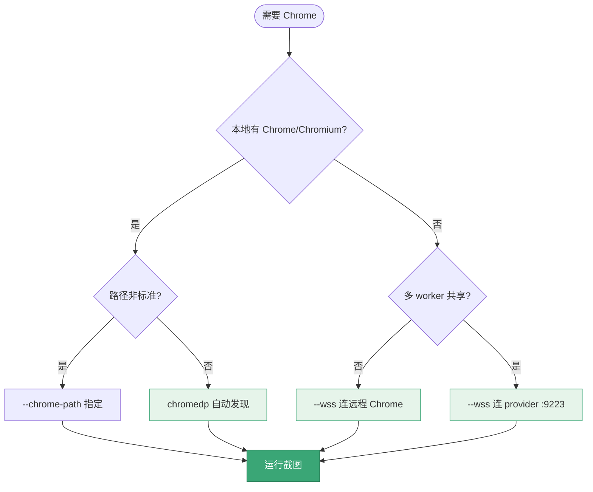
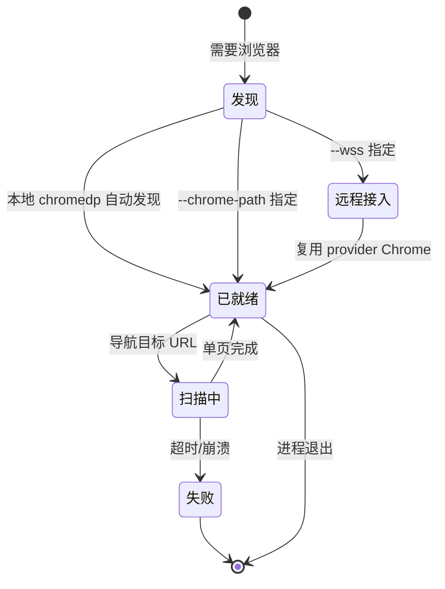

# Chrome 选项

<p align="center">🖥️ 控制浏览器行为与连接。</p>

## 标志

| 标志 | 默认 | 说明 |
|------|------|------|
| `--chrome-path` | — | Chrome 可执行文件路径 |
| `--user-agent` | — | 自定义 User-Agent |
| `--timeout` | `30` | 页面加载超时（秒） |
| `--delay` | `0` | 截图前等待（秒） |
| `--headless` | `true` | 无头模式 |
| `--ignore-cert-errors` | `false` | 忽略证书错误 |
| `--wss` | — | 远程 Chrome WebSocket URL |

## 示例

```bash
# 指定 Chrome 路径
snir scan example.com --chrome-path /usr/bin/chromium

# 自定义 UA
snir scan example.com --user-agent "Mozilla/5.0 (MyBot)"

# 加超时与延迟（慢站点）
snir scan example.com --timeout 60 --delay 3

# 有头模式（调试可见）
snir scan example.com --headless=false

# 忽略证书错误（测试环境）
snir scan example.com --ignore-cert-errors

# 远程 Chrome
snir scan example.com --wss ws://host:9222/devtools/browser/xxx
```

## Chrome 发现

未指定 `--chrome-path` 时，chromedp 自动发现系统 Chrome/Chromium。找不到则报 `ChromeNotFoundError`。见 [故障排查](../advanced/troubleshooting)。

Chrome 连接方式的选择：



Chrome 进程从发现、启动到扫描结束的状态流转：



## 远程 Chrome

`--wss` 连接远程 CDP 端点，免本地 Chrome，可被多 worker 复用。详见 [远程 Chrome](../advanced/remote-chrome)、[provider](./provider)。

## 超时与延迟

::: tip timeout vs delay 区分清楚
- `--timeout`：**整体加载上限**，到点没加载完直接判失败（默认 30 秒）
- `--delay`：**加载完成后再等几秒**，留给异步内容/动画/懒加载渲染（默认 0）

慢站点常见组合：`--timeout 60 --delay 3`——给足加载时间，再等动画收尾。
:::

## 证书

::: danger 生产环境切勿忽略证书错误
`--ignore-cert-errors` 仅用于**测试自签名证书**的内网环境。生产使用会：
- 🔓 让 snir 接受任意伪造证书，无法识别中间人攻击
- 📦 把"证书校验失败"的目标当成功采集，污染结果可信度
:::

## 下一步

- [代理选项](./scan-proxy)
- [设备模拟](./scan-device)
- [远程 Chrome](../advanced/remote-chrome)
- [故障排查](../advanced/troubleshooting)
