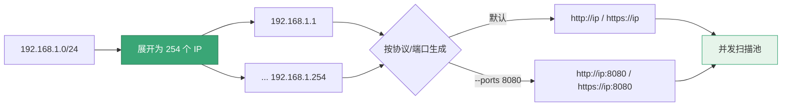

# scan cidr

<p align="center">🌐 `snir scan cidr [cidr]` — 扫描网段。</p>

把 CIDR 网段展开为 IP 列表，批量扫描其 Web 服务。

## 用法

```bash
snir scan cidr <cidr>
```

## 示例

```bash
# 扫描 /24 网段
snir scan cidr 192.168.1.0/24

# 带端口展开
snir scan cidr 10.0.0.0/24 --ports 80,443,8080

# 并发 + 持久化
snir scan cidr 192.168.1.0/24 --threads 20 \
  --write-jsonl --db

# 仅 HTTPS
snir scan cidr 192.168.1.0/24 --https --http=false
```

## 展开

`ExpandTargets` 把 CIDR 展开为所有可用 IP，再按 `--http`/`--https`/`--ports` 生成候选 URL：



- 默认 `http://ip` 与 `https://ip`
- `--ports 8080` 额外生成 `http://ip:8080`、`https://ip:8080`

::: warning 注意
`--ports` 是 Web 候选 URL 展开，不是 TCP 端口扫描。
:::

## 黑名单保护

::: warning 内网扫描的授权与安全边界
- 🛡️ 默认黑名单**屏蔽云元数据地址**（`169.254.169.254` 等）防 SSRF，但**不屏蔽私有网段**——因为内网扫描本就需要扫私网
- ✅ 仅在**明确授权**的内网资产盘点场景下扫描私网
- ❌ 勿对未授权网段执行 `scan cidr`，即便技术上能跑
- ⚠️ 大网段（如 `/16`）展开后是 6.5 万 IP，务必配合 `--threads` 与超时控制
:::

见 [黑名单](./scan-blacklist)。

## 适用场景

- 内网资产盘点（授权前提下）
- 网段内 Web 服务发现

## 下一步

- [scan 总览](./scan)
- [端口展开](./scan-ports)
- [安全侦察](../guide/security-recon)
