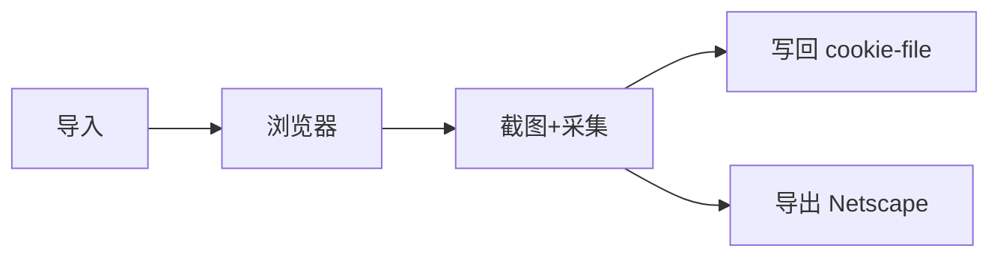

# Cookie 选项

<p align="center">🍪 管理 Cookie：内联、持久化、导入导出。</p>

## 标志

| 标志 | 说明 |
|------|------|
| `--cookie` | 内联 Cookie（`name=value`，可多次使用） |
| `--cookie-file` | Cookie 持久化文件（JSON，跨请求复用） |
| `--cookie-write-back` | 截图后把浏览器 Cookie 写回 `--cookie-file` |
| `--cookie-export` | 截图后导出 Cookie 到文件（Netscape 格式） |
| `--cookie-import` | 导入 Netscape 格式 Cookie 文件（curl/wget 格式） |

## 示例

```bash
# 内联 Cookie
snir scan example.com --cookie "session=abc123" --cookie "token=xyz"

# 持久化 Cookie 文件（JSON）
snir scan example.com --cookie-file cookies.json --cookie-write-back

# 导入 Netscape（如从 curl 导出）
snir scan example.com --cookie-import cookies.txt

# 导出为 Netscape（供 curl/wget 用）
snir scan example.com --cookie-export out.txt
```

## 工作流



## Cookie 持久化文件（JSON）

`--cookie-file` 指定一个 JSON 文件，`CookieJar` 跨请求复用 Cookie。配合 `--cookie-write-back`，截图后把浏览器实际 Cookie（含登录态）写回，下次扫描自动带上。

## Netscape 格式

兼容 curl/wget 的 `cookies.txt` 格式：

- `--cookie-import`：从 curl/wget 导出登录态，让 snir 带登录截图
- `--cookie-export`：把 snir 采集到的 Cookie 导出，供 curl/wget 复用

## 与证据采集的区别

- `--save-cookies`：把浏览器 Cookie 作为**证据**存入 `Result.cookies`
- `--cookie-*`：**注入/持久化** Cookie 用于会话保持

## 适用场景

- 登录后页面截图：先用 curl 登录导出 Netscape，再 `--cookie-import`
- 跨任务会话复用：`--cookie-file` + `--cookie-write-back`

详见 [Cookie 管理（进阶）](../advanced/cookie)。

## 下一步

- [证据选项](./scan-evidence)
- [Cookie 管理（进阶）](../advanced/cookie)
- [内部 CookieJar](../internals/runner-cookie-jar)
