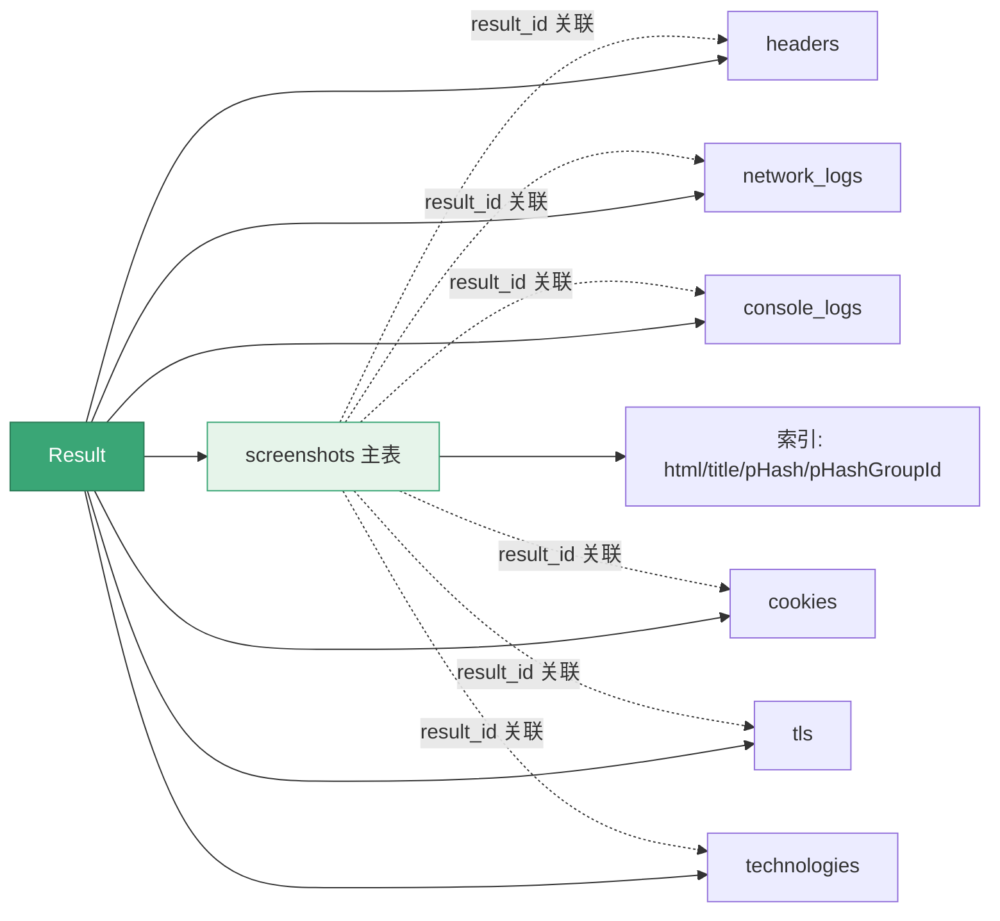

# 数据库选项

<p align="center">🗄️ 用 `--db` 把结果存入 SQLite。</p>

## 标志

| 标志 | 默认 | 说明 |
|------|------|------|
| `--db` | `false` | 启用 SQLite 存储 |
| `--db-path` | `go-web-screenshot.db` | 数据库文件路径 |

## 示例

```bash
# 启用数据库
snir scan example.com --db

# 指定路径
snir scan file -f urls.txt --db --db-path /data/scan.db

# 与 JSONL 并存
snir scan file -f urls.txt --db --write-jsonl
```

## 表结构

基于 GORM 自动迁移，主要表：

`--db` 启用后，每条 `Result` 由 DBWriter 拆分写入主表与各嵌套证据表：



| 表 | 对应模型 | 说明 |
|----|---------|------|
| `screenshots` | `Screenshot` | 主表，含 url/title/code/hash 等 |
| `scan_sessions` | `ScanSession` | 扫描会话 |
| `tags` / `screenshot_tags` | `Tag`/`ScreenshotTag` | 标签关联 |

`Result` 的嵌套证据（headers/network/console/cookies/tls/technologies）各自成表，通过 `result_id` 关联，带 `OnDelete:CASCADE`。

## 索引字段

入库时以下字段建索引：`html`、`title`、`perception_hash`、`perception_hash_group_id`，便于快速查询。

## 查询示例

```sql
-- 失败的目标
SELECT url, failed_reason FROM screenshots WHERE failed = 1;

-- 按状态码
SELECT response_code, count(*) FROM screenshots GROUP BY response_code;

-- 感知哈希聚类
SELECT perception_hash_group_id, count(*)
FROM screenshots GROUP BY perception_hash_group_id HAVING count(*) > 1;

-- 技术栈
SELECT s.host, t.name FROM technologies t
JOIN screenshots s ON t.result_id = s.id;
```

## 适合场景

- 长期结构化存储
- 多次扫描对比与查询
- 与 BI/分析工具对接

## 下一步

- [输出选项](./scan-output)
- [数据库存储（进阶）](../advanced/database)
- [内部 pkg/database](../internals/database)
