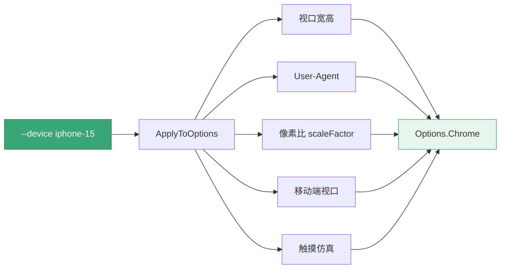

# 设备模拟

<p align="center">📱 用 `--device` 模拟手机/平板/桌面。</p>

## 标志

| 标志 | 说明 |
|------|------|
| `--device` | 设备预设名（如 `iphone-15`） |
| `--list-devices` | 列出全部可用预设 |

## 列出预设

```bash
snir scan --list-devices
```

::: info 预设覆盖主流真机
预设含 iPhone/iPad 全系、Pixel/Galaxy 主力机型、桌面三档（1080p/1440p/4K）。一个 `--device` 名同时设置视口、UA、像素比、移动端标记、触摸仿真——比手动调五个参数省事且不易出错。
:::

## 可用预设（部分）

| 名称 | 设备 |
|------|------|
| `iphone-15-pro` | iPhone 15 Pro |
| `iphone-15` | iPhone 15 |
| `iphone-14-pro-max` | iPhone 14 Pro Max |
| `iphone-se` | iPhone SE (3rd gen) |
| `ipad-pro-12` | iPad Pro 12.9 |
| `ipad-air` | iPad Air |
| `ipad-mini` | iPad Mini |
| `pixel-8-pro` | Pixel 8 Pro |
| `pixel-8` | Pixel 8 |
| `pixel-7` | Pixel 7 |
| `galaxy-s24` | Samsung Galaxy S24 |
| `galaxy-s23-ultra` | Samsung Galaxy S23 Ultra |
| `galaxy-tab-s9` | Samsung Galaxy Tab S9 |
| `desktop-1080p` | Desktop 1080p |
| `desktop-1440p` | Desktop 1440p |
| `desktop-4k` | Desktop 4K |

## 示例

```bash
# iPhone 视角
snir scan example.com --device iphone-15

# iPad
snir scan example.com --device ipad-pro-12

# 桌面 4K
snir scan example.com --device desktop-4k
```

## 预设应用了什么

`DevicePreset` 包含：

- 视口宽高
- User-Agent
- 设备像素比（scaleFactor）
- 是否移动端视口
- 是否触摸

`ApplyToOptions` 把这些写入 `Options.Chrome`。一个 `--device` 预设展开为五项浏览器配置：



`--device` 预设展开为 CDP `Emulation` 调用的时序：

```mermaid
sequenceDiagram
  participant U as 用户
  participant CLI as snir scan
  participant AP as ApplyToOptions
  participant OPT as Options.Chrome
  participant CH as Chrome(CDP)
  U->>CLI: scan --device iphone-15
  CLI->>AP: 查找预设
  AP->>AP: 取出视口/UA/像素比/移动端/触摸
  AP->>OPT: 写入五项浏览器配置
  CLI->>CH: 启动浏览器
  CH->>CH: setDeviceMetricsOverride(宽高+像素比)
  CH->>CH: setUserAgentOverride(UA)
  CH->>CH: setTouchEmulationEnabled(触摸)
  CH-->>U: 按设备视角截图 + Result
```

## 自定义视口

不用预设时，可手动设：

```bash
snir scan example.com --resolution-x 390 --resolution-y 844 --user-agent "..."
```

SDK 可用 `WithDeviceEmulation(width, height, scaleFactor, isMobile, hasTouch)` 精细控制。见 [视口与设备](../sdk/builder-viewport)。

## 下一步

- [scan 总览](./scan)
- [设备模拟（进阶）](../advanced/device)
- [视口与设备构建器](../sdk/builder-viewport)
