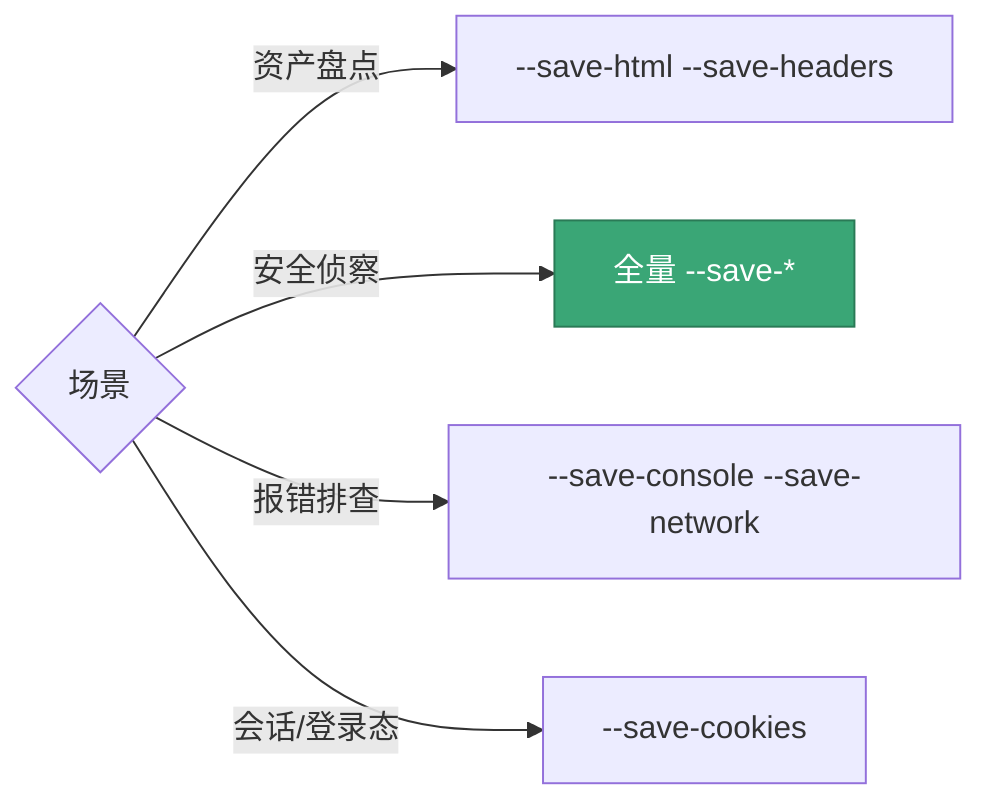
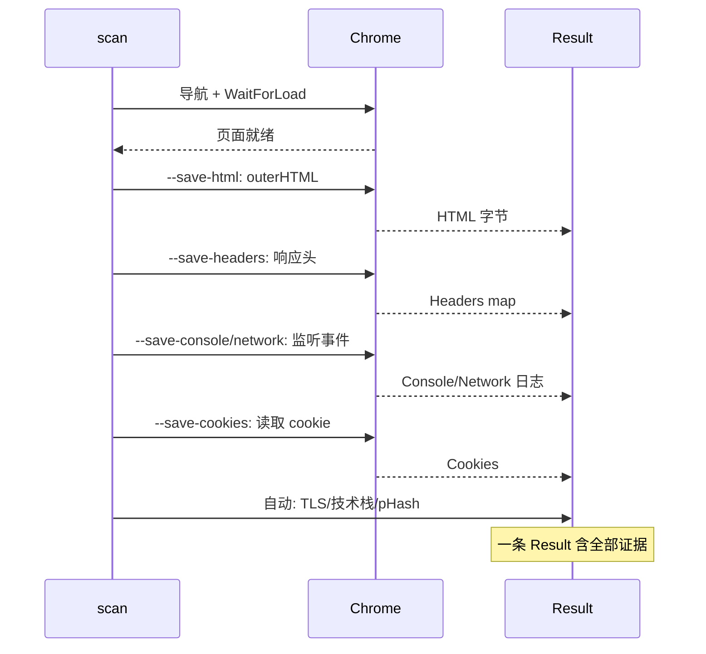

# 证据选项

<p align="center">🔍 控制采集哪些页面证据。</p>

snir 一次截图可同时采集多种证据，存入 `Result` 对应字段。

## 标志

| 标志 | 采集内容 | Result 字段 |
|------|---------|------------|
| `--save-html` | HTML 源码 | `html` |
| `--save-headers` | HTTP 响应头 | `headers` |
| `--save-cookies` | Cookie | `cookies` |
| `--save-console` | 控制台日志 | `console` |
| `--save-network` | 网络请求日志 | `network` |

此外，`final_url`、`response_code`、`title`、`tls`、`technologies`、`perception_hash` 默认采集。

::: tip 一键全量证据
懒得逐个开？`--save-html --save-headers --save-cookies --save-console --save-network` 全开即可，或 SDK 用 `WithEvidence()` 一次启用前五项。
:::

## 示例

```bash
# 全量证据
snir scan example.com \
  --save-html --save-headers --save-cookies \
  --save-console --save-network

# 仅 HTML 与头
snir scan example.com --save-html --save-headers

# 全量 + 持久化
snir scan example.com \
  --save-html --save-headers --save-cookies \
  --save-console --save-network \
  --write-jsonl --db
```

## 证据结构

### headers

```
[{name, value}, ...]
```

### cookies

```
[{name, value, domain, path}, ...]
```

### console

```
[{level, message}, ...]   // level: log/warn/error/info...
```

### network

```
[{type, url, method, status_code, content_type, body}, ...]
```

完整定义见 [Result Schema](../reference/result-schema)。

## 何时采集

不同场景按需选择证据组合：



证据在各采集阶段如何进入 Result：



| 场景 | 建议证据 |
|------|---------|
| 资产盘点 | html + headers |
| 安全侦察 | 全量 |
| 控制台报错排查 | console + network |
| 会话/登录态 | cookies |

## 下一步

- [Result Schema](../reference/result-schema)
- [证据采集](../advanced/evidence)
- [输出选项](./scan-output)
