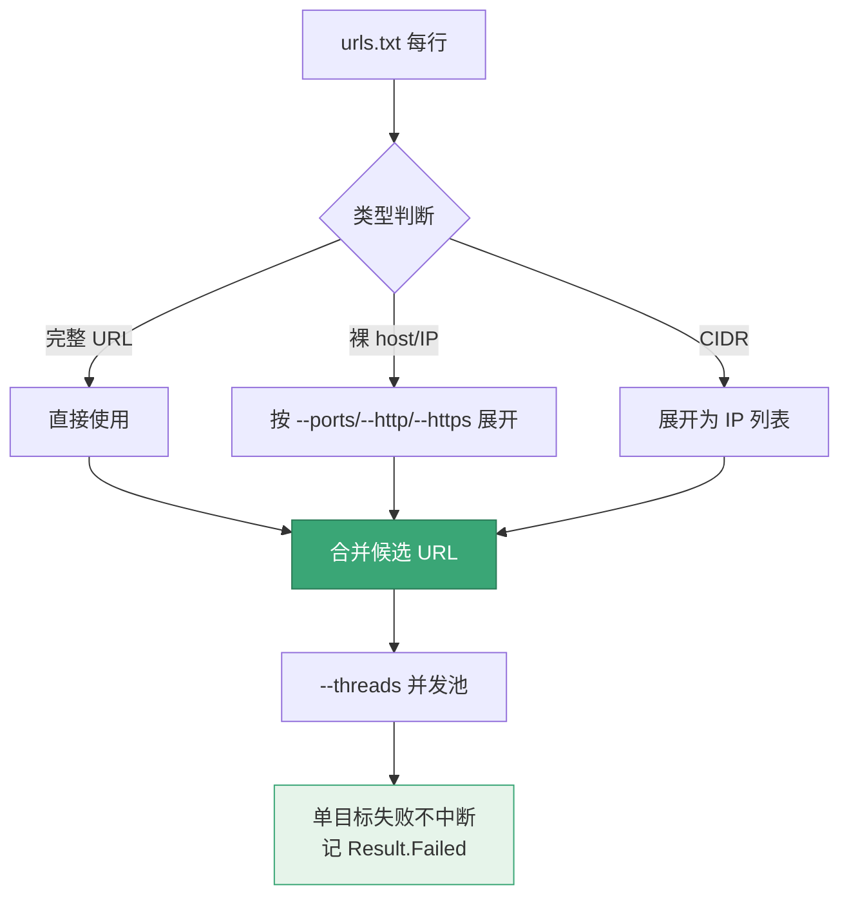
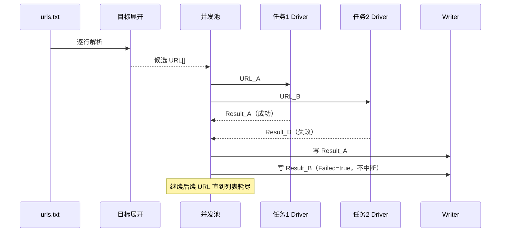

# scan file

<p align="center">📄 `snir scan file` — 从文件批量扫描 URL。</p>

从文本文件读取 URL 列表，并发批量扫描。

## 用法

```bash
snir scan file -f <文件>
```

## 标志

| 标志 | 简写 | 默认 | 说明 |
|------|------|------|------|
| `--file` | `-f` | — | 包含 URL 列表的文件路径 |

文件每行一个 URL/host/IP。继承所有 scan 公共标志。

## 示例

```bash
# 基本批量
snir scan file -f urls.txt --threads 10

# 完整证据 + 持久化
snir scan file -f urls.txt --threads 10 \
  --full-page --save-html --save-headers \
  --write-jsonl --db

# 端口展开（裸 host/IP）
snir scan file -f hosts.txt --ports 80,443,8080,8443

# 代理轮换
snir scan file -f urls.txt \
  --proxy-list http://p1:8080 --proxy-list http://p2:8080 \
  --proxy-strategy round-robin
```

## 文件格式

每行一个目标，支持：

```
example.com
https://example.com/path
192.168.1.10
10.0.0.0/24
```

- 裸 host/IP：配合 `--ports`/`--http`/`--https` 展开为候选 URL
- 完整 URL：直接使用
- CIDR 行：由 `ExpandTargets` 展开为 IP 列表

文件各行按类型分流处理：



批量扫描中"并发下发 + 单点失败隔离"的时序：



## 并发

`--threads`（默认 2）控制并发数。批量建议 5-20，视机器与目标限流而定。见 [并发与池](../advanced/concurrency)。

::: warning 并发不是越大越好
盲目调高 `--threads` 会导致：本地内存/CPU 打满、目标站点触发限流或封禁、Chrome 进程数爆炸（每并发一个 tab）。
建议从 `--threads 5` 起，观察资源占用与成功率再逐步上调。
:::

## 失败隔离

::: tip 单目标失败不连累全局
批量扫描中某个 URL 超时/报错**不会中断整个批次**，会被记录到 `Result.Failed` / `FailedReason` 继续下一个。配合 `--max-retries` 控制单目标重试次数。
:::

## 下一步

- [scan 总览](./scan)
- [端口展开](./scan-ports)
- [输出选项](./scan-output)
- [并发与池](../advanced/concurrency)
