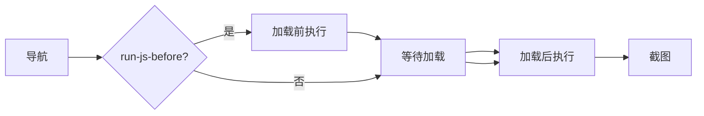
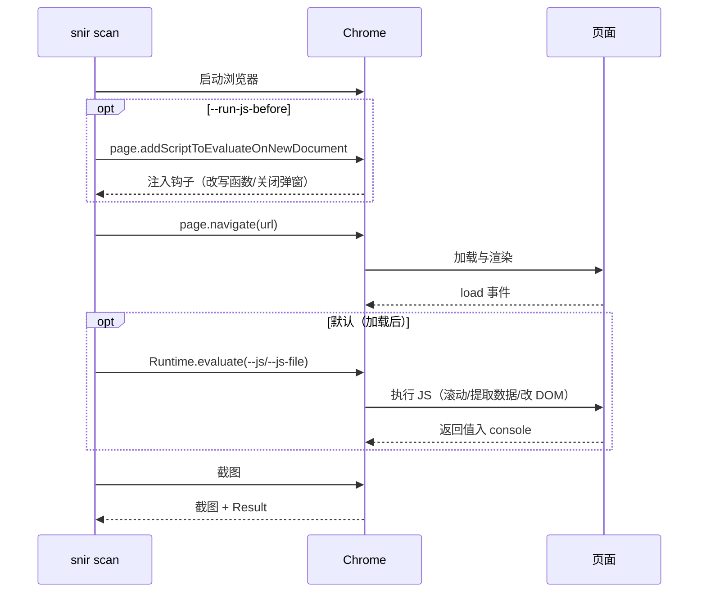

# JS 注入

<p align="center">☕ 用 `--js` 在页面执行自定义 JavaScript。</p>

## 标志

| 标志 | 说明 |
|------|------|
| `--js` | 要执行的 JavaScript 代码 |
| `--js-file` | 包含 JS 的文件路径 |
| `--run-js-before` | 在页面加载前执行（默认加载后） |

## 示例

```bash
# 执行内联 JS
snir scan example.com --js "document.title"

# 从文件
snir scan example.com --js-file inject.js

# 加载前执行
snir scan example.com --js-file preload.js --run-js-before
```

## 执行时机



JSBefore / 导航 / JSAfter / 截图四个阶段的执行时序：



- 默认：页面加载后执行
- `--run-js-before`：加载前执行，适合提前注入 hook、改写函数、关闭弹窗

## 典型用例

::: tip 实战配方
| 目的 | 代码 |
|------|------|
| 滚动到底触发懒加载 | `--js "window.scrollTo(0, document.body.scrollHeight)"` |
| 关闭 Cookie 同意弹窗 | `--js "document.querySelector('.consent')?.remove()"` |
| 改 DOM 后再截图 | `--js-file modify.js` |
| 提取页面数据 | `--js "document.title"`（结果入 console） |

弹窗遮挡是截图失败的常见原因，`--js` 提前移除是低成本解法。
:::

## 与交互动作的区别

::: warning 自由 JS vs 结构化动作
| 方式 | 灵活度 | 异步处理 | 适合 |
|------|--------|---------|------|
| `--js`（CLI） | 高，任意代码 | 需自己处理 | 一次性脚本注入 |
| `WithActions`（SDK） | 结构化动作 | 框架托管等待 | 复杂交互流程（点击→输入→等待→截图） |

简单注入用 `--js`，多步交互用 SDK 的 `WithActions`，见 [JS 与交互](../sdk/builder-js)。
:::

## 下一步

- [scan 总览](./scan)
- [JS 注入（进阶）](../advanced/js-injection)
- [JS 与交互构建器](../sdk/builder-js)
