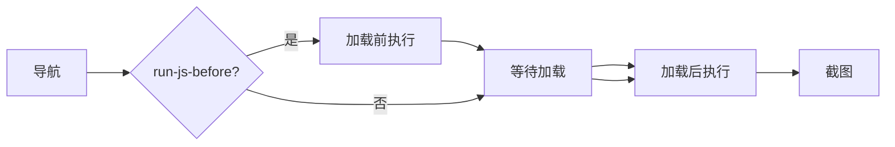

# JS 注入

<p align="center">☕ 用 `--js` 在页面执行自定义 JavaScript。</p>

## 标志

| 标志 | 说明 |
|------|------|
| `--js` | 要执行的 JavaScript 代码 |
| `--js-file` | 包含 JS 的文件路径 |
| `--run-js-before` | 在页面加载前执行（默认加载后） |

## 示例

```bash
# 执行内联 JS
snir scan example.com --js "document.title"

# 从文件
snir scan example.com --js-file inject.js

# 加载前执行
snir scan example.com --js-file preload.js --run-js-before
```

## 执行时机



- 默认：页面加载后执行
- `--run-js-before`：加载前执行，适合提前注入 hook、改写函数、关闭弹窗

## 典型用例

- 滚动到底部触发懒加载：`--js "window.scrollTo(0, document.body.scrollHeight)"`
- 关闭 cookie 弹窗：`--js "document.querySelector('.consent')?.remove()"`
- 修改 DOM 后再截图
- 提取页面数据

## 与交互动作的区别

- `--js`：自由 JS，灵活但需自己处理异步
- `WithActions`（SDK）：结构化动作（点击/输入/滚动/等待），见 [JS 与交互](../sdk/builder-js)

## 下一步

- [scan 总览](./scan)
- [JS 注入（进阶）](../advanced/js-injection)
- [JS 与交互构建器](../sdk/builder-js)
