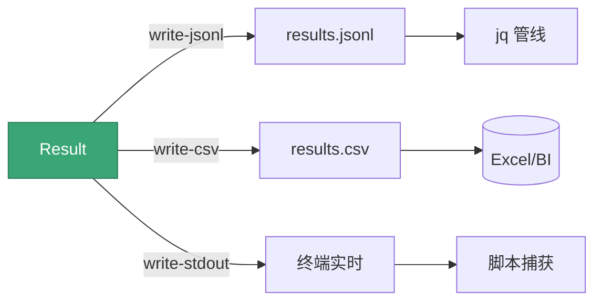

# 输出选项

<p align="center">📤 控制结果写往何处：JSONL/CSV/控制台。</p>

## 标志

| 标志 | 默认 | 说明 |
|------|------|------|
| `--write-jsonl` | `false` | 写 JSONL |
| `--jsonl-file` | `results.jsonl` | JSONL 文件路径 |
| `--write-csv` | `false` | 写 CSV |
| `--csv-file` | `results.csv` | CSV 文件路径 |
| `--write-stdout` | `true` | 输出到控制台 |

## 示例

```bash
# JSONL
snir scan example.com --write-jsonl

# CSV
snir scan example.com --write-csv

# 多个同时
snir scan file -f urls.txt \
  --write-jsonl --jsonl-file out.jsonl \
  --write-csv --csv-file out.csv \
  --write-stdout=false

# 自定义路径
snir scan example.com --write-jsonl --jsonl-file /data/scan.jsonl
```

## 各格式特点



| 格式 | 特点 | 适合 |
|------|------|------|
| JSONL | 流式、每行一条 JSON、追加友好 | 管线、jq 处理 |
| CSV | 表格、扁平 | Excel、BI |
| Stdout | 实时控制台 | 调试、脚本捕获 |

## JSONL 示例

每行一个完整 `Result` JSON：

```bash
snir scan file -f urls.txt --write-jsonl --write-stdout=false
jq -c 'select(.failed == true)' results.jsonl   # 看失败
jq -c '{url, title, code: .response_code}' results.jsonl
```

## CSV 注意

CSV 是扁平表格，嵌套字段（headers/network/cookies）会被序列化为字符串或省略。需要完整证据请用 JSONL 或 SQLite。

## 与数据库区别

- `--write-jsonl`/`--write-csv`：文件输出
- `--db`：SQLite 结构化存储（见 [数据库选项](./scan-db)）

可同时启用，`Result` 分发给所有 Writer。

## 下一步

- [数据库选项](./scan-db)
- [输出格式（进阶）](../advanced/output-formats)
- [Result Schema](../reference/result-schema)
